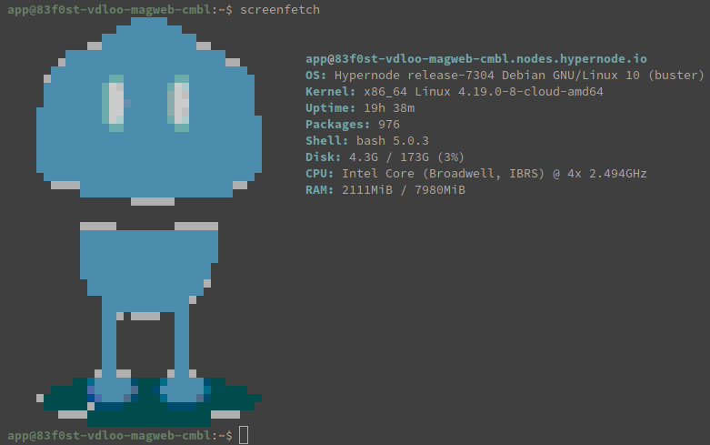

---
myst:
  html_meta:
    description: Hypernode upgraded all systems from Ubuntu Xenial to Debian Buster
      OS. Check the Hypernode changelog for the most up to date information.
    title: Debian Buster Upgrade Implications | Hypernode
redirect_from:
  - /en/about/about-us/upgrade-to-debian-buster-technical-implications/
---

<!-- source: https://support.hypernode.com/en/about/about-us/upgrade-to-debian-buster-technical-implications/ -->

# Upgrade to Debian Buster: Technical Implications

Because it is important to keep your hosting environment up to date we’re upgrading all Hypernodes from the Ubuntu Xenial operating system to the new Debian Buster OS. While we have worked hard to keep this upgrade as non-intrusive for the user as possible, this article lists some of the changes you might experience after having been upgraded to the new operating system. If you’re interested in the motivations for this upgrade check out [this previous changelog.](https://changelog.hypernode.com/changelog/release-7279-beta-debian-buster-hypernode-docker-and-configuration-specific-images/)

## Software Version Changes

These are some of the versions of software available on the system that have changed in this OS upgrade. Note that this list is not exhaustive and only a snapshot of the situation of the platform during the moment of the initial transition between OS versions. Over time as the platform develops these versions might be mutated further. See the [Hypernode changelog](https://changelog.hypernode.com/) for the most up-to-date reports on changes to the platform.

### Webstack Related Packages

These are the packages related to the webstack of the Hypernode. Please note that there may be minor version differences between the list below and the production environment due to ongoing security updates.

```bash
varnish -> Xenial: 4.1.3-2 -> Buster: 4.1.3-2 (same version)
varnish-modules -> Xenial: 0.9.1 -> Buster: 0.9.0-3
blackfire-agent -> Xenial: 1.27.0 -> Buster: 1.32.0
newrelic-daemon -> Xenial: 9.2.0.247 -> Buster: 9.8.0.259
elasticsearch 6 -> Xenial: 6.6.1 -> Buster: 6.6.1 (same version)
elasticsearch 7 -> Xenial: 7.6.0 -> Buster: 7.6.0 (same version)
composer -> Xenial: 1.10.6 or earlier -> Buster: 1.10.6
php5.6 -> Xenial: 5.6.40-21 -> Buster: 5.6.40-27
php7.0 -> Xenial: 7.0.33-20 -> Buster: 7.0.33-29
php7.1 -> Xenial: 7.1.33-9 -> Buster: 7.1.33-16
php7.2 -> Xenial: 7.2.27-6 -> Buster: 7.2.31-1
php7.3 -> Xenial: 7.3.14-6 -> Buster: 7.3.18-1
php-redis -> Xenial: 3.1.6-1 -> Buster: 5.2.0+4.3.0-1
php-imagick -> Xenial: 3.4.4-1-byte1 -> Buster: 3.4.4-4
redis-server -> Xenial: 2:3.0.6-1ubuntu0.4 (v=3.0.6) -> Buster: 5:5.0.3-4+deb10u1 (v=5.0.3)
nginx -> Xenial: 1.13.9-1 -> Buster: 1.16.1-3
```

### Python

While most users on Hypernode do not actively use the Python interpreter there are some users who run Python scripts or use tooling that uses the Python interpreter (like using [Ansible](https://github.com/ansible/ansible) to deploy to Hypernode). In Debian Buster the system Python will remain Python 2. This minor upgrade should not cause any incompatibilities.

```bash
python -> Xenial: 2.7.12-1ubuntu0~16.04.11 -> Buster: 2.7.16-1
```

Python 3 will be significantly updated though. If you run Python scripts and run into problems make sure to check those don’t use any features that have since been deprecated. For more information see the [Python changelog](https://docs.python.org/3/whatsnew/3.7.html).

```bash
python3 -> Xenial: 3.5.1-3 -> Buster: 3.7.3-1
```

### Other Interpreters

Here are some of the version changes of other interpreters. Even if you don’t actively program in these languages you might be using a tool that is using one of these interpreters (for example, if you instead of Ansible use [Capistrano](https://capistranorb.com/) to deploy that tool would be running on the Ruby programming language).

```bash
ruby -> Xenial: 1:2.3.0+1 -> Buster: 1:2.5.1
ruby2 -> Xenial: 2.3.1-2~ubuntu16.04.14 -> Buster: 2.5.5-3+deb10u1
perl -> Xenial: 5.22.1-9ubuntu0.6 -> Buster: 5.28.1-6
```

### Shells

In case you use some esoteric shell features and are interested in these version changes:

```bash
bash -> Xenial: 4.3-14ubuntu1.4 -> Buster: 5.0-4
dash -> Xenial: 0.5.8-2.1ubuntu2 -> Buster: 0.5.10.2-5
zsh -> Xenial: 5.1.1-1ubuntu2.3 -> Buster: 5.7.1-1
```

### Various system utilities and more

These are the version changes between various system utilities

```bash
awscli -> Xenial: 1.10.1-1 -> Buster: 1.16.113-1
git -> Xenial: 1:2.7.4-0ubuntu1.9 -> Buster: 1:2.20.1-2+deb10u3
webp -> Xenial: 0.4.4-1 -> Buster: 0.6.1-2
pngquant -> Xenial: 2.5.0-1 -> 2.12.2-1
supervisor -> Xenial: 3.2.0-2ubuntu0.2 -> Buster: 3.3.5-1
tmux -> Xenial: 2.1-3build1 -> Buster: 2.8-3
screen -> Xenial: 4.3.1-2build1 -> Buster: 4.6.2-3
rsync -> Xenial: 3.1.1-3ubuntu1.3 -> Buster: 3.1.3-6
```

## Other changes

- **ElasticSearch 5.2 will no longer be available**. You can use `hypernode-systemctl settings elasticsearch_version --value 6.x` to upgrade to `6.6.1`
- Newer kernel, systemd, libc, openssl, gcc, [cgroup v2 hierarchy](https://www.kernel.org/doc/Documentation/cgroup-v2.txt) and those type of fun things. Not so much relevant for end users, but it is for the development of the platform from our side in regards to dealing with [backwards incompatible changes in the software stack](https://github.com/elastic/elasticsearch/issues/23486) and being able to use new features for managing the fleet.
- The root disk size will now be `20 GB` on all nodes. Previously this was the case for OpenStack and DigitalOcean nodes, but for AWS the root disk size was the EC2 default of `8 GB`. For some Hypernodes this caused issues at peak moments when the access logs would be written to so fast that the log rotation couldn’t keep up. In the future this should be less of an issue because now there will be more space available. If you encounter such issues still with this increased capacity you can consider things like putting your [MySQL temporary directory on the /data disk](https://changelog.hypernode.com/changelog/release-5133-configurable-mysql-temporary-directory-extra-space/) in order to free up some more space.
- TLS 1.3 has been added. Note that TLS 1.1 and TLS 1.0 are deprecated and will be disabled at a later point in time. You can already enable a stricter cipher suite [using the hypernode-api](https://community.hypernode.io/#/Documentation/hypernode-api/settings/README).
- Curl has been updated to support and prefer HTTP/2. This may cause a problem if you use outdated Magento/Zend core libraries that can't interpret HTTP/2. If this is the case, you should modify your code to explicitly ask for a supported version. If you're using curl, you can do so by using something akin to:
  - ```
    ```
  curl_setopt(\$ch, CURLOPT_HTTP_VERSION, CURL_HTTP_VERSION_1_1);
  ```
  ```
- The OpenSSL seclevel has been updated to from '1' to '2'. This may reduce interoperability with older systems that are using pre-2013 industry standards. If this is the case you can downgrade your TLS settings using the command
  - ```
    ```
  hypernode-systemctl settings support_insecure_legacy_tls_enabled True
  ```

  ```

## Checking if a Hypernode Has Been Upgraded Yet

You can check the [message of the day](<https://en.wikipedia.org/wiki/Motd_(Unix)>) when you log in with ssh as it displays the `OS`, or run `lsb_release -a` or `cat /etc/os-release`. Alternatively you can check using [screenfetch](https://github.com/ByteInternet/screenfetch). On Buster you’ll see the Hypernode bot, on Xenial the package is not installed and the command is not available.


