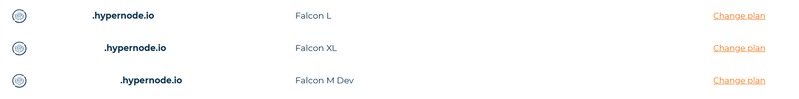

---
myst:
  html_meta:
    description: Find answers to frequently asked billing questions for the Control
      Panel, including payment methods, changing plans, and adding VAT numbers.
    title: Billing Control Panel FAQ | Hypernode
redirect_from:
  - /en/about/billing/billing-faq-for-the-control-panel/
---

<!-- source: https://support.hypernode.com/en/about/billing/billing-faq-for-the-control-panel/ -->

# Billing FAQ for the Control Panel

**Please note that this FAQ only applies to Control Panel customers that log in via [my.hypernode.com](https://my.hypernode.com/). If you use the Service Panel and log in via service.byte.nl please see [this article](billing-faq-for-the-service-panel.md).**

Every first of the month, Hypernode sends an invoice to customers who placed an order in the previous month or whose plans renew in the following month. The invoices are sent digitally to the Billing contact on the first of the month. You can easily find all invoices that have been sent in the Control Panel.

## What Are the Available Payment Methods?

Our Control Panel supports two different payment methods: credit card and SEPA Direct Debit. Please see our [Supported Payment Methods in the Control Panel](supported-payment-methods-in-the-control-panel.md) article for more information.

## How to Edit Billing Info

- Log in to the [Control Panel](https://my.hypernode.com/).
- Click on your username in the top right.
- Select **Billing portal**from the menu.
- Click **Billing & Shipping Addresses**to edit your billing info.

## How to See the Billing History

- Log in to the [Control Panel](https://my.hypernode.com/).
- Click on your username in the top right.
- Select **Billing portal**from the menu.
- Click **Billing History**to see your invoices.

## How to Change Your Plan

If you log in via [my.hypernode.com](https://auth.hypernode.com/), please use the steps below to change your plan via the Control Panel:

- Log into your Control Panel via [my.hypernode.com](http://my.hypernode.com)
- There are two ways to go the **Change plan**page:
  - Go to the**Change plan** page by selecting it from the sidebar on the left. Move your mouse over **Hypernodes** to make the menu appear:
    
  - Or click **Change your plan** in the Hypernode overview:
    
- You'll now see an overview of your current plan on the left and the new plan on the right:
  
- Select the desired plan and the type of environment, Development or Production.
- Select an add-on. Read more about our two SLA levels [here](../support/emergency-support-outside-office-hours.md).
- Agree with terms and conditions and click **Change** to change this plan. Your plan will be changed immediately.
- Warnings, if applicable, will be shown on the left.

## How to Cancel Your Plan

- Log in to the [Control Panel](https://my.hypernode.com/).
- Click on your username in the top right.
- Select **Billing portal**from the menu.
- In the Billing portal, select your current plan.
- Then click on **Cancel subscription**.
- The next screen confirms when your subscription will end. Please submit the reason of your cancellation as your feedback is valuable to us.
- Click on **Confirm cancellation** to finalise your cancellation.

### Cancellation Per End Date

You can cancel your subscription at any time via your control panel. The end date of your subscription is always the first of the next month. Example: if you cancel your subscription on the 15th of June, your Hypernode will be no longer available from the 1st of July onwards.

## How to Add a Purchase Order Number

You can add or update the PO Number while

- Creating a new Hypernode.
- Up- or downgrading your plan.

Multiple consolidated invoices will be generated if you set a PO number for your subscription.

If you need to update the PO Number and don't want to change your plan, please contact Support.

## How to Add a VAT Number

- Log in to the [Control Panel](https://my.hypernode.com/).
- Click on your username in the top right.
- Select **Billing portal**from the menu.
- In the Billing portal, select **Billing & Shipping Addresses**.
- Select your address.
- Fill in your VAT number in the VAT Reg # field.
