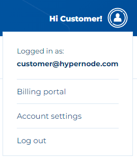
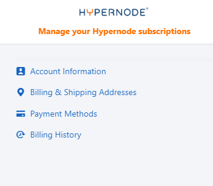

---
myst:
  html_meta:
    description: This FAQ covers billing and invoicing questions for customers who
      are migrated from the old Dutch legacy platform (Service Panel) to the new Control
      Panel.
    title: Billing and Invoicing FAQ for Dutch Customers | Hypernode
redirect_from:
  - /en/about/billing/migration-faq/
---

<!-- source: https://support.hypernode.com/en/about/billing/migration-faq/ -->

# Control Panel Billing / Facturen FAQ (Dutch)

***Note: This article is in Dutch because it is aimed at customers who are migrated from our old Dutch-only legacy platform (Service Panel) to the new Control Panel.***

We zijn dit kwartaal druk bezig om alle klanten van het oude service panel ([service.byte.nl](http://service.byte.nl)) om te zetten naar het nieuwe control panel ([my.hypernode.com](http://my.hypernode.com)). Omdat dit gepaard gaat met flink wat veranderingen en dit best wat vragen oplevert met betrekking tot facturatie hebben we deze FAQ in leven geroepen om hopelijk al je vragen te beantwoorden.

Voor algemene informatie over wat er precies is veranderd in vergelijking met het oude service panel kun je deze flyer raadplegen: <https://static.hypernode.com/docs/Hypernode_Control_Panel_Update.pdf>

______________________________________________________________________

## Waarom betaal ik nu van te voren in plaats van achteraf voor mijn Hypernode?

Eigenlijk simpelweg omdat we over zijn gegaan op een nieuw subscription management systeem die alleen maar met vooruitbetalingen werkt. Dit nieuwe systeem biedt een hoop voordelen en mogelijkheden voor klanten maar helaas hebben we wel deze omschakeling moeten maken.

## Waarom betaal ik nu voor een andere contractperiode?

Voorheen was je contractperiode afhankelijk van de dag dat je was begonnen met je Hypernode of domeinnaamregistratie. Met het control panel factureren we nu altijd gewoon van de 1ste tot de 1ste. Eventueel extra kosten voor upgrades zie je dan terug op het eerstvolgende facturen en bij downgrades wordt er een tegoed berekend op het volgende factuur. Zo blijft het eenvoudig en overzichtelijk.

## Waarom krijg ik nu 2 of zelfs 3 facturen in 1 maand?

Simpel gezegd komt dit omdat in meeste gevallen wij klanten niet precies op de 1ste van de maand migreren. Je hebt dus te maken met dat facturatie wordt 'afgesloten' vanuit het Service Panel, en we in het Control Panel alleen op de 1ste van elke maand factureren.

Om de contractperiodes van het service panel en het control panel te overbruggen wordt dit als volgt opgelost, laten we even van een situatie uit gaan waar jij als klant op 15 juni gemigreerd wordt.

- Op 1 juli ontvang je een factuur vanuit het **Control Panel**waarin je wordt gefactureerd voor
  1. De periode van 1 juli tot en met 1 augustus (want nu factureren we vooraf)
  1. De periode van 15 juni tot 1 juli (hierover corrigeren we het bedrag dat je eventueel al vooruit betaald hebt op het laatste factuur vanuit het Service Panel van mei, dit zie je onderaan het factuur terug als **promotional credits**indien van toepassing)
- Op 1 juli ontvang je ook nog een factuur vanuit het **Service Panel**voor de periode tot aan 15 juni
  \*\* **Vanuit het Service Panel ontvang je mogelijk nog een derde en laatste factuur** voor de periode vanaf de originele contractdatum tot en met 15 juni. Dit is dus alleen het geval als je bijvoorbeeld een Hypernode hebt die liep van 12 mei tot en met 12 juli terwijl je daar in die periode nog geen factuur voor hebt ontvangen.\*

## Ik word dubbel gefactureerd voor dezelfde periode, waarom is dat?

Je wordt niet dubbel gefactureerd maar dit lijkt wellicht zo omdat je 2 of zelfs 3 facturen hebt ontvangen in korte tijd, en je nu dus ook vooraf betaald inplaats van achteraf. Zie de uitleg hierboven onder de vraag 'Waarom krijg ik nu 2 of zelfs 3 facturen in 1 maand' hoe dat precies ziet.

Bij twijfel kun je altijd mailen naar [billing@hypernode.com](mailto:billing@hypernode.com) dan zoeken we dit graag voor je uit

## Waar is de iDEAL / Betaal knop bij mijn factuur?

Helaas kunnen wij die niet meer aanbieden, al hebben we wel een verzoek ingediend bij onze payment provider om dit weer mogelijk te maken. Je kunt nu echter wel gebruik maken van automatisch incasso (dit gebruikt voor Nederlandse klanten ook iDEAL als verificatie) en Credit Card, daarmee hoef je dus helemaal niet meer om te kijken naar je facturen.

## Waarom ziet mijn factuur er anders uit?

Omdat we naar een nieuw systeem zijn over gegaan en we ook de mogelijkheid hebben genomen om alles te updaten naar ons nieuwe design die matched met onze website. Factuurnummers bestaan nu dus ook uit 4 cijfers (in de toekomst 5).

## Waarom is alles in het Engels?

We zijn steeds meer Internationale klanten aan het bedienen en omdat wij deze markt niet willen buitensluiten en Nederlandse bedrijven ook steeds vaker mensen in dienst hebben die geen Nederlands spreken hebben we ervoor gekozen nu alles primair in het Engels te doen. Je kunt natuurlijk wel altijd nog gewoon in het Nederlands contact met ons ons support team communiceren.

## Kan ik nu met automatisch incasso betalen?

Dat kan zeker, en je kunt nu zelfs ook met Credit Card betalen. Dit doe je simpelweg door in te loggen op [my.hypernode.com](https://my.hypernode.com). Vervolgens druk je op je profiel rechtsboven en ga je naar Billing Portal:

Vervolgens kies je voor 'Payment methods' en kies je daar je gewenste betaalmethode:

## Waar kan ik mijn oude facturen van het service panel terugvinden?

Helaas zijn deze niet meer direct toegankelijk, mail naar [billing@hypernode.com](mailto:billing@hypernode.com) en geef aan voor welke periode je de facturen wilt ontvangen dan sturen we deze graag nog naar je toe.

## Hoe kan ik mijn bedrijfsnaam/btw nummer/adresgegevens op het factuur krijgen?

Dit doe je via het eerder genoemde Billing Portal (zie uitleg 'Kan ik nu met automatisch incasso betalen?' alleen ga je daar naar \*\*Billing & Shipping Addresses.\*\*Alle informatie die je bij 'Billing' aanpast zal op het eerstvolgende factuur verschijnen.

## Kan ik een mail adres opgeven waar alle facturen naar worden gestuurd?

Jazeker, het mail adres die je bij **Billing & Shipping Addresses**gebruiken wij om direct de facturen naar toe te sturen.

## Wat als ik verder nog vragen heb?

Zet je vraag graag op de mail naar [billling@hypernode.com](mailto:billling@hypernode.com), je kunt ons ook telefonisch benaderen voor vraagstukken maar gezien vragen over facturatie nog best vaak wat uitzoekwerk vergt nemen we liever graag de tijd om hier goed in te duiken, en dit gaat simpelweg makkelijker via e-mail. Je kunt in meeste gevallen verwachten dat wij binnen 1 werkdag reageren.
