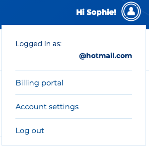
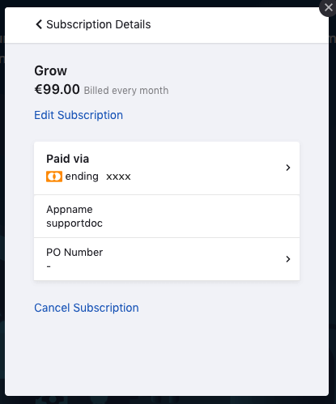
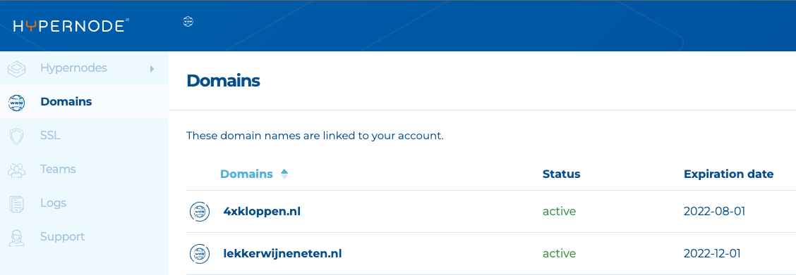
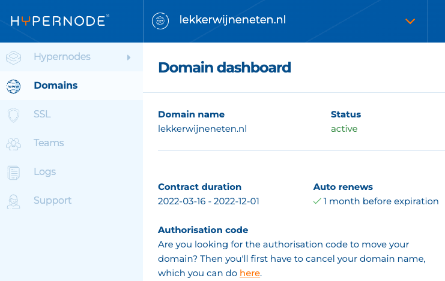

---
myst:
  html_meta:
    description: Learn how to cancel your Hypernode plan or domain in the Control
      Panel, including tips for outstanding invoices and undoing cancellations.
    title: How to Cancel Your Hypernode Plan | Hypernode
redirect_from:
  - /en/about/billing/how-to-cancel-your-hypernode-plan/
---

<!-- source: https://support.hypernode.com/en/about/billing/how-to-cancel-your-hypernode-plan/ -->

# How to Cancel Your Plan

You can cancel your subscription at any time you want. Your cancellation will be processed automatically

## How to Cancel Your Plan If You Are a Control Panel User

- Log into your Control Panel via [my.hypernode.com](http://my.hypernode.com)
- Hover over your name in the upper right corner and go to the Billing portal

- On the Billing portal, select your current plan.
- Then click on Cancel subscription.

- The next screen confirms when your subscription will end. Please submit the reason of your cancellation as your feedback is valuable to us.
- Click on Confirm cancellation to finalise your cancellation.

### Cancellation Per End Date

You can cancel your subscription at any time via your control panel. The end date of your subscription is always the first of the next month. Example: if you cancel your subscription on the 15th of June, your Hypernode will be no longer available from the 1st of July onwards.

## How to Cancel Your Domain If You Are a Control Panel User

- Log into your Control Panel via [my.hypernode.com](http://my.hypernode.com/)
- Click on **Domains** in the sidebar.

- Select the domain by clicking it which you want to cancel or transfer.
- At **Authorisation code** click on **here**.

- Confirm the cancellation for the renewal in the next screen.
- Now the cancellation is finalised.
- The authorisation code will be sent to the email address listed for the domain handle.
- The domain is available until the end date. You can transfer this domain to another party or let it expire.

## How to Cancel Your Plan If You Are a Service Panel User

### How to Cancel via the Service Panel

You can cancel your (Presence) plan immediately or at the end of the contract term. If you cancel immediately, everything will expire. Do you want to move your domain name and website? Then choose Cancel at the end of the contract date.

Hypernode plans can only be canceled immediately, so make sure that you exported everything you need from the server before you cancel.

You can cancel a domain name / plan via the Service Panel by using these steps:

1. Log in to the Service Panel.
1. Click on the relevant domain name in your domain names overview (click on 'Expand all' to display all domains).
1. Click on the 'Administratief' tab and then 'Opzeggen'.
1. Choose the method of cancellation for Presence plans; 'Immediately' or 'As per contract date'.
1. Enter your customer password and tick 'I'm sure I want to cancel'.
1. Please tell us why you canceled. Your feedback is important to us!
1. Click on the 'Complete cancellation' button after you have given feedback.

Please note:

- The cancellation for a Presence plan must be communicated 30 days before the extension of the contract.
- Unfortunately, you can't cancel plans by sending an email.

### Outstanding Invoices When Cancelling Your Plan

Outstanding invoices must be paid. Unfortunately, Hypernode cannot make exceptions to this rule. Customers can cancel or downgrade the contract immediately after payment of the invoice.

### Undoing the Cancellation of Your Presence Plan

If you have canceled a Presence plan and want to nullify this cancellation, you can do so via our Service Panel. The condition for this is that the plan hasn't been cancelled immediately, otherwise the package must be reactivated. To cancel the cancellation, follow the steps below:

1. Log in to the Service Panel.
1. Click on the relevant domain name in your domain names overview (click on 'Expand all' to display all domains).
1. Click on the 'Administrative' tab and then on Renew.
1. Check the option 'I understand that when I renew my subscription I will again agree with all financial obligations'.
1. Click on 'Renew subscription' and the cancellation is undone.

#### Undoing the Cancellation but You Cancelled Immediately?

If you have canceled immediately, you can no longer cancel your cancellation. After all, you can no longer access the package in your Service Panel. In that case, please contact our Support team as soon as possible: [support@hypernode.com](mailto:support@hypernode.com).

### How Does Hypernode Cancel My Domain Name

You never want to accidentally delete a domain name. Because this causes many problems, Hypernode will cancel your domain name in small steps. If you change your mind, we can easily undo it. Below we describe these steps for both a .NL domain name and a foreign domain name.

#### Cancelling .NL Domains

1. Hypernode will keep your domain name registered until the end of your contract
1. A week later we remove the domain from the DNS zone. Your domain is now unreachable but is still in your name.
1. A week later we will close the domain at SIDN. Your domain is now unregistered and will be quarantined.
1. After 40 days in quarantine, the domain will be released for registration again.

If your domain is in quarantine, this means that the domain is no longer accessible on the internet. Your contact information is also retrieved from the Whois. The domain can then only be registered by you again. This prevents domain hijacking. Do you want to get your domain name out of quarantine? Read how to do this on [How to Undo the Cancellation of a Domain Name](../../services/domain-procedures/how-to-undo-the-cancellation-of-a-domain-name.md) page.

#### Cancelling Foreign Domains

If you cancel a foreign domain name, Hypernode will let it expire automatically after the contract date has expired. It is therefore possible that your domain name is still available for some time after you have canceled the domain. After the domain expires, your domain may go into quarantine. In this status, only you can register the domain name again, and usually only via Hypernode. Only after the quarantine period has expired is your domain name completely free and can it be registered by everyone.

### Cancellation Policy

Hypernode plans that are managed from the Service Panel can only be canceled immediately. The Hypernode is cleaned up immediately. However, the end date of the contract is respected. For example, if the end date of your Hypernode is July 1, and you cancel your package on June 15, you pay until July 1. You will receive a credit from us for the unused period of the Hypernode that you have paid in advance. This credit is not paid out, but added to your account and settled with the next invoice.
