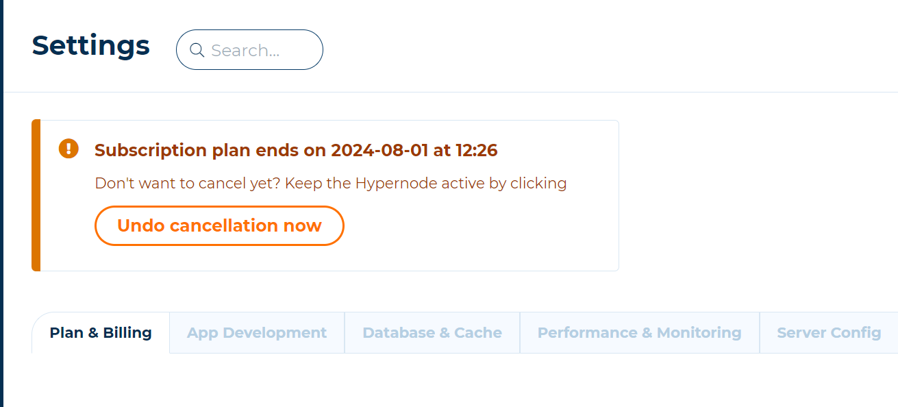
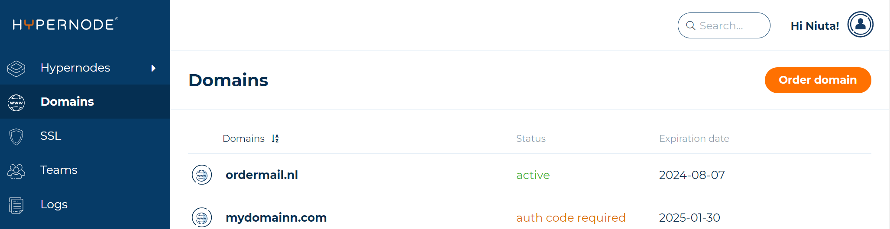
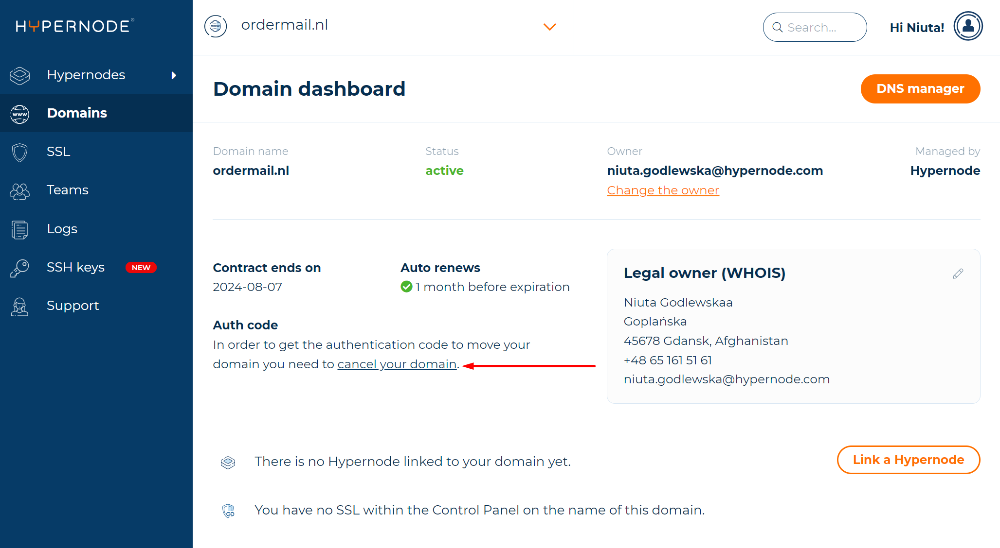

---
myst:
  html_meta:
    description: Learn how to cancel your Hypernode plan or domain in the Control
      Panel, including tips for outstanding invoices and undoing cancellations.
    title: How to Cancel Your Hypernode Plan | Hypernode
redirect_from:
  - /en/about/billing/how-to-cancel-your-hypernode-plan/
---

<!-- source: https://support.hypernode.com/en/about/billing/how-to-cancel-your-hypernode-plan/ -->

# How to Cancel Your Plan

You can cancel your subscription at any time you want. Your cancellation will be processed automatically

## How to Cancel Your Plan

- Log in to the [Control Panel](https://my.hypernode.com/).
- Go to **settings** of the Hypernode you want to cancel.
- Scroll down to **Cancel my subscription**
- The next screen confirms that your subscription will end. Please submit the reason of your cancellation as your feedback is valuable to us.
- Click on **Continue to cancellation** to confirm the ending date of your subscription.

### Cancellation Per End Date

You can cancel your subscription at any time via your Control Panel. The end date of your subscription is always the first of the next month. Example: if you cancel your subscription on the 15th of June, your Hypernode will be no longer available from the 1st of July onwards.

## How to Undo Cancel Your Plan

If you want to undo the cancellation you can do it till the end of the month after cancelling your plan. In order to cancel your cancellation follow the steps below. 
- Log in to the [Control Panel](https://my.hypernode.com/).
- Go to **settings** of the Hypernode you cancelled.
- At the top of the screen press **Undo cancellation now**
- Your subscription will be revived immediately, subscription will continue and backups won't be destroyed.

## How to Cancel Your Domain

- Log into your Control Panel via [my.hypernode.com](http://my.hypernode.com/)
- Click on **Domains** in the sidebar.

- Select the domain by clicking it which you want to cancel or transfer.
- At **Authorisation code** click on **cancel your domain**.

- Confirm the cancellation for the renewal in the next screen.
- Now the cancellation is finalised.
- The authorisation code will be sent to the email address listed for the domain handle.
- The domain is available until the end date. You can transfer this domain to another party or let it expire.

### Outstanding Invoices When Cancelling Your Plan

Outstanding invoices must be paid. Unfortunately, Hypernode cannot make exceptions to this rule. Customers can cancel or downgrade the contract immediately after payment of the invoice.

### How Does Hypernode Cancel My Domain Name

You never want to accidentally delete a domain name. Because this causes many problems, Hypernode will cancel your domain name in small steps. If you change your mind, we can easily undo it. Below we describe these steps.

#### Cancelling Foreign Domains

If you cancel a foreign domain name, Hypernode will let it expire automatically after the contract date has expired. It is therefore possible that your domain name is still available for some time after you have canceled the domain. After the domain expires, your domain may go into quarantine. In this status, only you can register the domain name again, and usually only via Hypernode. Only after the quarantine period has expired is your domain name completely free and can it be registered by everyone.
