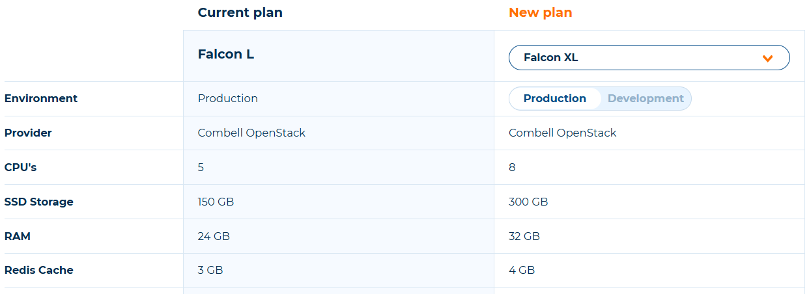

---
myst:
  html_meta:
    description: Learn how to easily upgrade or downgrade your Hypernode hosting plan
      based on your needs and usage. You only pay for what you use.
    title: Upgrade or downgrade a Hypernode Plan | Hypernode
redirect_from:
  - /en/about/billing/how-to-up-or-downgrade-your-hypernode-plan/
---

<!-- source: https://support.hypernode.com/en/about/billing/how-to-up-or-downgrade-your-hypernode-plan/ -->

# How to Up- or Downgrade Your Hypernode Plan

Many webshops deal with visitor peaks, for example during the Christmas season. Traffic generated by customers is great, but may lead to performance issues if the number of visitors is too high. We advise webshop owners to take precaution and upgrade to a bigger Hypernode with more resources in advance.

A big advantage of our Hypernode plans is that you can up- or downgrade your plan at any time! You are not bound to contract terms, you only pay for what you use.

## Up- and Downgrading Your Hosting Plan for Service Panel Users

When you log in via [service.byte.nl](https://auth.byte.nl/)please follow the steps below to up- or downgrade your hosting plan:

- Log in to the Service Panel. After logging in, you'll see a list of all your Hypernode plans.
- Click on the domain or Hypernode you want to up- or downgrade.
- Click on **Pakketbeheer**in the tab **Administratief**.
- Click on **Wijzigen**next to **Pakkettype**.
- You'll now see an overview of your current plan. Next to your current plan, you'll see the specs of the new plan in the column 'pakket'.
- After selecting the right plan in the right column, scroll down to agree with terms and conditions and click **Pakket aanpassen**. Your plan will be changed immediately.

Please note only the Contracting party or Technical Party (when they're a Hypernode partner) can change the plan.

## Up- and Downgrading Your Hosting Plan for Control Panel Users

If you log in via [my.hypernode.com](https://auth.hypernode.com/), please use the steps below to change your plan via the Control Panel:

- Log into your Control Panel via [my.hypernode.com](http://my.hypernode.com)
- There are two ways to go the **Change plan**page:
  - Go to the**Change plan** page by selecting it from the sidebar on the left. Move your mouse over **Hypernodes** to make the menu appear:
    
  - Or click **Change your plan** in the Hypernode overview:
    
- You'll now see an overview of your current plan on the left and the new plan on the right:
  
- Select the desired plan and the type of environment, Development or Production.
- Select an add-on. Read more about our two SLA levels [here](../support/emergency-support-outside-office-hours.md).
- Optional: schedule the plan change for a specific date and time.
- Agree with terms and conditions and click Change to this plan. Your plan will be changed immediately. (or on the scheduled date and time)
- Warnings, if applicable, will be shown on the left:
  

## Pay Per Day

Do you only need a larger Hypernode for a few days? No problem! You can downgrade to your original plan as soon as the larger Hypernode is no longer needed.

If you upgrade your Hypernode to a bigger plan for a single day, only 1 day will be billed. This way you can upgrade for an event, mailing or sales action without being bound to a monthly plan for the rest of the month.

Just upgrade your Hypernode plan a day in advance, run your event or sales action and as soon as the number of daily visitors has normalised again, downgrade your plan. You only pay for what you use.

If you upgrade your Hypernode plan and change it back within 2 hours, no additional cost will be incurred.

This way, if you up- or downgrade your Hypernode by mistake, you can always undo your action without extra costs.

If you want to do a quick test or ensure yourself the bigger node is big enough for your expected traffic increase, this can be done during the 2 hour reflection time.

## Recommended Checks Before an Up -or Downgrade

Up -or downgrading your hosting plan is very easy, but be aware we will automatically migrate your shop to a new (Hyper)node, resulting in some downtime and a change of IP address.

### No Change of IP Address With Dedicated IP’s – 2 Exceptions

When upgrading or downgrading a Hypernode plan, we first create a second node, migrate your shop to this new node and then remove the old one. Hypernodes have a dedicated IP, meaning the IP address of your Hypernode does not (!) change when you change a Hypernode plan. However, there are 2 exceptions.

1. Changing between Professional/Falcon, Pelican and Excellence/Eagle plans will lead to an IP change because you will change providers (e.g. Combell OpenStack to DigitalOcean to Amazon and visa versa)
1. If you request your node to be booted in a different region (datacenter) the IP address will change as well.

Right before the migration is finished, we email the technical contact the new IP address.

If you think you might switch between Professional/Falcon and Excellence/Eagle plans in the future, we recommend you to move your domain(s) to Hypernode so we can handle the DNS of your domains to avoid downtime. Or, use the DNS settings as explained in [this article](../../hypernode-platform/dns/how-to-manage-your-dns-settings-for-hypernode.md).

Make also sure to keep a list of payment providers, firewalls, local DNS servers and other services that depend on the IP address of the Hypernode, so you can quickly change the IP address if needed.

### Timing

Make sure you do not schedule up- or downgrades during peak hours and always check Magereport Premium or the command line to ensure yourself no product exports and long running crons are currently active.

Ensure yourself no mailings, TV commercials, social media advertisement and other traffic generating events are started. Always upgrade in advance!

### SSH Access During Up- and Downgrades

During the up- or downgrade we disable SSH and FTP access to avoid new file changes that are not copied to the new server.

Make sure not to add product changes, upload images, or change settings in the Magento admin backend while a migration is executed.

## How an Up- or Downgrade is Managed (Grow, Professional/Falcon S-XL and Excellence/Eagle M-XL)

Up- and downgrades are a fully automated process which consists of provisioning a completely new Hypernode of the specified size, copying the data from the old Hypernode to the new one and updating the DNS. To perform the data synchronisation, we first perform a pre-sync where we copy the data to the new node while the old node continues functioning. Up until this point nothing has changed from the perspective of the original machine.

When the complete dataset has been synced to the new instance, we stop the services on the old system to prevent new orders from coming in and then perform a second quick synchronisation to make sure that everything that has changed since the initial synchronisation is transferred as well. After that point the DNS is updated, the services are started on the new machine and the migration has been completed. After that, we decommission the old node.

Downtime depends on the size of the shop (the amount of data which needs to be synced) and the TTL of your DNS.

## How an Up- or Downgrade is Managed (Professional/Falcon 2XL and up, Excellence/Eagle 2XL and up)

As explained above, a shop occurs downtime when up-or downgrading (only during the second sync). Downtime may only be a couple of minutes for small shops, but a data sync in case of (very) large shops may take a while, resulting in longer downtime. For Professional/Falcon 2XL, 3XL, 4XL and 5XL plans (Combell OpenStack) and Excellence/Eagle 2XL, 3XL, 4XL and 5XL (Amazon) we have therefore implemented a very cool way of handling up -and downgrades, resulting in very little downtime.

Upgrades and downgrades between these plans keep the same cloud volume during x-grades instead of copying the filesystem from the old instance to the new one like before. This speeds up the data transfer step in migrations from multiple minutes (variable depending on the amount of data and rate of change on disk) to less than one minute for these specific node sizes. Details can be found in our [Hypernode Changelog](https://changelog.hypernode.com/changelog/faster-upscaling-larger-excellence-hypernodes/).
