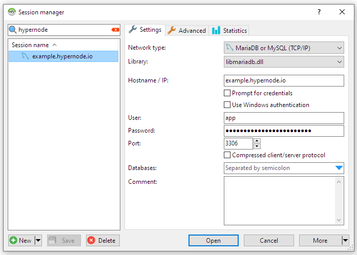

---
myst:
  html_meta:
    description: HeidiSQL is a reliable tool designed for web developers using the
      MySQL server, Microsoft SQL databases and PostgreSQL. Find here how to use it
      on Hypernode.
---

<!-- source: https://support.hypernode.com/en/best-practices/database/how-to-use-heidisql-on-hypernode/ -->

# How to use HeidiSQL on Hypernode

[HeidiSQL](http://www.heidisql.com/) is a useful and reliable tool designed for web developers. It lets you manage your database, enabling you to browse and edit data and create and edit tables, views, and databases. You can also easily export and download structure and data to a backup, SQL file, or to other servers.

HeidiSQL is a tool that runs on Windows 8 and 10. It can also be used on Linux, using *wine*.

This article will explain where to download and how to use HeidiSQL with your Hypernode.

## Download and Install HeidiSQL

First, go to the [HeidiSQL homepage](http://www.heidisql.com/download.php) and use the installer to install the latest version of HeidiSQL.

## Add your IP to the allowlist.

By default, your MySQL server is protected by a firewall. To connect remotely, you must [add your IP address to the allowlist](https://support.hypernode.com/en/hypernode/mysql/how-to-use-mysql-on-hypernode). You can find your IP address by typing in 'what is my IP' into Google.

## Configure HeidiSQL

Then configure HeidiSQL as follows:

1. Start HeidiSQL
1. Click new in the bottom-left corner
1. Choose a suitable name for your connection
1. Edit the following fields.
   1. Hostname / IP: enter your hypernode
   1. User: enter the MySQL user (Usually '*app*')
   1. Password: enter the MySQL password for the user (see .my.cnf file)
1. Leave all other fields as they are.
1. Click save in the bottom-left corner

## Create a database dump

You should consider using [Magerun](https://support.hypernode.com/knowledgebase/using-mysql-on-hypernode/#Using_Magerun), but you could use HeidiSQL to create a database dump. Please note that making a dump through HeidiSQL may generate an inconsistent backup, as data may change while your backup is created.

1. Start HeidiSQL.
1. Connect to your Hypernode.
1. Use Tools -> Export database as SQL.
1. In the left pane, choose the Magento database.
1. You can choose a filename to export to.
1. Choose appropriate options, notably data.
1. Press Export.
