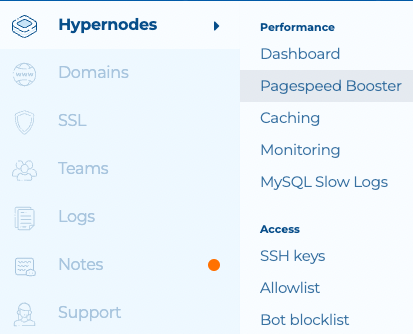
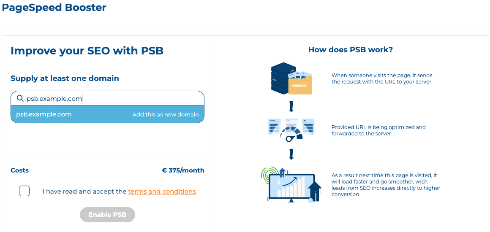
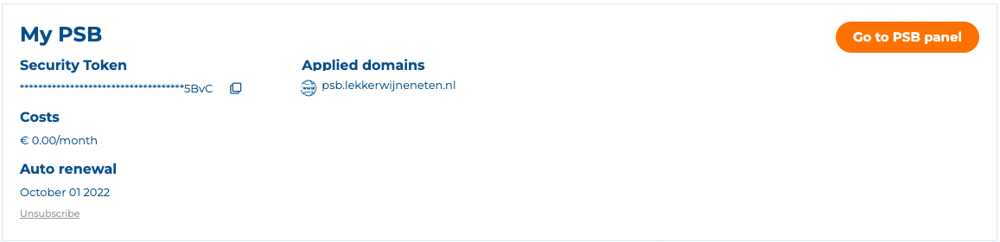
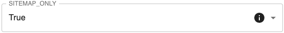
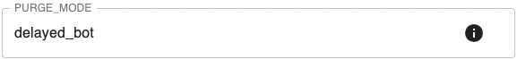
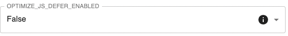
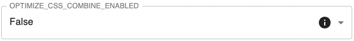
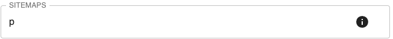
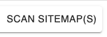

---
myst:
  html_meta:
    description: Learn how to enable PageSpeed Booster, a reverse proxy that increases
      page speed and performance on Hypernode. Requirements included.
    title: How to enable the PageSpeed Booster? | Hypernode
redirect_from:
  - /en/best-practices/performance/how-to-enable-pagespeed-booster/
---

<!-- source: https://support.hypernode.com/en/best-practices/performance/how-to-enable-pagespeed-booster/ -->

# How to Enable PageSpeed Booster

PageSpeed Booster is a reverse proxy that acts like a filter in front of your website, similar to Varnish. On pages that can be cached,
it uses many static optimisation techniques to greatly increase the page speed score and performance of your website.

This article will explain how to enable PageSpeed Booster on your Hypernode account.

Requirements

To get started with the PageSpeed Booster (formerly known as Percolate), you must meet the following requirements:

- ***A production environment that is hosted on Hypernode.***
- ***A development environment hosted on Hypernode containing a copy/mirror of the production site.***
- ***Varnish enabled on both the production and development environment.***
- ***Time to thoroughly test the environment with the PageSpeed Booster enabled.***
- ***The PageSpeed Booster implemented on your development environment according to [these steps](../../troubleshooting/performance/how-to-implement-pagespeed-booster.md#configuring-pagespeed-booster-on-your-development-environment) listed in our documentation.***

## Step 1: Getting started

### Step 1.1: Activation of the PageSpeed Booster

From the main page on your [Control Panel account](https://my.hypernode.com/) go to the "PageSpeed Booster" page under "Performance" by clicking on "Hypernodes" top left corner of your screen.

On the next page you are able to select which Hypernode Development plan you want to enable the PageSpeed Booster on. When PSB is working correctly on the Development Plan you apply these same steps to your Production plan.
On this page you can add one or multiple domains for which PSB will be enabled on. Note that both the **[www.example.com](http://www.example.com)** and the non [www](http://www). domain **example.com** must be added. We highly recommend doing extensive testing on a subdomain first before running PSB on your live webshop and domains. For example the subdomain **psb.example.com**

After adding your domain(s) and accepting the terms and conditions, your PageSpeed Booster will be booted in about a minute or two.

### Step 1.2: The PageSpeed Booster on the Control Panel

When PSB is activated your PageSpeed Booster view on the Control Panel will be changed. This will now show you on which domains PSB is applied, the renewal date, costs, as well as the Security Token. This token can be used for login on your own PSB panel.
In the top of your screen you can see the PSB CNAME record. This is where you PSB applied domains should point to. This records will look something like this:

**"appname-appname.fsn1.percolate-3.hipex.cloud**"

### Step 1.3: The PageSpeed Booster panel

The next step is to go to your own PSB panel. You can use the orange button to go there or visit your test domain, for example with our test subdomain: <https://psb.example.com/.percolate/status/> Here you will be asked to use your Security Token to get access to the PSB environment.

## Step 2: The PSB panel

The PSB panel provides all sorts of information and settings about your PageSpeed Booster. We advise the following recommend settings for new users. Go to "Settings" in the top of your screen and change these accordingly:

### Step 2.1: Recommended PSB settings

For the live webshop URL the setting **Site map only** under "General" can be turned to **True**:

For \*\*[staging.example.com](https://staging.example.com)\*\*this settings can be turned to **False**.

The setting **Purge mode** under "General" can be turned to **DELAYED_BOT**:

The setting **OPTIMIZED_DIFER_ENABLED** under "Javascript " can be turned to **FALSE**:

The setting **OPTIMIZE_CSS_COMBINE_ENABLED** under "CSS " can be turned to **FALSE**:

If you are curious what a specific setting does or means, you can click on the **i**button for additional information.

### Step 2.2: Additional recommend settings

When your webshop has a good sitemap it can be loaded into PageSpeed Booster. This can be done under the settings "General" Sitemaps:

Take note that [Cloudflare RocketLoader](https://support.cloudflare.com/hc/en-us/articles/200168056-Understanding-Rocket-Loader) is not supported by PageSpeed Booster and therefore should be disabled.

## Step 3: Implementation of the PageSpeed Booster

After following the above steps, it is now time to set up the necessary Hypernode server configuration for the PageSpeed Booster. These steps are written in our article [How to Implement PageSpeed Booster](../../troubleshooting/performance/how-to-implement-pagespeed-booster.md). It is recommended to implement and use PSB first on your Development Hypernode and subdomain setup for PSB testing.

The steps include:

- Configuring PageSpeed Booster on your Development Environment
- Configure SSL and DNS
- Configuring Varnish
- Modifying your Varnish VCL configuration
- Add the user agent **PSB**to the [allowlist for the ratelimiter](../../hypernode-platform/nginx/how-to-resolve-rate-limited-requests-429-too-many-requests.md#whitelisting-additional-user-agents) in `~/nginx/http.ratelimit` file
- Turn off ESI Block Parsing
- Add PageSpeed Booster as Flush Target

## Step 4: Testing of PageSpeed Booster

### Step 4.1: Run PSB and monitor the queue

Go to the PSB panel and open your queue, for our example it is this URL <https://psb.example.com/.percolate/status/queue>. For the Development Hypernode there is 1 available worker for the web page optimization.
For the Production Hypernode there are 4 workers.
The optimization queue will run when pages are visited or when you scan the available **sitemap**(**s**). The button is in the top left of your PSB panel:

### Step 4.2: Reading out the PSB queue

When the PageSpeed booster tries to optimize your webshop, there are three different situations:

- **Optimized** The page is optimized by the PageSpeed Booster.
- **Failed-retry** The page could not be optimized by the PageSpeed Booster, but you can run a retry.
- **Failed** Because of an error within the page, the PageSpeed booster could not optimize the page. The most common cause for this failed optimization is a **parse**error.

## Step 5: Troubleshooting PSB

Keep in mind that PageSpeed Booster is a complex tool that require a lot of testing before it can be pushed to the live site. For example, it is possible that your site has errors in the HTML/CSS code. The PageSpeed Booster will find these errors, and they have to be fixed for the PageSpeed Booster to work correctly. We have created a separate documentation article were we will list some of the more common errors we have seen and how to fix them.
