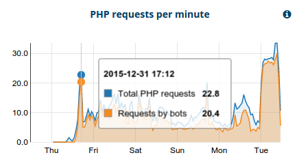

---
myst:
  html_meta:
    description: Learn by understanding bot traffic and layering navigation, and following
      the four recommended measures to resolve the issue for better performance and
      SEO.
    title: Fix performance issues caused by bots and crawlers | Hypernode
redirect_from:
  - /en/best-practices/performance/how-to-fix-performance-issues-caused-by-bots-and-crawlers/
  - /knowledgebase/fixing-bad-performance-caused-by-search-engines/
---

<!-- source: https://support.hypernode.com/en/best-practices/performance/how-to-fix-performance-issues-caused-by-bots-and-crawlers/ -->

# How to Fix Performance Issues Caused by Bots and Crawlers

First: do you have a problem? Generally, performance for regular shop visitors might be affected if you have more than 10 bot pageviews per minute or bot traffic exceeds 50% of total pageviews. [MageReport Premium](https://www.magereport.com) offers a handy graph that displays the summary of live bot traffic. When your shop has at least 1600 PHP requests in one day and 30% of those are bots, the bot traffic check in MageReport comes out red.

Among the thousands of shops on our platform, **excessive bot traffic is the number one reason for bad Magento performance**. Often, bots get stuck in the layered navigation feature of Magento. This causes the bot to crawl every combination of every product in combination with other parameters and is now creating millions of URLs to index. Every single page needs to be generated, which will cost a lot of resources.

Layered navigation pages do not require crawling, and in fact, their indexation could **produce a penalty** for your search engine ranking, as it produces a lot of duplicate content. So you are advised to resolve this, both for performance and SEO reasons.

With these four measures, you will resolve this situation completely.

# How to Block Abusive Bots (If Any)

If MageReport says you are high on bot traffic, log in to your Hypernode to determine which bots are hammering your shop. This command will show you the top 10 bots that visited your site yesterday:

```bash
$ pnl --yesterday --php --bots --fields ua | sort | uniq -c | sort -n
[...snip...]
1902 Mozilla/5.0 (compatible; Googlebot/2.1; +http://www.google.com/bot.html)
3796 Mozilla/5.0 (compatible; bingbot/2.0; +http://www.bing.com/bingbot.htm)
12813 Mozilla/5.0 (compatible; MegaIndex.ru/2.0; +http://megaindex.com/crawler)

```

In this example, there were almost 4K Bingbot pageviews, 2K Google pageviews and almost 13K MegaIndex pageviews. So you could eliminate a large chunk of load by blocking MegaIndex (a shady crawler whose benefits to you are disputable). [Here](../../hypernode-platform/nginx/how-to-block-user-agents-and-referrer-sites.md) are instructions on blocking specific bots on Hypernode.

# How to Block Bot Access to Layered Navigation

You can block bots that don’t respect the robots.txt, using a webserver configuration file. This is a very effective way, but it takes some tuning to get it right. First, you need to determine the URLs that identify layered navigation. This differs for several navigation extensions, but you can easily figure it out. Log in to your Hypernode and run this command:

```bash
$ pnl --today --bots --php --fields req,ua

```

This will give you a long list of requests and user agents, for example:

```nginx
GET /clothing.html?size=412_286 HTTP/1.1 Mozilla/5.0 (compatible; BLEXBot/1.0; +http://webmeup-crawler.com/)
GET /clothing/pants.html?color=1181_1188_1500 HTTP/1.1 Mozilla/5.0 (compatible; bingbot/2.0; +http://www.bing.com/bingbot.htm)

```

It is clear that the “size” and “color” parameters are used for layered navigation, because they define subsets of your catalogue. For normal indexing, you only want /clothing.html and /clothing/pants.html indexed. To block bots in this case, you should add this to `/data/web/nginx/server.layered_navigation:`

```nginx
if ($http_user_agent ~* 'http|bot|crawl|spider') {
set $is_bot 1;
}
# Here, you should define the layered navigation urls.
# You should use your own filter keywords here
if ($request_uri ~ 'color=|size=|mode=list|dir=desc|dir=asc') {
set $layered_navigation 1;
}
set $bot_and_layered "$is_bot$layered_navigation";
if ($bot_and_layered = '11') {
return 410; # HTTP GONE tells search engines to drop this URLs from the index
}

```

This should have an immediate benefit on your capacity. Use this command to monitor live requests. All bot traffic should get a 410 status code:

```bash
$ tal | pnl --fields status,req,ua
410 GET /clothing.html?size=412_286 HTTP/1.1 Mozilla/5.0 (compatible; BLEXBot/1.0; +http://webmeup-crawler.com/)
410 GET /clothing/pants.html?color=1181_1188_1500 HTTP/1.1 Mozilla/5.0 (compatible; bingbot/2.0; +http://www.bing.com/bingbot.htm)

```

# How to Educate Bots Using Robots.txt

Legitimate bots will honor instructions from your robots.txt. However, it will take some time before crawlers notice the changes from this file. An example robots.txt for Magento on Hypernode van be found [here](https://gist.github.com/gwillem/feeada60fb6b4ebc5c3f).

# How to Implement "nofollow" in Layered Navigation Links

Make sure all URLs in the layered navigation have “nofollow” in its links. How to implement this can be found [here](https://www.byte.nl/blog/reduce-magento-resources-using-meta-tag-robots/). Just as with robots.txt, it will take some time before crawlers detect the changes. Moreover, this only works for URLs that are not indexed yet.

# Additional Information

- [How to Block Specific Countries From Accessing Your Shop](../../hypernode-platform/nginx/how-to-block-your-webshop-for-specific-countries.md)
- [How to Resolve 429 Too Many Requests](../../hypernode-platform/nginx/how-to-resolve-rate-limited-requests-429-too-many-requests.md)
