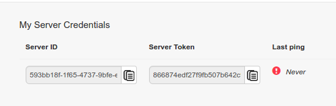

---
myst:
  html_meta:
    description: All Hypernodes support Blackfire, an amazing tool to find performance
      bottlenecks in Magento. It is similar to New Relic, but suited for troubleshooting.
    title: Use Blackfire on Hypernode to find performance issues
redirect_from:
  - /en/best-practices/performance/how-to-use-blackfire-on-hypernode-to-find-performance-issues/
  - /knowledgebase/profiling-magento-blackfire/
---

<!-- source: https://support.hypernode.com/en/best-practices/performance/how-to-use-blackfire-on-hypernode-to-find-performance-issues/ -->

# How to Use Blackfire on Hypernode to Find Performance Issues

All Hypernodes support Blackfire, an amazing tool to find performance bottlenecks in Magento. It is similar to New Relic, but much better suited for troubleshooting.

**Hypernode customers can get a 20% discount on the Premium plan. Contact**[**support@hypernode.com**](mailto:support@hypernode.com)**for a coupon code.**

## How to Activate Blackfire

First, signup for an account. Start with the free version, which includes a wealth of information. In your account tab, you will see this:



## Activate via the hypernode-systemctl tool

You can activate Blackfire via the hypernode-systemctl tool. First you need to enable it, then add your Server ID and Server Token.

- `hypernode-systemctl settings blackfire_enabled`: boolean - Indicates whether Blackfire is enabled on your node.
- `hypernode-systemctl settings blackfire_server_id`: string - The Blackfire Service ID for your Blackfire setup.
- `hypernode-systemctl settings blackfire_server_token`: string - The Blackfire Server Token for your Blackfire setup.

## Activate via Your Control Panel

1. Log in on the [Control Panel](https://auth.hypernode.com)
1. Select your Hypernode (example.hypernode.io) and click **Details**
1. Hover over **Hypernodes**in the sidebar and select **Monitoring**
1. Click the **Blackfire** tab
1. Enter your Blackfire Server ID and Blackfire Server Token and click **Save**.
1. Now select **Enable Blackfire** to enable Blackfire

## **Please take into account that it takes a most 10 minutes for our system to actually create the account. Grab a cup of coffee and relax!**

## Activate via Your Service Panel

1. Log in to your [Service Panel](https://auth.byte.nl/login/)
1. Select the Hypernode from the overview
1. Go to **Instellingen**and then **Blackfire**
1. Select **Enable**, enter your Service ID and Server Token
1. Save your input by clicking **Opslaan.**

**Please take into account that it takes a most 10 minutes for our system to actually create the account. Grab a cup of coffee and relax!**

## How Is It Different From New Relic?

New Relic is an Application Performance Monitoring utility. It is made to track real traffic, and to provide alerts and a first level of insight to business managers and developers. Analyzing the performance of an application’s code requires to instrument the code, which generates an overhead.

The more precise data is gathered, the slowest the app gets.

Therefore, analyzing all of the traffic makes it impossible to get pin-point information on the code’s resources consumption.

Blackfire works in a very different manner, and is therefore very complementary. End users requests are not instrumented; only the requests triggered by the developer or tool requiring performance information are. Blackfire’s profiling technology thereby provides and unequaled code introspection, and enables developers to understand the behavior of their code and identify optimization possibilities very fast. Blackfire is usable in production, just like New Relic, but provides an even better value-add in development in staging, through the use of performance tests, which proactively validate the code, before any go-live.

For more information, check [the Blackfire documentation](https://blackfire.io/docs).

## Using Blackfire With Varnish

If you want to use Varnish in combination with Blackfire, some additional configuration in your VCL is required like described on the website of [Blackfire](https://blackfire.io/docs/integrations/proxies/varnish). This is quite an expert level change and requires enough experience with varnish to manually edit your VCL. Do note the "Authorized IPs" section on top of the following snippet. If you don't add the correct IP you will get an error:

"*Are you authorized to profile this page? No probe response, missing PHP extension or invalid signature for relaying agent.*"

```vcl
acl profile {
   # Authorized IPs, add your own IPs from which you want to profile.
   "x.y.z.w";

   # Add the Blackfire.io IPs when using builds:
   # Ref https://blackfire.io/docs/reference-guide/faq#how-should-i-configure-my-firewall-to-let-blackfire-access-my-apps
   "46.51.168.2";
   "54.75.240.245";
}

sub vcl_recv {
  if (req.esi_level > 0) {
    # ESI request should not be included in the profile.
    # Instead you should profile them separately, each one
    # in their dedicated profile.
    # Removing the Blackfire header avoids to trigger the profiling.
    # Not returning let it go trough your usual workflow as a regular
    # ESI request without distinction.
    unset req.http.X-Blackfire-Query;
  }

  # If it's a Blackfire query and the client is authorized,
  # just pass directly to the application.
  if (req.http.X-Blackfire-Query && client.ip ~ profile) {
    return (pass);
  }
}
```

You can find the extended instructions in [the Blackfire documentation](https://blackfire.io/docs/reference-guide/configuration)

## Profiling Simple HTTP Requests

Profiling an HTTP request can be done on the command line thanks to the blackfire utility. The easiest way to profile an HTTP request is to use the curl sub-command of the blackfire utility. You can run this command on the command line of your Hypernode.

```
blackfire curl http://example.com/
```

\*\*\*\*\*If you'd like to profile an HTTP request via the CLI on your Hypernode, make sure to whitelist `127.0.0.1`in your .vcl.

Also please note that you can only profile live applications with a paid plan of Blackfire, for more info click [here](https://support.blackfire.io/en/articles/1455348-hack-edition-users-cannot-profile-non-local-http-applications).
