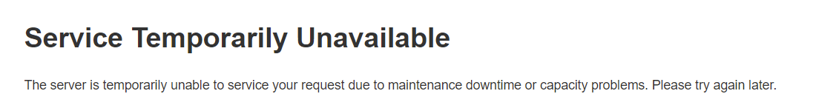

---
myst:
  html_meta:
    description: You have copied your shop to Hypernode and tested its functionality.
      Now is the time to go live with your Hypernode. Follow these steps!
    title: How to go live with your Hypernode? | Testing
redirect_from:
  - /en/best-practices/testing/how-to-go-live-with-your-hypernode/
  - /knowledgebase/go-live-with-your-hypernode/
---

<!-- source: https://support.hypernode.com/en/best-practices/testing/how-to-go-live-with-your-hypernode/ -->

# How to Go Live With Your Hypernode

You have copied your shop to Hypernode and tested its functionality. Now is the time to go live with your Hypernode. Follow these steps for a a smooth transition.

## Prerequisites

- You have verified that your site runs properly on Hypernode, including redirects, password protected areas, etc.
- You have access to the DNS settings of the domains for all your storefronts.
- You have lowered the DNS TTL for these DNS records (300 seconds is a good value).
- Check which domains will need to be configured by listing the base URLs. (Magento1: `‘magerun sys:store:config:base-url:list/` Magento2: `magerun2 sys:store:config:base-url:list`)
- You have checked whether there are external dependencies on your shop’s IP address (for example, external suppliers who need your IP for their firewall. Bol.com is a known example).

## Step 1: Put the Site on Your Old Host Into Maintenance Mode

This will prevent data being changed while performing a last synchronization to Hypernode. Maintenance mode can easily be activated by placing a file called `maintenance.flag` in the top Magento folder on your old host. (`touch maintenance.flag`) for Magento 1. Instead of placing a maintenance.flag file in the webroot, Magento 2 looks for a .maintenance.flag file in the var/ directory.

To do this, log in on your Hypernode, and create the maintenance flag:

```nginx
touch /data/web/magento2/var/.maintenance.flag
```

If you site is set to maintenance mode **ON**, an error message will be shown to all visitors of your site:



## Step 2: Synchronize Database and Files

Final synchronisation of files and database, using the Hypernode importer on Hypernode:

```nginx
hypernode-importer --host ssh.yourdomain.com --user yourdomain.com --path yourdomain.com
```

The importer will **overwrite** any local modifications made to `local.xml` or `fpc.xml` configuration files, so if you have made custom modifications (Redis config for example) between `hypernode-importer` runs, you should make a backup of these files.

If you have custom changes that need to be made to the site after copying to make it run on Hypernode, now is the time to apply them.

## Step 3: Take Old Site out of Maintenance Mode (Optional)

If you want to keep maintenance time low at the cost temporarily serving a slow site, you can change the configuration of the old site to use the new database. This step can be safely skipped.

Configuration can be taken from the new `local.xml`, but this will typically just involve changing the database host to `mysqlmaster.myapp.hypernode.io`.

After reconfiguring the database, you can take the site out of maintenance mode by removing the maintenance flag. (`rm maintenance.flag`)

Note: from now on, database changes (orders) will be written to Hypernode, but not file changes. At this stage, do not upload new media (products) in the old Magento backend.

## Step 4: Take Hypernode out of Maintenance Mode

Remove the maintenance flag on the Hypernode, so customers accessing the new site won’t hit the maintenance page.

## Step 5: Change Your Base URL to Include WWW

Only if you use Hypernode’s WWW-redirection service, ensure that the base URL of your shop starts with [www](http://www). or a subdomain such as shop. Otherwise, your visitors will bounce back and forth between the redirection service and the Hypernode.

## Step 6: Flush Magento Cache on Hypernode

Flush the cache of Magento on the Hypernode. (`magerun cache:flush`)

## Step 7: Set up Hypernode Managed Vhosts

The Hypernode Managed Vhosts (HMV) system is currently enabled by default on all new booted Hypernodes (all Hypernodes created after 01-05-2020).

Check if you have HMV enabled by running this command:

`hypernode-systemctl settings managed_vhosts_enabled`

If so, it will give the following output:

`managed_vhosts_enabled is set to value True`

If this is not enabled, skip the part below.

Due to this configuration it is required to add a new vhost for every domain you want to link to your Hypernode. So you need to configure your DNS correctly and add a new vhost for the domain.

To add a new vhost, for example the domainname [www.example.com](http://www.example.com), to your configuration, you can simply run the command `hypernode-manage-vhosts www.example.com`. This will create a new vhost configuration in `/data/web/nginx/www.example.com/`, using the Magento 2 template.

Please note that defining the vhosts '[www.example.com](http://www.example.com)', does not automatically add 'example.com' as a vhost. You will have to manually define a vhost for this. Since most people simply want their 'example.com' to redirect to '[www.example.com](http://www.example.com)', you can simply use the `--type wwwizer` argument to set this up. This will configure the vhost to redirect all traffic to the www-version of the domain.

Read more about Hypernode Managed Vhosts in [this article](../../hypernode-platform/nginx/hypernode-managed-vhosts.md).

## Step 8: Change DNS Records

### Web Records

See our manual on configuring DNS for more information. As the DNS changes are propagated, traffic will go to your Hypernode.

There are 3 ways to handle your DNS. Only customers who have access to the Service Panel (service.byte.nl) can choose option 1.

1. Move your domain(s) to Hypernode and let Hypernode  manage the DNS (Dutch customers only).
1. Manage an external DNS by pointing your domain(s) to Hypernode by using CNAME and not A record.
1. Manage an external DNS by pointing your domain(s) to the IP-address of Hypernode via A record.

Good to know:

\*Option 1 and 2 will prevent DNS downtime.

*Option 2 has an important disadvantage: your cannot use SSL in combination with your naked domain. People that directly visit <https://yourdomain.com/>, will get a certificate warning from the browser.*

*Option 3 is the best option in case of an external DNS and you want to make use of <https://yourdomain.com/>, but you will encounter DNS downtime if the IP address of your Hypernode changes.*

As there are situations you cannot benefit from a dedicated IP on Hypernode, please decide for yourself what is the best way to handle DNS. Our recommendation is always to move your domains to Hypernode if possible.

### Setting up DNS records to send mail from your Hypernode

Please follow [this article](../../hypernode-platform/email/how-to-set-up-your-dns-for-outgoing-email.md) on how to setup your DNS to send mail from your Hypernode.

Note that **4**different DNS records have to added or adjusted.

### SPF Records (For Experts)

If you have previously configured SPF, you should also update your the SPF policy. You should include `spf.appname.hypernode.io` for all domains you choose to send mail from using Hypernode.

The following example allows mail from both your mail exchangers and all your Hypernode nodes:

```nginx
mydomain.com TXT v=spf1 mx:mydomain.com include:spf.appname.hypernode.io ~all
```

For more information have a look at [our article about SPF records](../../hypernode-platform/dns/how-to-set-up-your-spf-records-for-hypernode.md).

## Step 9: Configure SSL

Enable SSL for your shop for safety and to improve search engine optimisation.

You can find a detailed how-to in [this article](../../hypernode-platform/nginx/how-to-configure-your-shop-to-only-use-https.md) about configuring SSL on your shop.

## Step 10: Configure Cron

Configure cron jobs to run on your Hypernode (`crontab -e`), and configure them not to run on your old host (`crontab -ir`).

Note that the time on Hypernode is configured to UTC, so the times used in the crontab are one or two hours later than Central European Time. More information about cronjobs can be found in [Configure Cronjobs on Hypernode](../../hypernode-platform/tools/how-to-use-periodic-tasks-cronjobs-on-hypernode.md).

## Step 11: Configure Backups on Hypernode (Optional)

For Hypernode Pelican, Falcon S (or up) and Eagle hosting plans free backups are available. If you need a backup, contact us via support@hypernode.com. Hypernode Pelican S and Falcon XS (used to be Grow) plans do not have free backups included, but we can make one available for 25 euros excl VAT per backup.

## Downgrade or Cancel Your Previous Plan

Now your shop is live on Hypernode, you can cancel your previous hosting plan.
