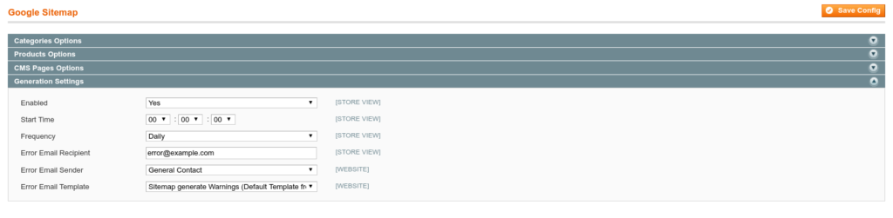
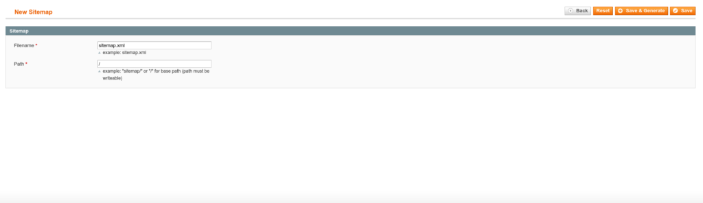
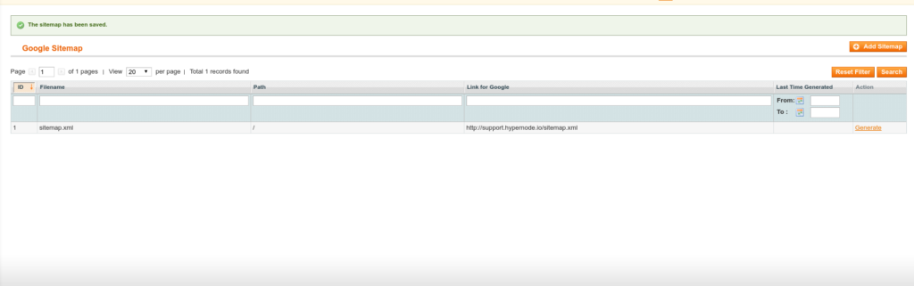

---
myst:
  html_meta:
    description: This article explains how to enable a sitemap.xml in Magento 1 and
      how to configure NGINX to Use the Same Sitemap for All Storefronts.
    title: How to create a sitemap xml for Magento 1? | Hypernode
redirect_from:
  - /en/ecommerce/magento-1/how-to-create-a-sitemap-xml-for-magento-1-x/
---

<!-- source: https://support.hypernode.com/en/ecommerce/magento-1/how-to-create-a-sitemap-xml-for-magento-1-x/ -->

# How to Create a Sitemap.xml for Magento 1.x

## Enable sitemap.xml in Magento

### Configure Magento to Create Sitemaps

- To enable sitemaps inside Magento, log in to your admin
- Make sure your [crontab is working properly](../../hypernode-platform/tools/how-to-use-periodic-tasks-cronjobs-on-hypernode.md)
- Navigate to `System` > `Configuration` > `Catalog` > `Google Sitemap` > `Generation Settings`

Now fill in the information:



### Create a sitemap.xml in Magento

When the generation of sitemaps is enabled in the catalog settings, we should make sure a sitemap.xml is created.

- Navigate to `Catalog` > `Google Sitemap` > `Add Sitemap`
- Add a sitemap.xml file to the configuration:



*If you use only one sitemap for all storefronts, just use `/` as path. If you want to use multiple sitemap.xml files depending on your storefront create a `sitemap` directory in `/data/web/public`, a directory named after each storefront to save each sitemap.xml on a different location.*

### Generate the Sitemap Manually

After adding a sitemap to the Magento configuration, we'll make sure the sitemap exists by clicking the `generate` button on the far right of the page:



## Configure Nginx to Use the Same Sitemap for All Storefronts

There is no additional configuration needed for Nginx when you use one sitemap for all storefronts. As there is only one sitemap.xml, Google and other search engines, will use the same sitemap for all sites.

## Configure Nginx to Use a Sitemap.xml per Storefront

When you want to use a different sitemap per storefront some additional configuration will be required:

- Make sure there is no sitemap in `/data/web/public/sitemap.xml` to avoid an incorrect sitemap to be served (change the location of the sitemap.xml in Magento from `/sitemap.xml` to `/sitemaps/$storecode/sitemap.xml` where `$storecode` is the name of your storefront)

- Create a sitemap directory and a directory for your storefront:

  ```bash
  for CODE in $(n98-magerun sys:store:list --format csv | sed 1d | cut -d "," -f 2 )
  do
  mkdir -p /data/web/public/sitemaps/$CODE
  done
  ```

- Create an Nginx include as `/data/web/nginx/server.sitemap` to route all requests to sitemap.xml to the given store:

  ```nginx
  location /sitemap.xml {
      rewrite ^/sitemap\.xml$ /sitemaps/$storecode/sitemap.xml;
  }
  ```

- Now test your sitemap by requesting and verify whether the right sitemap is served:

  ```bash
  curl -v https://www.example.com/sitemap.xml
  ```

## Alternative Configurations

### Configure Nginx to Serve a Sitemap.xml Outside the Public Directory

In case the sitemap.xml is created outside the public webroot (`/data/web/public/`), you can't use a rewrite construction to serve your sitemap as the file is not public accessible. To circumvent this, you can use the [Nginx `alias` feature](http://nginx.org/en/docs/http/ngx_http_core_module.html#alias) to create an alias to a file outside the public webroot:

```nginx
location /sitemap.xml {
    alias /data/web/magento/sitemap.xml;
}
```

### Configure Sitemaps When Storecode to URL is Enabled

Use the following configuration if storecode to URL is enabled in your webshop and no `$storecode` variable is set:

```nginx
location ~ .+/sitemap.xml {
    rewrite ^/([^/]+)/sitemap\.xml$ /sitemaps/$1/sitemap.xml;
}
```

## Add Your Sitemap Location to Your Robots.txt

When you can successfully request your sitemap.xml, add it to your `robots.txt`:

```bash
Sitemap: http://www.example.com/sitemap.xml
```

## Troubleshooting

We've seen one or two special cases where creating a sitemap was extremely slow. This was caused by some queries that sometimes took 10 minutes (!) to complete. In this very specific case the solution was to enable `use_index_extensions` in mysql. To do this, add `SET SESSION optimizer_switch='use_index_extensions=on'` to the mysql `initStatements` in your `local.xml`:

```xml
<connection>
    <host><![CDATA[mysqlmaster]]></host>
     <username><![CDATA[app]]></username>
     <password><![CDATA[somepass]]></password>
     <dbname><![CDATA[magento_db]]></dbname>
     <initStatements><![CDATA[SET NAMES utf8; SET SESSION optimizer_switch='use_index_extensions=on';]]><initStatements>
     <model><![CDATA[mysql4]]></model>
     <type><![CDATA[pdo_mysql]]></type>
     <pdoType><![CDATA[]]></pdoType>
     <active>1</active>
 </connection>
```

## Additional Links

There is lots of information about setting up and pushing your sitemap to Google and other search indexes. See:

- <http://alanstorm.com/generating_google_sitemaps_in_magento>
- <http://www.aschroder.com/2010/01/sitemap-submit-magento-extension-to-submit-your-google-sitemap/>
- <https://support.google.com/webmasters/answer/183669?hl=en&topic=8476&ctx=topic>
