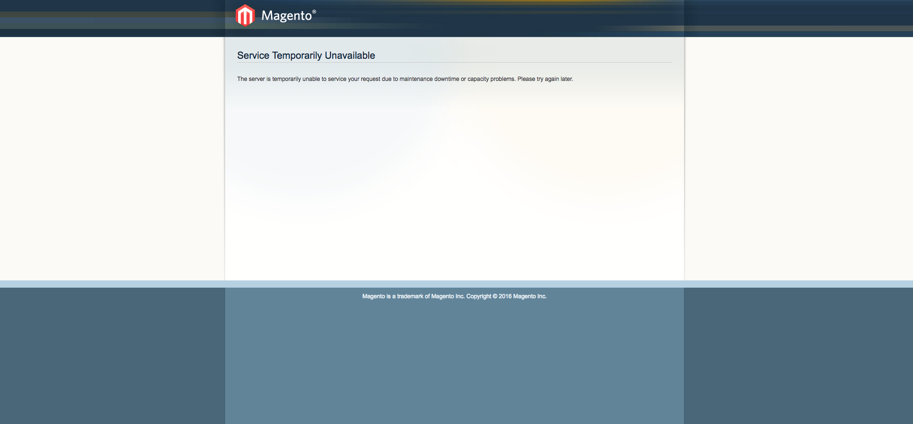

---
myst:
  html_meta:
    description: Shop owners want to perform upgrades, install extensions or do the
      necessary maintenance on a shop. For this you use Maintenance Mode in Magento
      1.
    title: How to enable maintenance mode in Magento 1? | Hypernode
redirect_from:
  - /en/ecommerce/magento-1/how-to-enable-the-maintenance-mode-in-magento-1/
---

<!-- source: https://support.hypernode.com/en/ecommerce/magento-1/how-to-enable-the-maintenance-mode-in-magento-1/ -->

# How to Enable the Maintenance Mode in Magento 1

Maintenance mode is a shortcut to serve a temporary error notification to all customers that are visiting your shop informing them to come back at a later time, as it is currently not possible to place an order.

Periodically shop owners and maintainers want to perform upgrades, install extensions or do the necessary maintenance on a shop.

To do this in a secure manner, without customers being able to placing orders that get lost during the operation, maintenance mode is available on your Magento shop.

## Enable Maintenance Mode for Magento 1

### Enable the Maintenance Mode in Magento 1 by Setting the maintenance.flag

To put your Magento installation in maintenance mode, you can create a `maintenance.flag` file inside the web root (`/data/web/public/maintenance.flag`).

Alternatively you can use `n98-magerun` to do this for you:

```
n98-magerun sys:maintenance
```

This will switch the maintenance mode from ON to OFF or from OFF to ON.

If you site is set to maintenance mode ON, an error message will be shown to all visitors of your site:



### Allow a Developer Access to a Magento Installation in Maintenance Mode

With Magento 1, if your shop is in maintenance mode, it is not accessible at all for anyone visiting your shop.

This can be a bit of a hassle in case your developer needs access to the Magento backend.

To circumvent this, open the index.php in your favourite editor and change the following statement:

```
if (file_exists($maintenanceFile)) {
    include_once dirname(__FILE__) . '/errors/503.php';
    exit;
}
```

To:

```
$ip = $_SERVER['REMOTE_ADDR'];
$allowed_ips = array('1.2.3.4', '3.4.5.6'); // Change the IPs 1.2.3.4 and 2.3.4.5 to the IP addresses of the developers that should have access while in maintenance mode.

if (file_exists($maintenanceFile) && !in_array ($ip, $allowed_ips)) {
    include_once dirname(__FILE__) . '/errors/503.php';
    exit;
}
```

## Serve a Custom Error Message When in Maintenance Mode

To serve the error page in your own style, we should add some layout files in the directory from where error pages are served.

For Magento 1 this directory is `/data/web/public/errors`.

A default selection of static files used for error pages is already present in the default directory.

It is not recommended to change files in the default directory as this can cause errors when later security patches need to change the core error files. Therefore, to change the styling or your own error page, first copy the default directory to another directory:

Magento 1:

```
cd /data/web/public/errors
cp -rv default custom/
```

Next copy the local.xml.sample to local.xml:

```
cp local.xml.sample local.xml
```

Now change `<skin>default</skin>` to `<skin>custom</skin>`; in both `local.xml` and `design.xml` to activate the custom skin we just created:

```
editor local.xml design.xml
```

After this change, the static content for error pages is served from `/errors/custom` rather than from `/errors/default`.

*You can now start designing and adjust the custom error files to your preferences by changing the files in the `custom/` directory.*
