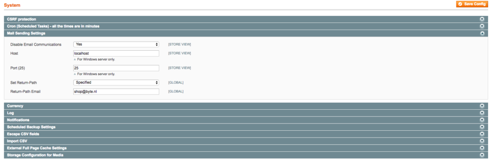

---
myst:
  html_meta:
    description: To avoid outgoing email being detected as spam in Magento 1, you
      should change the email return-path for your outgoing email to a valid email
      address.
    title: How to set the return path for Magento 1? | Hypernode
redirect_from:
  - /en/ecommerce/magento-1/how-to-set-the-return-path-for-a-magento-1-shop/
---

<!-- source: https://support.hypernode.com/en/ecommerce/magento-1/how-to-set-the-return-path-for-a-magento-1-shop/ -->

# How to Set the Return-Path For a Magento 1 Shop

When you send emails from your Magento shop with no return-path set, the return-path will default to noreply@hypernode.io. This email address may be recognised as a spam address by spam filters, as it is a very generic email used on all Hypernodes with the same email configuration.

To avoid outgoing email being detected as spam, you should change the email return-path for your outgoing email to a valid email address (e.g. sales@example.tld) which can be managed with your own SPF settings.

If the recipient is using SAV (Sender Address Verification), and the e-mail address is not reachable, or the SPF record does not match the email source, a spamfilter could see this as a spam message.

## Change Your Return-Path

Every email has two senders. The first sender is the From line that is seen in the mailclient as the recipient. The other is the Return-Path. The latter address is used for errors (bounces) to control the delivery of the mail to the sender.

## Set the Return-Path For a Magento 1 Shop

To set the return-path for your Magento 1 shop, log in on the admin panel and follow the instructions:

- Login to your Magento admin panel.
- Navigate to System > Configuration in the top navigation panel.
- In the left navigation panel, select System, and select Mail Sending Settings in the dropdown:

- Change Set Return-Path to “specified”.
- In the Return-Path Email field, set a valid email address.
- Click Save Config to save the changes.
