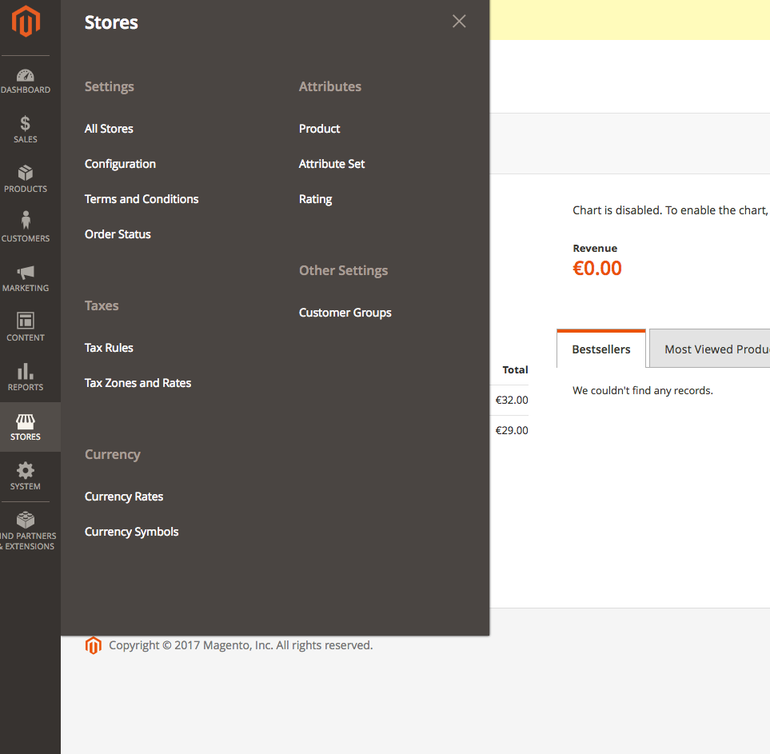
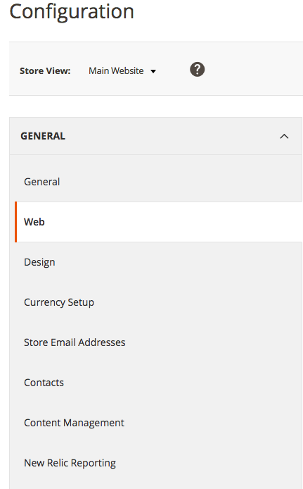
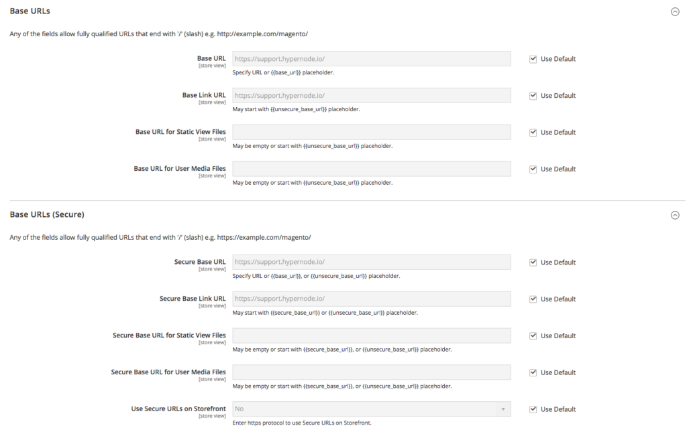
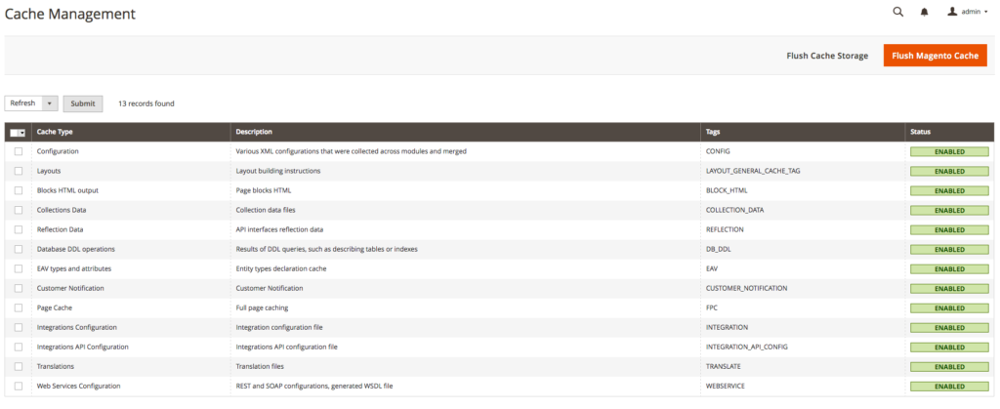
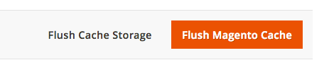

---
myst:
  html_meta:
    description: There are several ways to change the Base URL of your Magento 2.x
      storefronts. In this article we provide you with instructions for each of these
      ways.
    title: How to change the base url in Magento 2? | Hypernode
redirect_from:
  - /en/ecommerce/magento-2/how-to-change-your-magento-2-base-urls/
---

<!-- source: https://support.hypernode.com/en/ecommerce/magento-2/how-to-change-your-magento-2-base-urls/ -->

# How to Change Your Magento 2 Base URLs

There are several ways to configure the `base_url` settings of your Magento 2 shop.

`note:` When you have an SSL certificate and use the secure base URL you should change the unsecure base URLs to HTTPS as well. This could result in conflicts when you leave this on HTTP.

## Configuring Your Base URLs Over the Web

### Configure Your Base URLs in the Magento 2 Admin

To configure your base URLs from within Magento 2, first login to your Magento admin area.

From the top navigation bar, select `Stores` -> `Configuration`:



From the configuration menu, select `General` -> `Web`:



Open the `secure` and `unsecure` dropdown sections from the page:



Now, insert the correct URL configuration in the `base_url` input box and click on `Save Config.`After saving your adjusted base URLs config, navigate to `System` -> `Cache Management`:



To clear your caches, click the big orange button at the top of the page:



### Configure Your Base URLs Using PHPmyAdmin

As changing the base URLs using PHPmyAdmin works the same for both Magento 1 and Magento 2, take a look at [the Magento 1 article about changing base URLs](../../ecommerce-applications/magento-1/how-to-change-the-base-url-in-magento-1-x.md#change-the-base-url-via-phpmyadmin).

## Configuring Your Base URLs Using SSH

### Change Base URLs Settings With MySQL From the Command Line

To change your base URLs using plain MySQL queries, you can use exactly the same commands as described in [the Magento 1 article](../../ecommerce-applications/magento-1/how-to-change-the-base-url-in-magento-1-x.md#change-the-base-urls-directly-in-mysql-from-the-commandline).

### Change Your Base URL Using n98-magerun2

Changing your base URLs using `n98-magerun2` on Magento 2 is yet not as easy as with Magento 2 as there are no plugins yet to provide this functionality.

Therefor we use the `config:store:set` functionality in `n98-magerun2`.

To do this, login on your Hypernode using SSH and navigate to your Magento 2 directory:

```nginx
cd ~/magento2
```

Then, get an overview of the current base URL settings:

```nginx
n98-magerun2 sys:store:config:base-url:list
```

This will print out a list of your storefronts and their URL configuration:

```nginx
Magento Stores - Base URLs

+----+---------+------------------------------+------------------------------+
| id | code | unsecure_baseurl | secure_baseurl |
+----+---------+------------------------------+------------------------------+
| 1 | default | http://support.hypernode.io/ | http://support.hypernode.io/ |
+----+---------+------------------------------+------------------------------+
```

Next run magerun2 and set the base URLs:

```nginx
cd /data/web/magento2
export SHOPHOST="mynode.hypernode.io"
magerun2 --root-dir=/data/web/magento2 config:store:set web/unsecure/base_url https://$SHOPHOST/
magerun2 --root-dir=/data/web/magento2 config:store:set web/secure/base_url https://$SHOPHOST/
magerun2 --root-dir=/data/web/magento2 config:store:set web/unsecure/base_link_url https://$SHOPHOST/
magerun2 --root-dir=/data/web/magento2 config:store:set web/secure/base_link_url https://$SHOPHOST/
magerun2 --root-dir=/data/web/magento2 cache:flush
```

Keep in mind:

- Make sure the base urls always end with a trailing slash (`/`)
- Replace the URL for `SHOPHOST` with the url of you shop.

### Change the Base URLs to SSL Using a Script

If you want to change your base URL for use with SSL, we created [a handy python script](https://gist.github.com/hn-support/083aabc8f9125b29098454cee1f25c89) that you can use to quickly adjust your base URLs to use SSL. To make use of this script, setting the unsecure base URL first is required.

To use it, download the script, make it executable and run it:

```nginx
cd /data/web/public
wget https://gist.githubusercontent.com/hn-support/0c76ebb5615a5be789997db2ae40bcdd/raw -O change-baseurls.py
chmod +x change-baseurls.py
./change-baseurls.py
```

Now check your base URLs using Magerun:

```nginx
n98-magerun2 sys:store:config:base-url:list
```
