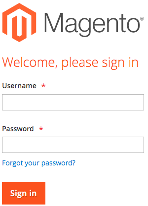
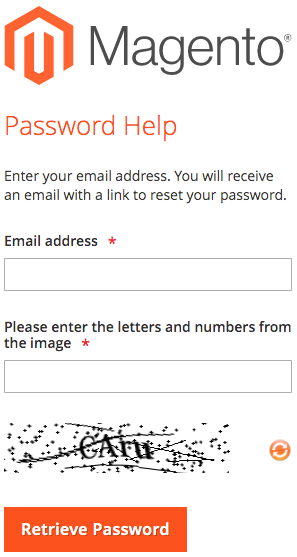
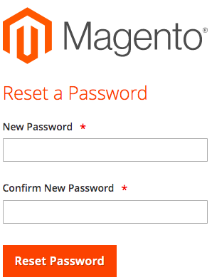
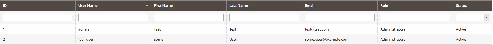
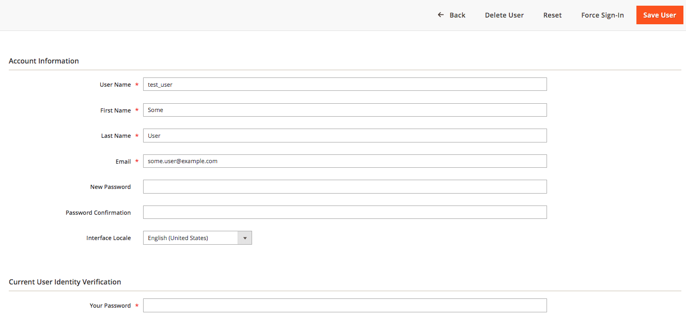

---
myst:
  html_meta:
    description: If you are unable to login to your Magento 2 shop, you have several
      methods to retrieve a new password to log back in. Find them here!
    title: How to reset your Magento 2 admin password? | Hypernode
redirect_from:
  - /en/ecommerce/magento-2/how-to-reset-your-magento-2-x-admin-password/
---

<!-- source: https://support.hypernode.com/en/ecommerce/magento-2/how-to-reset-your-magento-2-x-admin-password/ -->

# How to Reset Your Magento 2.x Admin Password

If you are unable to login to your Magento shop, you have several methods to retrieve a new password to log back in.

These methods are:

- Use the ‘Reset password’ functionality
- Let someone else reset the password for you
- Change the password using `magerun`
- Insert a new password in the database

## Use the Reset Password Functionality

- Visit your Magento admin backend in a browser, and click the link "**Forgot your password?**".

Next insert your email address, enter the captcha and press the **Retrieve Password** button.



An email will be send to your email address, containing a password reset link. Click the **RESET PASSWORD** link, or paste the link in your browser.

- You then will be asked to insert a new password. Insert the password twice and click the **Reset Password** button to save your changes.



## Reset Passwords Via the Magento Admin Backend

Using the Magento backend, you can only reset a password if you happen to know your current password, or with a little help from someone else with a valid set of credentials.

If you don’t know your current Magento admin credentials, you can either use the **[Reset Password](#use-the-reset-password-functionality)** functionality as explained earlier, or change your password with the tools mentioned below.

### Reset Your Own Password Via the Magento Backend

To reset a password through the Magento backend, access the backend in your browser, and login using the credentials of you user account. Next, in the top-right corner click on the arrow next to your username -> `Account Setting(*username*)`

From the **My Account** management page, enter your new password, and confirm the password. Insert your **current password** to verify your identity and click the **Save Account** Button in the top-right corner of the page.

### Reset Someone Elses Password Using the Magento Admin Backend

To reset another users credentials, insert the name of the particular user, first, select `System` -> `Permissions` -> All `Users`.

From there, select the user you want to perform a password reset for. You now will be taken to the **Account Information** page. Next, insert and confirm the new password at the **New Password** field, insert your own password at the **Current User Identity Verification** to verify your identity and Click on **Save User**at the top-right corner.

## Change the Password Using Magerun

The `magerun` Magento management commandline utility provides a plugin to create, edit and delete users. With this plugin you can easily change the password for an existing user by running the following commands:

```bash
cd ~/magento2
magerun2 admin:user:change-password [username]

```

This will show a password prompt. Insert the password and test if you can login on the webinterface. The plugin does not ask for a confirmation, so it might be smart to test the password right after changing it.
