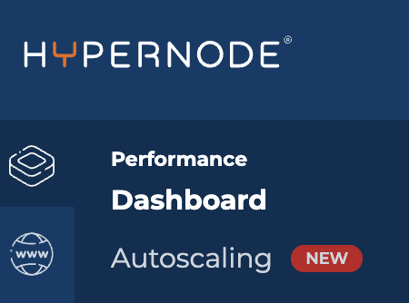
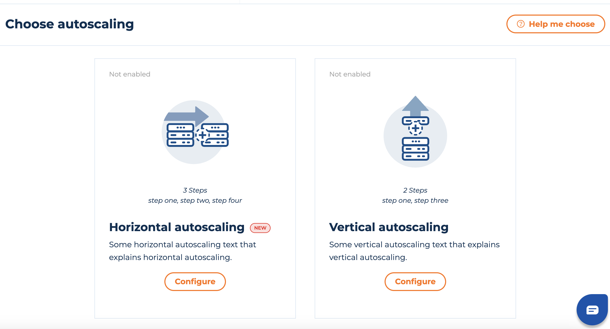
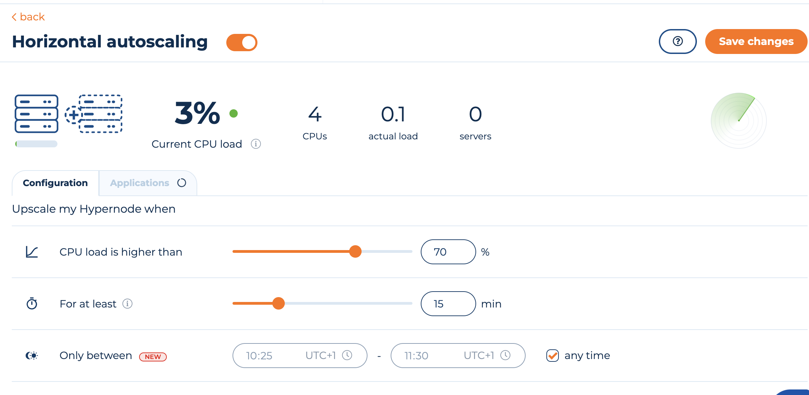
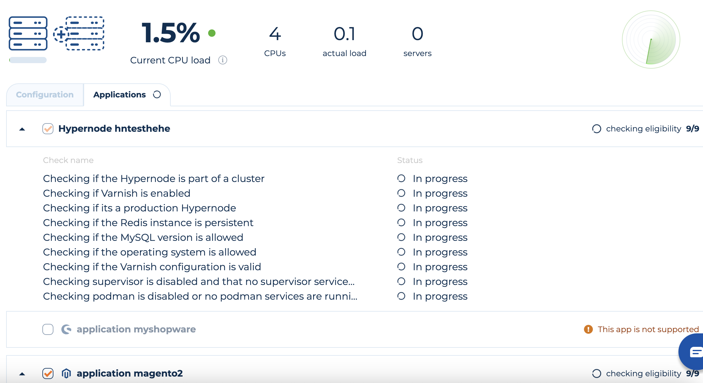

---
myst:
  html_meta:
    description: Step-by-step instructions on enabling horizontal Autoscaling through
      the Control Panel
    title: How to enable horizontal Autoscaling? | Hypernode
---

# How to Enable horizontal Autoscaling?

## What is horizontal Autoscaling?

Horizontal autoscaling in other words means upgrading the amount of resources when your Hypernode needs it, so you don’t need to worry about constant monitoring.

The amount of resources your Hypernode will upgrade with, is calculated by our agent based on the requirements.

The upgrade is effective as long the extra resources are needed and being used. For more technical overview you can check our docs [How Horizontal Autoscaling Works](how-does-horizontal-autoscaling-work.md).

## Autoscaling in the Control Panel

1. Choose the Hypernode you want to enable autoscaling for and then click on the autoscaling option from the vertical navbar.
   
1. If you already enabled vertical autoscaling, you will have to disable it in order to enable horizontal autoscaling for that Hypernode. This is because we only support one type of autoscaling for a Hypernode at a given time.
1. If you have not enabled vertical or horizontal autoscaling, you will see the following two choices with an option to help you choose. If you are still confused about which type of autoscaling you would like for your Hypernode please click on "Help me choose". And if the additional information is not enough, feel free to [contact support](https://www.hypernode.com/en/contact/) for more info.
   
1. Now if you have decided to enable horizontal autoscaling, you can move ahead with the below steps.

## Enabling Horizontal autoscaling from the Control Panel

1. Click Configure on the Horizontal autoscaling option.
1. You will see the price of the autoscaling license. If you wish to continue, click configure. This charge is automatically added as part of your subscription when you enable autoscaling ( at a futher step ).
1. Toggle Horizontal autoscaling. This will enable the form to choose the thresholds and the applications you would like to autoscale with. You can choose the certain conditions when autoscaling should be initiated. By default we recommend when the load on the server is higher than 70 for more than 15 minutes.

Note: You can also choose the specific time window in which autoscaling should be initiated, if you prefer not to autoscale 24/7. ( E.g. if you have a cron running at 4am that will increase the load on the server but you dont want that to trigger autoscaling, you can choose the autoscaling window to be 5AM-3AM. This will avoid autoscaling between 3AM-5AM)

4\. Now click on applications to check if your Hypernode and all the applications on that Hypernode are eligibile for horizontal autoscaling. We have a list of requirements that your Hypernode and it's applications must meet for you to be able to enable horizontal autoscaling. You can see the list [here](https://www.hypernode.com/).

5\. If an application is not supported, you can either unselect that application so that its not a part of horizontal autoscaling. Or you can update your application as required to make it eligible and re-run the checks.
6\. After you have decided the thresholds and choosen the eligible applications, you can now click save changes at the top right corner. This will enable horizontal autoscaling, charge you for the autoscaling license and now your Hypernode will be monitored 24/7 against the conditions you have set.
7\. You can always come back to this page to change the conditions and add/remove applications.
8\. You can always disable autoscaling by toggling off and clicking save changes after which your license will be removed. And if you wish to come back and enable it, you can follow the same steps above.
