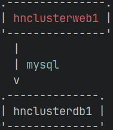

---
myst:
  html_meta:
    description: Hypernode clusters allow you to scale your setup to your needs, both
      horizontally and vertically.
    title: Cluster | Hypernode platform
---

# Hypernode Cluster

Hypernode comes as a single server setup by default. This is to make sure that latency between services is as low as possible,
and that the server is as fast as possible. However, if you have a lot of traffic, or a lot of data, you might want to consider a
cluster setup. This is a setup where you have multiple servers, each with their own task. This way, you can scale your setup to
your needs.

## Cluster vs single server

Choosing between a single server setup and a cluster setup is a trade-off between performance and flexibility. A single server
setup is the fastest, but a cluster setup is more flexible as it allows for more ways of scaling up the available resources.
You can add more servers to your cluster, allowing you to scale your setup to your needs. However, a cluster setup does come
with a performance penalty. The latency between services is higher, which causes a slight overhead in performance.

## Up/downgrading between plans

You're able to up or downgrade your plan with Hypernode whenever you want. This applies to both single server setups and
cluster setups.

In a Hypernode cluster this goes per Hypernode. So if you have a cluster with 3 Hypernodes, you can upgrade 1 Hypernode to a
higher plan, and the other 2 Hypernodes can stay on the old plan. This allows you to scale your setup to your needs while
the rest of the cluster stays up.

## Connecting between cluster Hypernodes

All Hypernodes within the same cluster are connected to each other. You can see how the Hypernodes relate to each other in the
map:



You can generate this map on the fly using the CLI command `hypernode-cluster-map`. You can also get a detailed overview of the
state of the cluster using the CLI command `hypernode-cluster-info`:

```bash
app@1fosk3-hnclusterweb1-magweb-hetz:~$ hypernode-cluster-info
+---------------+--------------------------+-------------+----------------+------------+
| Hypernode     | Roles                    | Private_IP  | Private_subnet | Cluster_IP |
+---------------+--------------------------+-------------+----------------+------------+
| hnclusterdb1  | mysql                    | 192.168.1.5 | 192.168.1.0/24 | 10.0.0.2   |
| hnclusterlb1  | redis, nfs, loadbalancer | 192.168.1.2 | 192.168.1.0/24 | 10.0.0.3   |
| hnclusterweb1 | web                      | 192.168.1.3 | 192.168.1.0/24 | 10.0.0.1   |
| hnclusterweb2 | web                      | 192.168.1.4 | 192.168.1.0/24 | 10.0.0.5   |
+---------------+--------------------------+-------------+----------------+------------+
```

### Wireguard

All nodes within the cluster can communicate with each other over their cluster IP addresses. These are private IP addresses
that are only accessible within the cluster, as they are [Wireguard](https://www.wireguard.com/) tunnels between each Hypernode
in the cluster.

```bash
app@1fosk3-hnclusterweb1-magweb-hetz:~$ ssh hnclusterdb1.hypernode.io hostname
cj8jv7-hnclusterdb1-magweb-hetz.nodes.hypernode.io

# For convenience, you can also use the short hostname
app@1fosk3-hnclusterweb1-magweb-hetz:~$ ssh hnclusterdb1.h hostname
cj8jv7-hnclusterdb1-magweb-hetz.nodes.hypernode.io
```

### Private network switch

We can provide you with a private network so that your Hypernodes can communicate with each other with a larger bandwidth than
over a regular internet connection. This is especially useful if you have a lot of traffic between your Hypernodes, or if you
have a lot of data that needs to be transferred between your Hypernodes.

For this we provide a subnet where every Hypernode has its own private network IP address, which is only accessible to Hypernodes
in the same cluster and in the same datacenter/regions. Just like with Wireguard connections you can connect between Hypernodes
over the same private network. When available, we automatically configure the use of the private network over Wireguard
connections because of the larger bandwidth.
