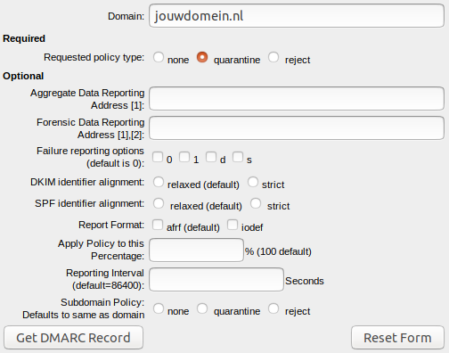
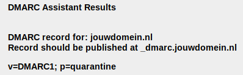
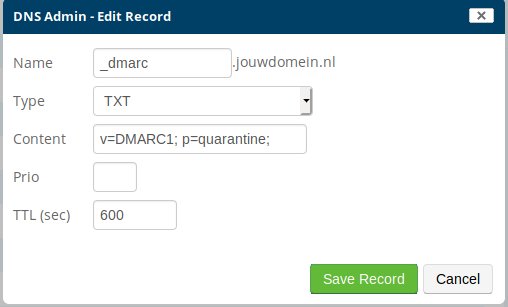

---
myst:
  html_meta:
    description: With SPF and DKIM you indicate which mail is real and which is fake.
      With DMARC you then indicate what the recipient of the mail should do.
    title: How to use DMARC? | Hypernode
redirect_from:
  - /en/best-practices/email/how-to-use-dmarc/
---

<!-- source: https://support.hypernode.com/en/best-practices/email/how-to-use-dmarc/ -->

# How to Use DMARC

**Please note that this only applies to Service Panel users who log in via service.byte.nl. This functionality isn't available in the Control Panel yet.**

Hypernode offers DMARC (Domain-based Message Authentication, Reporting and Conformance). With SPF and DKIM you indicate which mail is real and which is fake. With DMARC you then indicate what the recipient of the mail should do if it doesn't pass the inspection.

## What Is DMARC?

The DMARC record is a TXT record in the DNS. It can be described as a combination between a tightly configured SPF record and a correctly configured DKIM.

The recipient of the email checks the SPF and DKIM records. If the message does not pass this check, the DMARC record tells the mail server what to do with the email. There are three different policies (p):

- None policy: with this policy, the server will not do anything with email that fails the DMARC check. The email just goes into the inbox of the receiver. **This option\*\*\*\*will not be allowed for the Thuiswinkel Waarborg keurmerk.**
- Quarantine policy: emails that fail the DMARC check will be put in special quarantine folders e.g. the junk or spam folder. This is the recommended policy.
- Reject policy: emails that fail the DMARC check will be rejected. These messages will bounce and will not end up in any folder.

This is an example of a DMARC record:

|                        |          |              |                        |         |
| ---------------------- | -------- | ------------ | ---------------------- | ------- |
| **Name**               | **Type** | **Priority** | **Content**            | **TTL** |
| \_dmarc.yourdomain.com | TXT      | (empty)      | v=DMARC1; p=quarantine | 600     |

## How to Configure DMARC

### Generating DMARC Record

As explained above, there are a number of settings possible with DMARC so that the receiving party knows how and what it can send to you. You can use [this website to generate a DMARC record](https://www.kitterman.com/dmarc/assistant.html), which you can then add to your DNS.

When generating a DMARC record you need to fill in a domain and select a policy type. The different policies are described in the **What Is Dmarc**section above.

There are a few other DMARC options which are optional. **Please note: t****hese options are only for the experienced DMARC user****.**

When you've filled in the domain and the required policy, click **Get DMARC Record**. A record will be generated:

### Adding DMARC Record to DNS

In the above example the DMARC record is **v=DMARC1; p=quarantine**. You need to add this as a TXT record to your DNS:

DMARC is active as soon as you save the record.

## What Are Other DMARC Options?

Besides the policy, DMARC offers a few other options as well. These are all optional and we recommend you to only use these if you are experienced with DMARC.

- Aggregate Data Reporting: Enter an email address here if you need to receive a message every other day with all emails that others have received and whether these emails are original and from you.
- Forensic Data Reporting: Enter an email address here if you want to receive a message per email that didn't pass inspection with detailed information and logs. Please note that this address may receive a ton of mail.
- Failure reporting options: There are a few different options for receiving a Forensic Data Report. To use this option, you need to fill in the Forensic Data Reporting field:
  - 0: Generate a DMARC failure report if all underlying authentication mechanisms (SPF and DKIM) fail to produce an aligned “pass” result. (default)
  - 1: Generate a DMARC failure report if any underlying authentication mechanism (SPF or DKIM) produced something other than an aligned “pass” result. (recommended)
  - d: Generate a DKIM failure report if the message had a signature that failed evaluation, regardless of its alignment.
  - s: Generate an SPF failure report if the message failed SPF evaluation, regardless of its alignment.
- DKIM identifier alignment: How strict the domain used to create the signature should match the 'From' header.
- SPF identifier alignment: If the domain portion of the envelope from address aligns with the domain found in the header from address.
- Report format: The format of the Forensic Data Report.
- Apply policy: What percentage of emails need to be checked (100% is the default).
- Reporting interval: How many seconds you want in between reports.
- Subdomain policy: Which policy need to be used for subdomains. If empty, the same policy is used for the main- and subdomain.
