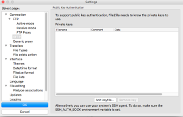
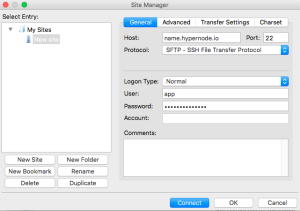

---
myst:
  html_meta:
    description: In this article we’ll explain how you can configure FTP/SFTP (create/delete
      users) and which credentials to use to make a FTP/SFTP connection.
    title: How to Configure FTP/SFTP on Hypernode
redirect_from:
  - /en/hypernode/ftp/how-to-configure-ftp-sftp-on-hypernode/
  - /knowledgebase/configuring-ftp/
---

<!-- source: https://support.hypernode.com/en/hypernode/ftp/how-to-configure-ftp-sftp-on-hypernode/ -->

# How to Configure FTP/SFTP on Hypernode

For some shops FTP/SFTP usage is required to access an external data supplier. For these customers we’ve added the feature to add and remove FTP/SFTP users on your Hypernode. In this article we’ll explain how you can configure FTP/SFTP (create/delete users) and which credentials to use to make a FTP/SFTP connection.

NB: We strongly recommend using SSH or SFTP for file transfers. FTP is an inherently unsafe protocol, and should only be used for syncing data with suppliers that can’t be done through the Magento API.

## Managing FTP

**NB: The FTP users created with the instructions below can also be used for SFTP. More information about this can be found**[**here**](#sftp-ssh-file-transfer-protocol)**.**

### Adding FTP Users

The first step is to create a FTP user on your Hypernode. This is done through the `hypernode-ftp add` command. The syntax of this command is as follows:

```nginx
hypernode-ftp add --username USER --homedir DIRECTORY
```

For example if you want to create user `bob` with homedir `/data/web/`:

```nginx
hypernode-ftp add --username bob --homedir /data/web/
```

You will be asked for a password, and after adding a password the user is created. This creates the user bob whom is restricted to the folder `/data/web/` and everything that’s in it.

### Deleting FTP Users

If you want to delete a FTP user you can use the `hypernode-ftp remove` command. The syntax of this command is as follows:

```nginx
hypernode-ftp remove --username USER
```

We could delete the bob user by using the command like this:

```nginx
hypernode-ftp remove --username bob
```

### Listing all FTP Users

If you want to check which FTP users are enabled you can use the `hypernode-ftp list` command. This command returns a list of all available users and their particular homedir:

```nginx
Users found:
bob /data/web
```

Or in case you did not add any FTP users yet:

```nginx
No users in FTPasswd file
```

## Adding Your IP Address to the Whitelist

Because FTP is heavily firewalled on Hypernodes, you need to add your local IP address to the firewall whitelist. To find out what your IP address is, search for “what is my IP” on Google. After adding your IP to the firewall whitelist, it can take a few minutes until the changes are configured on the server, so if you keep experiencing a timeout, have a coffee before you try again.

### Via the hypernode-systemctl Tool

You can easily whitelist IP addresses via the command line.

To see which whitelists are currently set you can run the following:

```nginx
hypernode-systemctl whitelist get
```

You will see all IP’s whitelisted per type (external database access, FTP and WAF).

If you want to specify a specific whitelist you can run the following:

```nginx
hypernode-systemctl whitelist get ftp
```

### Adding to Whitelist

To add more values to your whitelists you can run the following. Please note that descriptions are optional:

```nginx
hypernode-systemctl whitelist add ftp 1.2.3.4 --description "my description"
```

Note that you can whitelist either single IP addresses (e.g. 1.2.3.4) or whole ranges (e.g. 1.2.3.4/27). In order to whitelist an IP range, simply add the correct CIDR notation to the IP address (/something).

### Removing From Whitelist

To remove values from your whitelists you can run the following:

```nginx
hypernode-systemctl whitelist remove ftp 1.2.3.4
```

### Via Your Service Panel

Customers who log in via [service.byte.nl](http://service.byte.nl) can whitelist an IP via the Service Panel by following the steps below:

1. Log on to your [Service Panel](http://service.byte.nl).
1. Select the Hypernode.
1. Go to ‘Instellingen’.
1. Select ‘Externe FTP toegang’.
1. Add IP address and description.

### Via Your Control Panel

Customers who log in via [my.hypernode.com](https://my.hypernode.com) can allow an IP via the Control Panel by following the steps below:

1. Log into the Control Panel.
1. Select the Hypernode.
1. Go the **Allowlist**by selecting it from the sidebar on the left:
   
1. Add the IP by choosing a rule type, entering the IP and a description.

## Connecting to FTP

If you want to connect to FTP you’ll have to use the following credentials:

- Hostname: **appname.hypernode.io** (replace this with the name of your Hypernode)
- User: **Your username**
- Password: **Your password**
- Port:
  - **21** For regular FTP
  - **2222** For SFTP (you need to opt-in first!)

## ACTIVE Mode or PASSIVE Mode

**ACTIVE** and **PASSIVE** mode are 2 techniques for establishing an FTP connection with an FTP server.

FTP uses two channels between client and server, the **command channel**and the **data channel**, which are actually separate TCP connections. The command channel is for commands and responses, the data channel is for transferring files.

In active mode, the **client** establishes the command channel (from client port X to server port 21) but the **server** establishes the data channel (from server port 20 to client port Y, where Y has been supplied by the client).

In passive mode, the **client** establishes **both channels**. In that case, the server tells the client which port should be used for the data channel.

Passive mode is generally used in situations where the FTP server is not able to establish the data channel. One of the major reasons for this is **network firewalls**. While you may have a firewall rule which allows you to open up FTP channels to appname.hypernode.io, the Hypernode FTP daemon may not have the power to open up the data channel back through your firewall.

Passive mode solves this by opening up both types of channel from the client side.

If you are behind a router or firewall, switching to passive mode is a genuine fix for almost all connectivity problems when using FTP. If you experience connectivity errors, try switching from passive to active mode or vice versa.

## SFTP (SSH File Transfer Protocol)

We also offer SFTP on Hypernodes. SFTP allows you to securely copy files from and to the Hypernode using tools like `scp` and `sftp` and it’s windows equivalent `WinSCP`. This is done over a secure encrypted connection and can be used for the default user or users that have been restricted to a specific directory.

You can connect using the SFTP protocol on port **2222**, using the same credentials as with regular FTP connections.

### SFTP for the Default User

You can login with the default app user credentials. The below instructions will cover the basics on how to configure this using FileZilla.

#### Generate an SSH Keypair

Start by generating a keypair (a private and a public key). This can be done through a **Terminal** (Linux and Mac OSX have this program pre-installed) or through **PuTTY**. How to do this is covered in this [article](../ssh/how-to-use-ssh-keys-on-hypernode.md).

#### Add Your Public Key to Your Hypernode

When you have generated the keypair you need to add your public key to your Hypernode.

Service Panel users can use the SSH Keymanager in the [Service panel](../ssh/how-to-use-ssh-keys-on-hypernode.md#service-panel-users-add-public-key-to-the-ssh-keymanager).

Control Panel users also have access to an SSH Keymanager via their Control panel. How this works is explained in [this article](../../services/control-panel/how-to-add-keys-to-the-ssh-key-manager.md).

Alternatively you can also add the public key to the the `~/.ssh/authorized_keys` file.

1. Log in to your Hypernode.
1. Go to the `~/.ssh/authorized_keys` file.
1. Edit this file by adding extra public key(s) to this folder.
1. Save the file.

#### Add Your Private Key in FileZilla

After the public key has been added, we need to make sure the private key gets properly configured. As mentioned you can use FileZilla for this task. Follow the steps below:

1. Open FileZilla
1. Click **Edit** and select **Settings**.
1. Click **SFTP**.
1. Click **Add keyfile:**
   ****
1. Select your private key and click **Open**.
1. You’ll be asked if you want to convert your private key to a format which FileZilla can use. Click **Yes**.
1. Enter the passphrase you used when generating the keypair and click **Ok**.
1. Give the file a name and select the folder where you want to save the file to.
1. Press **OK**.

#### Connecting to Hypernode With SFTP

1. Select the menu item **File** and select **Site Manager.**
1. Click **New Site** and give the new connection a name (default is set to New Site).
1. Use the following settings:
   
1. Press Connect and you will be connected to your Hypernode.

### SFTP for Restricted Users

Similar to FTP you can also grant other users access to only certain directories using the same mechanism as with FTP users.

## Troubleshooting

- When using SFTP, you are always chrooted to the homedir. This implies that when you want to copy a file to `/tmp`, you will receive an error, as the `tmp/` directory does not exist in the configured homedir.
- If you experience a ‘Connection timed out’ error, please check in our service panel if your IP address is whitelisted.
- If the IP is whitelisted and you still get this error: Check your local firewall and antivirus logs.
