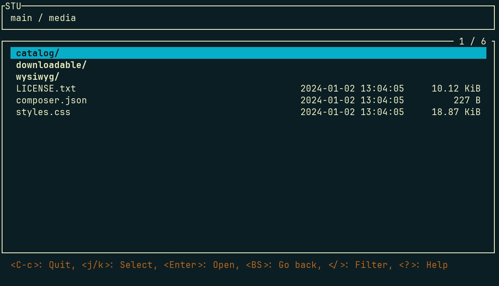

---
myst:
  html_meta:
    description: Learn how to enable and use Hypernode Object Storage Versioning
    title: Hypernode Object Storage | Object Versioning
---

# Object Versioning

With object versioning, you can keep track of changes made to your objects in the Object Storage workspace. This allows you to restore previous versions of your objects when needed.

## Enabling Object Versioning

To enable object versioning, you can use the `update` command with the `--enable-versioning` flag. This will enable versioning for all objects in your Object Storage workspace.

```console
app@abcdef-example-magweb-cmbl:~$ hypernode-object-storage update --enable-versioning
Enabling versioning...
```

It's also possible to enable versioning in the Control Panel. To do this, go to the Object Storage workspace you want to enable versioning for, and flip the Object Versioning toggle.

```{note}
Object versioning increases the storage space used by your objects. Each version of an object is stored separately, so if you have a lot of changes to your objects, you may need a bigger storage plan at some point.
```

## Restoring object revisions

With the `restore` command, you can restore an object to the state it was in at a specific point in time. You can specify the date and time of the revision you want to restore, as well as the object path.

The date and time should be in the format `YYYY-MM-DD HH:MM:SS`. The object path can be the full path to the object you want to restore or a path to a directory. If you specify a directory, all objects in that directory will be restored to the specified revision.

```console
app@abcdef-example-magweb-cmbl:~$ hypernode-object-storage restore main "2025-04-24 06:00:00" media/catalog/product/e/x/example.jpg
```

By default, the `restore` command will only show what it would do without actually restoring the objects. To actually restore the objects, you need to add the `--apply` flag.

```{note}
The `restore` command restores objects in place. This means that the current version of the object will be replaced with the version you are restoring. If you want to keep the current version of the object (or directory), you should make a copy of it before running the `restore` command.
```

## Interactively exploring revisions

You can also explore your objects and their revisions interactively using the `explore` subcommand. This will open a terminal UI file browser where you can navigate through your objects and their versions.

```console
app@abcdef-example-magweb-cmbl:~$ hypernode-object-storage explore
```

Here's an example of how the terminal UI looks when you run the `explore` command:


