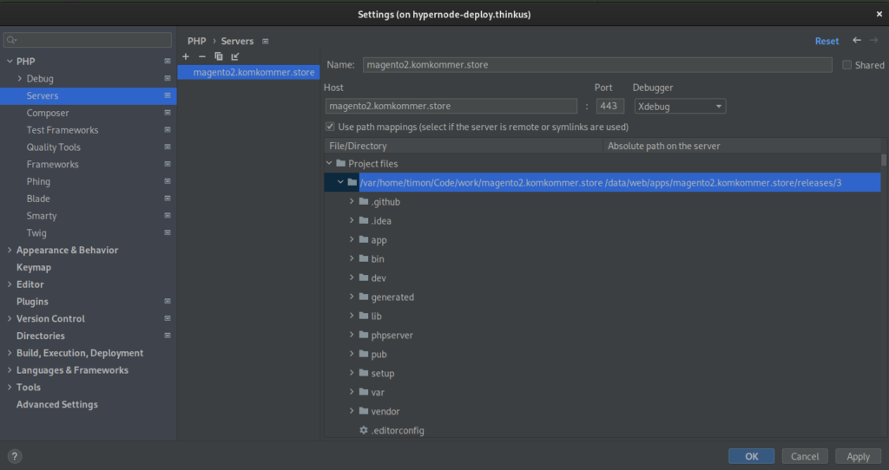
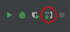

---
myst:
  html_meta:
    description: With remote debugging you can debug your application running on a
      Hypernode from your local machine.
    title: Remote Debugging | Hypernode
    keywords: hypernode, remote, debugging, xdebug, phpstorm, php, remote debugging,
      varnish, xdebug cloud
---

# Remote Debugging

With remote debugging you can debug your application running on a Hypernode from your local machine.
This can be very useful in situations where a problem only occurs on a Hypernode and not on your development environment.

By utilizing smart HTTP traffic routing, this has no performance impact on the normal (non-debugging) traffic.
Debugging traffic will be routed to the PHP-FPM instance which has been configured with Xdebug enabled.

## Getting started

To enable remote debugging, you first have to enable the Xdebug setting:

### Enable Xdebug

```console
app@abcdef-example-magweb-cmbl:~$ hypernode-systemctl settings php_xdebug_enabled True --block
```

### Setting up the connection

To connect your IDE to Xdebug on the Hypernode, you can either set up a reverse SSH tunnel or you can set up [Xdebug cloud](https://xdebug.cloud/).
The latter is a paid service, but it’s very easy to set up and saves you the hassle of setting up a reverse SSH tunnel.

**Xdebug cloud**

Make sure you have an active Xdebug cloud subscription and key, then run the following command:

```console
app@abcdef-example-magweb-cmbl:~$ hypernode-systemctl settings php_xdebug_cloud_key <your-key> --block
```

Also make sure you configure your IDE to connect to Xdebug cloud:

- [PhpStorm](https://xdebug.cloud/docs#phpstorm)
- [Visual Studio Code](https://xdebug.cloud/docs#vscode)

**Reverse SSH tunnel**

If you're not using Xdebug cloud, you need to open a reverse SSH tunnel so that Xdebug on the Hypernode can communicate with PhpStorm on your local machine:

```console
$ ssh -R 9003:localhost:9003 app@example.hypernode.io -N
```

### Configure PhpStorm

Then you open up your PhpStorm project and go to your *File -> Settings -> PHP -> Servers*. Click the *+* button to add a server and fill *Name* and *Host* with the full domain name of the site you want to debug (for example www.shop.com). Then check the box *Use path mappings* and click on the right column next to your project root. Here you can fill in the absolute path of the application on the remote server, for example:

- `/data/web/magento2`
- `/data/web/apps/myshop/releases/3`



Hint: if you’re making use of a multi deployment structure (like with Hypernode Deploy) and want to know what the absolute path for your current directory is, you can use realpath to find out:

```console
app@abcdef-example-magweb-cmbl:~$ realpath apps/magento2.komkommer.store/current
/data/web/apps/magento2.komkommer.store/releases/3
```

Finally click the *Start Listening for PHP Debug Connections* button. Now your debug environment is ready to go.



### Start debugging

To start debugging, make sure you have the Xdebug helper extension enabled in your browser:

- [Xdebug helper for Google Chrome](https://chrome.google.com/webstore/detail/xdebug-helper/eadndfjplgieldjbigjakmdgkmoaaaoc?hl=en)
- [Xdebug helper for Firefox](https://addons.mozilla.org/en-US/firefox/addon/xdebug-helper-for-firefox/)

After installation, go to the URL of the application you want to debug and click the Xdebug helper icon and click Debug. The icon should become green and now your requests will be directed to the php-fpm instance with Xdebug enabled.

Place a breakpoint in your IDE, reload the page or execute the action you want to debug and you should see a popup from PhpStorm asking about path mappings. In this dialog you should configure the absolute path on the server for you project, for example `/data/web/magento2`. Click OK and your IDE should be landing your breakpoint (if it doesn’t but you want to verify if your configuration is correct, select *Run -> Break at first line in PHP scripts*).

JetBrains has way more knowledge and information on this topic, so we advise you to go visit their documentation to learn more:

- [Remote debugging via SSH tunnel](https://www.jetbrains.com/help/phpstorm/remote-debugging-via-ssh-tunnel.html)
- [Debug with PhpStorm: Ultimate Guide](https://www.jetbrains.com/help/phpstorm/debugging-with-phpstorm-ultimate-guide.html)

### Enabling Xdebug for the CLI

After enabling Xdebug, the CLI will not load the module by default.
To load it, you can set the `PHP_INI_SCAN_DIR` environment variable to the specific Xdebug-enable config directory:

```console
app@abcdef-example-magweb-cmbl:~$ export PHP_VERSION=$(jq -r .php_version /etc/hypernode/app.json)
app@abcdef-example-magweb-cmbl:~$ export PHP_INI_SCAN_DIR=/etc/php-debug/$PHP_VERSION/cli/conf.d/
app@abcdef-example-magweb-cmbl:~$ php -m | grep xdebug
xdebug
```

## Varnish bypass

While remote debugging works with Varnish enabled, you might want to bypass Varnish when debugging.

We can very easily do that by creating a second VCL. First dump your current VCL to a separate file:

```console
app@abcdef-example-magweb-cmbl:~$ varnishadm vcl.list
available cold/cold 0 boot
active warm/warm 0 magento2
app@abcdef-example-magweb-cmbl:~$ varnishadm vcl.show magento2 > ~/magento2_debug.vcl
app@abcdef-example-magweb-cmbl:~$
```

Now change the `magento2_debug.vcl` file by adding the following right under the `std.collect(req.http.Cookie);` statement:

```vcl
# bypass if xdebug session
if (req.http.cookie ~ "XDEBUG_SESSION=[a-zA-Z]+") {
    return (pass);
}

```

Then load and activate the `magento2_debug.vcl` configuration:

```console
app@abcdef-example-magweb-cmbl:~$ varnishadm vcl.load magento2_debug /data/web/magento2_debug.vcl
VCL compiled.
app@abcdef-example-magweb-cmbl:~$ varnishadm vcl.use magento2_debug
VCL 'magento2_debug' now active
```

Now you should be bypassing the Varnish cache when you have the Xdebug cookie set.
