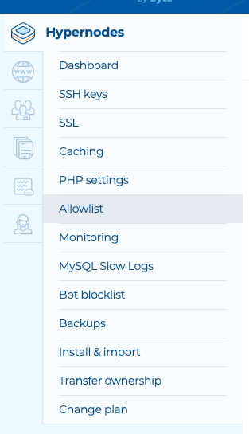

---
myst:
  html_meta:
    description: This tutorial shows how to log in to the Hypernode with PuTTY (for
      Windows users) or Terminal (Linux and Mac OSX) using SSH.
    title: How to log into a Hypernode with SSH?
redirect_from:
  - /en/hypernode/ssh/how-to-log-in-to-the-hypernode-with-ssh/
  - /knowledgebase/login-hypernode-ssh/
---

<!-- source: https://support.hypernode.com/en/hypernode/ssh/how-to-log-in-to-the-hypernode-with-ssh/ -->

# How to Log in to the Hypernode With SSH

Congratulations with your new Hypernode! To access it, you need to use an SSH client.

This tutorial shows how to log in to the Hypernode with PuTTY (for Windows users) or Terminal (Linux and Mac OSX) using SSH.

NB: If you want to create SSH keys, please read the article: [Create SSH Keys on Hypernode](../ssh/how-to-use-ssh-keys-on-hypernode.md).

## For Windows Users

### Log in Using PuTTY

To use PuTTY you need to download this program from the [PuTTY website](http://www.chiark.greenend.org.uk/~sgtatham/putty/latest.html). To connect to Hypernode you’ll have to use your SSH hostname (name.hypernode.io) and username (app).

#### ‘How to’ for Dutch Users

If you ordered your Hypernode trial or hosting plan via Hypernode.nl, your SSH connection settings can be found in the Byte Service Panel. Use the following steps to connect to Hypernode.

- In the Byte Service Panel select your Hypernode (name.hypernode.io), go to `Instellingen` and click `Shell /SSH Instellingen`. The required credentials are listed under **SSH Gegevens**.
- Open to PuTTY
- Navigate to Session and enter your hostname (or IP address) in the Host name field
  - This should be the name of your Hypernode plan: **example**\*\*.hypernode.io\*\*
- Click `Open`
- Enter **app** as your username
- Enter your password (it’s the same as the “Technisch Beheerder” login password for the Service panel)
- Congrats! You can now access your Hypernode.

#### ‘How to’ for English Speaking Users

If you ordered your Hypernode plan or trial via Hypernode.com, you received your SSH hostname and IP address via email as soon as your Hypernode is ready for use.

- Open to PuTTY
- Navigate to Session and enter your hostname (or IP address) in the Host name field
- This should be the name of your Hypernode plan: **example**\*\*.hypernode.io\*\*
- Click `Open`
- Enter **app** as your username
- Congrats! You can now access your Hypernode.

### Log in Using the Windows Subsystem for Linux on Windows 10

If you are on Windows 10 and a more experienced user, you can install the `Windows Subsystem for Linux`.

This way you can simply install the bash shell and all needed GNU Utils to create an environment similar to the hypernode.

To do this, use [this excellent howto on howtogeek](http://www.howtogeek.com/249966/how-to-install-and-use-the-linux-bash-shell-on-windows-10/).

## For Linux and Mac OSX Users

### Log in Using Terminal (Linux) or iTerm2 (MacOS)

#### ‘How to’ for Dutch Users

If you ordered your Hypernode trial or hosting plan via Hypernode.nl, your SSH connection settings can be found in the Byte Service Panel. Use the following steps to connect to Hypernode.

```nginx
ssh app@name.hypernode.io
```

Where `name` is the name you have chosen when you ordered the Hypernode. If the name of your node is example.hypernode.io the command would be like this:

```nginx
ssh app@example.hypernode.io
```

Press ‘Enter’.

Optional: enter your password (it’s the same as the “Technisch Beheerder” login password for the Service panel). Press ‘Enter’ again. Congrats! You now accessed your Hypernode.

#### ‘How to’ for English Speaking Users

If you ordered your Hypernode plan or trial via Hypernode.com, you received your SSH hostname and IP address via email as soon as your Hypernode is ready for use.

Use the following command to connect to Hypernode:

```nginx
ssh app@name.hypernode.io
```

Where `name` is the name you have chosen when you ordered the Hypernode. If the name of your node is example.hypernode.io the command would be like this:

```nginx
ssh app@example.hypernode.io
```

Press ‘Enter’. Congrats! You now accessed your Hypernode

## Dutch Users Only: Disabling Password Authentication

More experienced SSH users often want to fully disable password authentication on the Hypernode.

This can be done through your Service Panel by disabling password logins on SSH.

To do this, select `Instellingen` -> `Shell toegang`.

From there click the `Uitschakelen` button in the section `Inloggen via wachtwoord`:

## Brute Force Protection

We enabled fail2ban on the hypernode, which is a tool that detects bruteforces by tailing the remote access logs (`/var/log/auth.log`). IP’s that try to login with incorrect credentials more then 6 times in 20 minutes will be added to the firewall for an hour.

It is possible that you ban your own IP through fail2ban because of extensive testing. You can manage your own whitelist of IP’s that fail2ban needs to ignore. The IP’s added to the WAF whitelist will be completely ignored by fail2ban. If you happen to get blocked yourself, add your IP address to the WAF whitelist.

### All Users: Via the hypernode-systemctl Tool

You can easily whitelist IP addresses via the command line. First, run the following to check if any IP’s are already whitelisted:

```nginx
hypernode-systemctl whitelist get waf
```

### Adding to Whitelist

To add more values to your whitelists you can run the following. Please note that descriptions are optional:

```nginx
hypernode-systemctl whitelist add waf 1.2.3.4 --description "my description"
```

### Removing From Whitelist

To remove values from your whitelists you can run the following:

```nginx
hypernode-systemctl whitelist remove waf 1.2.3.4
```

### Via Your Service Panel

Customers who log in via [service.byte.nl](http://service.byte.nl) can whitelist an IP via the Service Panel by following the steps below:

1. Log on to your [Service Panel](http://service.byte.nl).
1. Select the Hypernode.
1. Go to ‘Instellingen’.
1. Select ‘Externe FTP toegang’.
1. Add IP address and description.

### Via Your Control Panel

Customers who log in via [my.hypernode.com](https://my.hypernode.com) can allow an IP via the Control Panel by following the steps below:

1. Log into the Control Panel.
1. Select the Hypernode.
1. Go the **Allowlist**by selecting it from the sidebar on the left:
   
1. Add the IP by choosing a rule type, entering the IP and a description.
