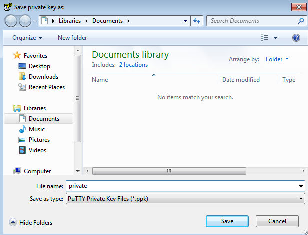
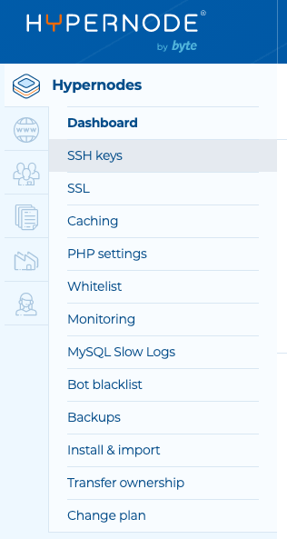
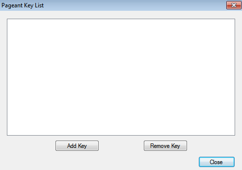
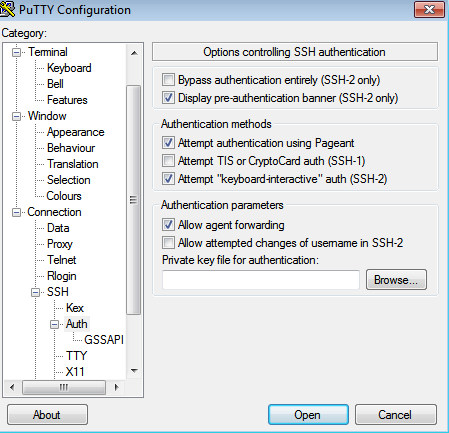

---
myst:
  html_meta:
    description: This tutorial shows how to create a keypair and use PuTTY (for Windows
      users) or Terminal (Linux and Mac OSX) to log in to your Hypernode.
    title: How to use SSH keys on a Hypernode?
redirect_from:
  - /en/hypernode/ssh/how-to-use-ssh-keys-on-hypernode/
  - /knowledgebase/use-ssh-keys-on-hypernode/
---

<!-- source: https://support.hypernode.com/en/hypernode/ssh/how-to-use-ssh-keys-on-hypernode/ -->

# How to Use SSH Keys on Hypernode

This tutorial shows how to create a keypair and use PuTTY (for Windows users) or Terminal (Linux and Mac OSX) to log in to your Hypernode.

## For Windows Users; PuTTY

To generate an SSH keypair and connect to your Hypernode, you’ll need to use three different programs; PuTTY, PuTTYgen and Pageant. Download these programs from the [PuTTY website](http://www.chiark.greenend.org.uk/~sgtatham/putty/download.html). Follow the next steps.

### Generate the Keypair With PuTTYgen

1. Open PuTTYgen.
1. Change the bits to 4096 in the **Number of bits in a generated key** field.
1. Click Generate and move your mouse randomly (image 1).
   
1. Copy the key in the upper field (this is your public key) and save it somewhere.
1. Enter a name for the key in the **Key comment** field.
1. Enter a password in the **Key passphrase** and **Confirm passphrase** fields.
1. Click **Save private key** (image 2).
   
1. Close PuTTYgen.

### Add Public Key to Your Hypernode

After you have created a key pair, make sure you add your public key to your Hypernode. Please check first if you have access to a Byte Service Panel or a Hypernode control Panel.

### Service Panel Users: Add Public Key to the SSH Keymanager from Windows

If you log in via the **Service Panel**, you have access to an SSH Keymanager to add your public keys to a Hypernode. The steps:

1. Log in to the [Service Panel](https://service.byte.nl/protected/overzicht/).
1. Select your domainname (name.hypernode.io).
1. Go to the 'Instellingen' tab.
1. Click on the option **Shell / SSH Instellingen.**
1. Click **Beheer SSH Keys voor dit domein**. Now click on the button **Beheer mijn public keys**.
1. Click on **SSH Key toevoegen**. If you already have a key configured, you should choose for the **Handmatig** option.
1. Paste the content of your public key into the public key field and give it a name.
1. Click on **Opslaan**to add the key to the Keymanager.
1. Select the domain you wish to add your key to (if you’re a Hypernode customer, make sure you add the key to your Hypernode domain and the Magento domain the site is currently being hosted) and click on the **Opslaan** button.
1. Your key is now added to your domains.

Repeat the above steps if you would like to add more keys.

### Control Panel Users: Add Public Key via Your Control Panel

Need to add an SSH key to just **one** Hypernode (e.g. SSH keys that are used to deploy the application and nothing else)? Follow the steps below to do so.

1. Log in to the [Control Panel](http://my.hypernode.com/).
1. From the Hypernode overview, select a specific Hypernode by clicking on **Details**.
1. Then hover over **Hypernodes**in the sidebar and select **SSH keys:**
1. You can add a new key on this page by clicking the **Add SSH key**button. You'll also see an overview of previously added keys.
1. On the next page, paste the content of your public key into the public key field and give your SSH key a name:
   
1. Click **Add SSH key**to add the key to the Hypernode.

Repeat the above steps if you would like to add more keys.

A couple of things to keep in mind:

– The following SSH public key types in the control panel are supported: RSA keys >= 2048 bits, ECDSA and Ed25519 keys.

– DSA and RSA keys \< 2048 bits are not permitted because they are not secure.

– You will be prompted with a clear message if there is a problem with your key.

**Limiting an SSH key to specific IP addresses**

It’s possible to restrict remote SSH logins to a single IP address when adding an SSH Key to your Hypernode. To enable this feature, simply add the ssh key options prefix from=”X.X.X.X” to your public key at the start of your public key. For example, to limit logins to IP address 1.2.3.4, you would use the following prefix on your SSH key:

from=”1.2.3.4″ ssh-ed25519 AAAA….

The IP address can be specified as a range such as from=”1.2.3.0/24″ or as a comma separated list of IP addresses such as from=”1.2.3.4,1.2.3.5″.

More information about this feature can be found in [the OpenSSH documentation](https://man.openbsd.org/sshd#from=_pattern-list_).

### All Users: Add Extra Public Key via SSH

If you want to add SSH users you can also edit the `~/.ssh/authorized_keys` file.

1. Log in to your Hypernode
1. Go to the `~/.ssh/authorized_keys` file
1. Edit this file by adding extra public key(s) to this folder
1. Save the file

### Add Private Key to Pageant

1. Open Pageant
1. Click **Add Key** (image 3)
   
1. Select your private key and click **Open**.
1. Insert your password and click **Ok**.
1. Your private key is now saved into Pageant

### Enable Agent Forwarding in PuTTY

1. Open PuTTY
1. Navigate to **Connection → SSH → Auth**
1. Enable **Allow agent forwarding** (image 4)



### Connect to Hypernode Using PuTTY

To finally connect to Hypernode you’ll have to use your SSH hostname and username.

- **Service Panel** users can find these settings under **Instellingen -> Shell/SSH instellingen**.
- **Control Panel** users will find this information in the email they received in which we inform you your Hypernode is ready for use.

Use the following steps to connect to Hypernode.

1. Go back to PuTTY
1. Go to Session and enter your hostname in the Host name (or IP address). This should be the name of your Hypernode plan; **example**\*\*.hypernode.io\*\*
1. Click Open
1. Enter **app** as your username
1. Test if you can connect to your agent: **ssh-add -L**
1. Congrats! You can now access your Hypernode

## For Linux and Mac OSX Users; Terminal

### Generate a SSH Keypair

The first step is to actually generate a keypair. You can do this by using the next bash command `ssh-keygen -b 4096` on your desktop.

You’ll get the following output:

```nginx
Generating public/private rsa key pair.
Enter file in which to save the key (/home/users/username/.ssh/id_rsa):
Enter passphrase (empty for no passphrase):
Enter same passphrase again:
Your identification has been saved in /home/users/username/.ssh/id_rsa.
Your public key has been saved in /home/users/username/.ssh/id_rsa.pub.
```

This command will ask you to give the files a name. Name it whatever you like and enter a passphrase. Two files will now be created; `id_rsa` and `id_rsa.pub` (unless you gave it a different name). The file `id_rsa` is your **private key** and the file `id_rsa.pub` is your **public key.**

### Place the Files in Your `.ssh` Folder

When generating the keypair the files will be placed in the exact folder from where you ran the ssh-keygen command. We recommend that you move these files to the `.ssh` folder on your desktop. This folder was created instantly when you used the ssh-keygen command. You can use the mv command to move the files to their new location.

### Enable Key Forwarding

The next part is to create a config file in which you enable forwarding. You can use this command (**make sure you are in the `.ssh` folder)**:

`editor config`

Put in the next information:

`Host *`

`ForwardAgent yes`

This will make sure you can use your ForwardAgent

### Use an SSH-agent

When using an SSH keypair it’s recommended you use an ssh-agent to store your keypair credentials. By doing this you can connect to your Hypernode and from there connect to a different machine. This works because of your ssh-agent. It stores your SSH session and therefore you can use this to connect to different machines on the fly. Add your key to your agent by using the next command:

`ssh-add id_rsa`

You can check if your key is really in your agent by using the following command:

`ssh-add -L`

### Add Public Key to Your Hypernode

After you have created a key pair, make sure you add your public key to your Hypernode. Please check first if you have access to the [Service Panel](https://auth.byte.nl/) or the [Control Pane](http://my.hypernode.com)[l](https://my.hypernode.com/).

### Service Panel Users: Add Public Key to the SSH Keymanager

If you log in via the **Hypernode Service Panel**, you have access to an SSH Keymanager to add your public keys to a Hypernode. The steps:

1. Log in to the [Service Panel](https://service.byte.nl/protected/overzicht/).
1. Select your plan (example.hypernode.io).
1. Go to the **Instellingen** tab.
1. Click on the option **Shell / SSH Instellingen.**
1. Click **Beheer SSH Keys voor dit domein**. Now click on the button **Beheer mijn public keys**.
1. Click on **SSH Key toevoegen**. If you already have a key configured, you should choose for the **Handmatig** option.
1. Paste the content of your public key into the public key field and give it a name.
1. Click on **Opslaan**to add the key to the Keymanager.
1. Select the domain you wish to add your key to and click on the **Opslaan** button.
1. Your key is now added to your domains.

Repeat the above steps if you would like to add more keys.

### Control Panel Users: Add Public Key via Your Control Panel

Need to add an SSH key to just **one** Hypernode (e.g. SSH keys that are used to deploy the application and nothing else)? Follow the steps below to do so.

1. Log in to the [Control Panel](http://my.hypernode.com/).
1. From the Hypernode overview, select a specific Hypernode by clicking on **Details**.
1. Then hover over **Hypernodes**in the sidebar and select **SSH keys:**
1. You can add a new key on this page by clicking the **Add SSH key**button. You'll also see an overview of previously added keys.
1. On the next page, paste the content of your public key into the public key field and give your SSH key a name:
   
1. Click **Add SSH key**to add the key to the Hypernode.

Repeat the above steps if you would like to add more keys.

A couple of things to keep in mind:

– The following SSH public key types in the control panel are supported: RSA keys >= 2048 bits, ECDSA and Ed25519 keys.

– DSA and RSA keys \< 2048 bits are not permitted because they are not secure.

– You will be prompted with a clear message if there is a problem with your key.

**Limiting an SSH key to specific IP addresses**

It’s possible to restrict remote SSH logins to a single IP address when adding an SSH Key to your Hypernode. To enable this feature, simply add the ssh key options prefix from=”X.X.X.X” to your public key at the start of your public key. For example, to limit logins to IP address 1.2.3.4, you would use the following prefix on your SSH key:

from=”1.2.3.4″ ssh-ed25519 AAAA….

The IP address can be specified as a range such as from=”1.2.3.0/24″ or as a comma separated list of IP addresses such as from=”1.2.3.4,1.2.3.5″.

More information about this feature can be found in [the OpenSSH documentation](https://man.openbsd.org/sshd#from=_pattern-list_).

### All Users: Add Extra Public Key via SSH

If you want to add SSH users you can also edit the `~/.ssh/authorized_keys` file.

1. Log in to your Hypernode
1. Go to the `~/.ssh/authorized_keys` file
1. Edit this file by adding extra public key(s) to this folder
1. Save the file

### Connect to Your Hypernode

After doing this you can use the following command to connect to Hypernode:

`ssh app@myname.hypernode.io`
