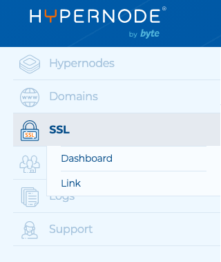
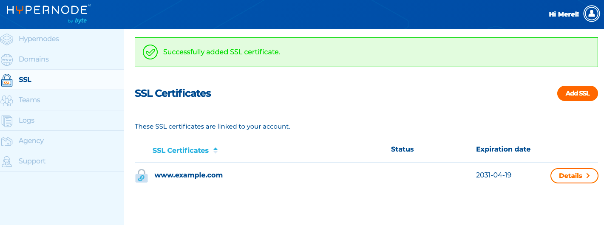
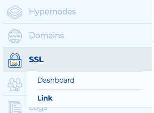
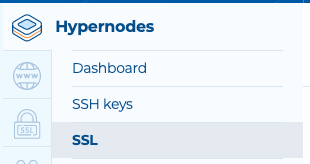

---
myst:
  html_meta:
    description: 'This article explains how to install SSL certificates on your Hypernode.
      An SSL certificate keeps online interactions and transactions private. '
    title: How to use SSL certificates when ordered via Hypernode?
redirect_from:
  - /en/hypernode/ssl/how-to-use-ssl-certificates-on-your-hypernode-when-ordered-via-hypernode-com/
---

<!-- source: https://support.hypernode.com/en/hypernode/ssl/how-to-use-ssl-certificates-on-your-hypernode-when-ordered-via-hypernode-com/ -->

# How to Use SSL Certificates on your Hypernode When Ordered via Hypernode.com

This article explains how to install SSL certificates on your Hypernode. An SSL certificate keeps online interactions and transactions private and they help customers gain confidence to provide personal information on your website. We strongly recommend shop owners to use SSL certificates. This way, your shop will become securely accessible using HTTPS.

## Why Use SSL?

SSL sends information across the internet encrypted so that only the intended recipient can understand it. SSL establishes a secure connection between your visitor's browser and your webshop. It allows you to sent private and sensitive information, such as payment credentials, across the internet without having to worry about the problems of eavesdropping, data tampering, and message forgery.

When you have ordered your Hypernode on Hypernode.com you have three options to use SSL on your Hypernode plan(s):

- Buy an SSL certificate via Hypernode.
- Upload your own SSL certificate
- Request a certificate using Let’s Encrypt

## Buy an SSL Certificate Via Hypernode (Recommended)

We recommend you to purchase an SSL certificate via Hypernode, because then you’ll benefit from our managed hosting services. Not only do we take care of the technical implementation of the certificate for you, we also renew the certificate on time and provide customer support on SSL issues. This way your e-commerce shop will always have a secure connection.

### Ordering an SSL Certificate

You can only order an SSL certificate if you have a Hypernode in your account for which you have the owner and/or admin role.

1. In the Hypernode Control Panel, select SSL from the menu on the left.
1. Click the orange**Add SSL** button on the right hand side.
1. Click **+Add managed SSL** **certificate**.
1. Fill in your domain name.
1. Choose the type of SSL certificate.
1. Select a Hypernode on which you want to install the certificate.
1. Select an email address to receive the validation link and check your legal details. The required details may vary, depending on the type of SSL certificate.
1. Review your order and confirm.

For security reasons, each request is validated by our supplier. This prevents malicious parties from requesting SSL certificates for websites they don't control. As a result, it may take a while before your certificate is issued and installed. Most SSL certificates are ready to use within hours. Check the Control Panel to see which steps (still) need to be completed.

### EV Validation

Additional validation takes place with an EV SSL certificate. As a result, it may take some time before your certificate is issued. An overview of all these validation steps, and which actions are still necessary, can be found in the Control Panel. You will also receive a link to the online Sectigo Subscriber Agreement by email. Agree and sign the terms and conditions to complete the application.

We will email you once your certificate is received and installed on the Hypernode.

### Don’t Want Your SSL Certificate to Be Renewed?

1. In the Hypernode Control Panel, select SSL from the menu on the left.
1. Select the SSL certificate you want to cancel by clicking **Details**.
1. Click **Don't renew this certificate**and follow the steps.

Please note! To avoid being charged for another year, please make sure to cancel the SSL certificate before it is renewed. We renew your certificate 30 days before it expires.

If the certificate has already been renewed, Hypernode has already incurred costs for the renewal of the SSL certificate. Approving or not approving this request does not change that. The costs for the certificate will be added to the upcoming invoice.

## Add a Third Party SSL Certificate to Your Account

You can add your SSL certificate to your account via your Control Panel. Follow the steps below:

1. Log into your [Control Panel](https://my.hypernode.com/).
1. Select SSL in the sidebar on the left:
   
1. To add a new SSL certificate, click the **Add SSL**button on the right.
1. Click **Add third party SSL certificate**.
1. Fill in the Private Key, Certificate and Certificate Authority (only .PEM files).
1. Click **Apply your SSL certificate**. You'll then go to this page:
   
1. Click **Details**and then **(Un)link to Hypernodes**to select one or more Hypernodes to link the certificate to.

From the detail page, you can also select **Link**in the sidebar to link the SSL certificate to a Hypernode:


### Add a Third Party SSL Certificate Directly to a Hypernode

You can also add a third pardy SSL certificate directly to a Hypernode. Follow the steps below to do so:

1. Log into your [Control Panel](https://my.hypernode.com/).
1. Select the specific Hypernode from the overview.
1. Hover over **Hypernodes**in the sidebar and click **SSL:**
   ****
1. To add a new SSL certificate, click the **Add SSL**button on the right.
1. Click **Add third party SSL certificate**.
1. Fill in the Private Key, Certificate and Certificate Authority (only .PEM files).
1. Click **Apply your SSL certificate**.

### Link a Third Party SSL Certificate to a Hypernode

If you already have a third party SSL added to your account, you can link it to a specific Hypernode by following these steps:

1. Log into your [Control Panel](https://my.hypernode.com/).
1. Select the specific Hypernode from the overview.
1. Hover over **Hypernodes**in the sidebar and click **SSL:**
   ****
1. Here you'll see an overview of the available SSL certificates. Click **Details**and then **(Un)link to Hypernodes**to link one or more Hypernodes to link the certificate to.

### Check Which Third Party Certificates Are Linked to Your Hypernode

If you want to check which Third Party certificates are linked to a specific Hypernode, you can do so by following these steps:

1. Log into your [Control Panel](https://my.hypernode.com/).
1. Select the Hypernode from the overview.
1. Hover over **Hypernodes**in the sidebar and click **SSL:**
   ****
1. You will now see an overview of all linked SSL certificates.
1. Click **Details**to go the detail page. You can unlink the domain or delete the SSL certificate from here.

## Use Let’s Encrypt

For the more technically equipped developers we provide Let’s Encrypt.

Let’s Encrypt is a way to order free SSL certificates through domain validation. This has a few limitations:

- You are responsible for your own Let’s Encrypt certificates, we do not provide any support on Let’s Encrypt.
- Let’s Encrypt does not provide wildcard and/or EV certificates
- Let’s Encrypt SSL Certificates are only valid for a 3 months period.

See [our documentation about configuring Let’s Encrypt on your Hypernode](../ssl/how-to-use-lets-encrypt-on-hypernode.md) on how to set up Let’s Encrypt on your Hypernode.

## Changing Your Base URLs

If your SSL certificates are linked to your Hypernode, or you ordered Let’s Encrypt certificates, we can change the base URLs to use only HTTPS. To do this, we created a little Python script that changes all your base URLs to HTTPS.

To use this:

```nginx
## Download the script

wget -O change_baseurls.py https://gist.githubusercontent.com/hn-support/0c76ebb5615a5be789997db2ae40bcdd/raw/

## Execute to change the base URLs to HTTPS

python change_baseurls.py
```

## Forcing Your Entire Shop to Use SSL

You can easily force your entire shop to go over HTTPS using a simple redirect.

### Redirecting all traffic (when Varnish is not used)

To redirect all traffic from HTTP to HTTPS, open the `server.rewrites` with your editor:

```nginx
editor /data/web/nginx/server.rewrites
```

Then add the following snippet:

```nginx
if ($scheme = http) { return 301 https://$host$request_uri; }
```

Now finish saving the option using `CTRL+o` followed by `CTRL+x`.

To check if all went well, check if `/data/web/nginx/nginx_error_output` is present containing an error message. If you can’t find this file, your config reload went well.

Now test your result by visiting the domain!

It is also possible to selectively redirect to HTTP or HTTPS depending on the domain, by using a mapping.

### Redirecting all traffic to https and www

If you want to redirect your domain to both https and www, add this snippet to `server.rewrites`

```nginx
if ($http_host ~* "^(?!www\.).*$") {

    return 301 https://www.$http_host$request_uri;

}

if ($scheme = http) {

    return 301 https://$host$request_uri;

}
```

### Redirecting to HTTPS When Using Varnish

If you are using Varnish on your Hypernode, the given redirect will be cached by Varnish causing the site to go down with a 'too many redirects' error, as the redirect will be served from the cache on both HTTP and HTTPS.

To resolve this, make use of a `public.rewrites` instead of a `server.rewrites`.

All files in /data/web/nginx starting with public.\* will be included in front of the Varnish instance, and will therefore not be cached.

## Things to Remember When Using an SSL Certificate

- Don’t forget to point the DNS for your domain to your Hypernode. More information about how this is done can be found in the article DNS settings Hypernode.
- You will need a storefront in Magento with a secure_base_url. Otherwise Magento will redirect you to the main store. You can change the base urls using the script mentioned above, you can also do this using the following support documentation.

## SSL on Your (non-www) Naked Domain While Using the Www-izer

If you use the www-izer forwarders in the DNS settings for your domain name, people that visit [https://example.com](https://yourdomain.com) directly will get an error message, either indicating that there is no https available or a plain connection refused error.
If Hypernode manages your DNS, or you’ve configured your DNS to point directly to the Hypernode, this will not be a problem.

For more information please read the article DNS Settings Hypernode

## Enable SSL Stapling

To enable SSL Stapling for your SSL certificate, create the following configuration in /data/web/nginx/http.ocsp:

```nginx
ssl_stapling on;
ssl_stapling_verify on;
```

## Check Settings of Third Party Solutions

After configuring your shop to only use HTTPS, please do not forget to check HTTP(S) settings of third party solutions to avoid problems, e.g.:

- Payment providers like Adyen
- Stock providers like Picqer
- Google Analytics and Google Search Console

## How to Generate Certificate Signing Request on Nginx using OpenSSL

Log into your Hypernode with SSH and run the following command:

```nginx
openssl req -new -newkey rsa:2048 -nodes -keyout myserver.key -out myserver.csr
```

**Note:** Replace yourdomain with the domain name you're securing. For example, if your domain name is mydomain.com, you would type mydomain.key and mydomain.csr where server is the name of your server.

This will begin the process of generating two files: the Private-Key file for the decryption of your SSL Certificate, and a certificate signing request (CSR) file used to apply for your SSL Certificate.

Enter the requested information:

\*\*- Common Name (CN):\*\*The fully-qualified domain name, or URL, you want to secure.

If you are requesting a Wildcard certificate, add an asterisk (\*) to the left of the common name where you want the wildcard, for example \*.mydomain.com.

**- Organization (O):** The legally-registered name for your business. If you are enrolling as an individual, enter the certificate requestor's name.

**- Organization Unit (OU):** If applicable, enter the DBA (Doing Business As) name.

**- City or Locality (L):** Name of the city where your organization is registered/located. Do not abbreviate.

\*\*- State or Province (S):\*\*Name of the state or province where your organization is located. Do not abbreviate.

\*\*- Country (C):\*\*The two-letter International Organization for Standardization (ISO) format country code for where your organization is legally registered.

**Note:** If you do not want to enter a password for this SSL, you can leave the Passphrase field blank.

Your `.csr` file will then be created.

Open the CSR file with a text editor and copy and paste it (including the BEGIN and END tags) into the Certificate order form.

Save (backup) the generated .key file as it will be required later when installing your SSL certificate in Nginx.
