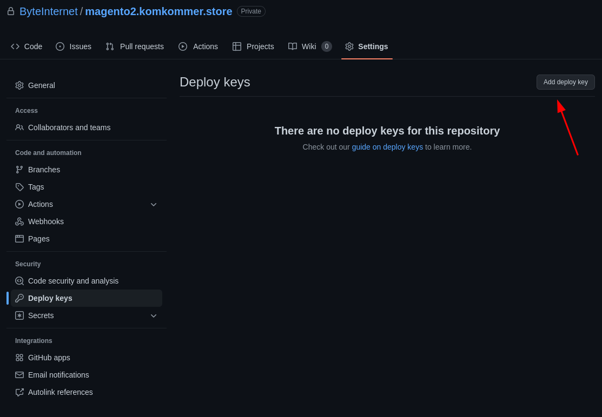

---
myst:
  html_meta:
    description: 'This guide will walk you through the process of setting up a continues
      integration and delivery/deployment pipeline for a Magento 2 shop. '
    title: How to deploy your application using Hypernode Deploy?
redirect_from:
  - /en/support/solutions/articles/48001219280-how-to-deploy-your-application-using-hypernode-deploy-v1/
---

<!-- source: https://support.hypernode.com/en/support/solutions/articles/48001219280-how-to-deploy-your-application-using-hypernode-deploy-v1/ -->

# How to deploy your application using Hypernode Deploy v1

## Introduction

This tutorial will guide you through the process of setting up a continues integration and delivery/deployment pipeline for a Magento 2 shop, using Github as your CI-system. For simplicity reasons, we'll only focus on one environment: Staging.

## Prerequisites

Before starting, make sure you have the following requirements setup correctly:

- (Access to) a Hypernode
- A Github account

Make sure to [create a new SSH key pair](../ssh/how-to-use-ssh-keys-on-hypernode.md) as a deployment key, and [add this to your Hypernode via the Control Panel](../../services/control-panel/how-to-add-keys-to-the-ssh-key-manager.md). We'll use this SSH key in the deployment process to upload your application to the Hypernode.

## Configure your Deployment SSH key pair in Github

Now that your deployment key is generated and added to your server, it's time to configure the deployment key pair in Github.

Go to your Github repo and then to `Settings > Deploy keys`.



Copy the private key from your deployment key pair, paste them as is (modifying the contents could result in "invalid key format" issues), and press `Add key.`

``

## Dump Magento configuration to configuration files

For a successful pipeline it is important that the necessary configuration from the Magento Admin is exported to files, because we can't and do not want to have database dependencies / connections within a CI pipeline.

Use the following command to dump the configuration to files:

```bash
bin/magento app:config:dump
```

Strip the configuration files so that 'app/etc/config.php' contains only the essential configuration. Add 'app/etc/config.php' to your Git repo history, but not 'app/etc/env.php' because this file only needs to live on the server.

Read more about dumping Magento configuration in the [devdocs of Magento](https://devdocs.magento.com/guides/v2.3/config-guide/cli/config-cli-subcommands-config-mgmt-export.html).

## Create Hypernode Deploy configuration file

Now we added and configured the deploy key, it's time to setup the deployment configuration using "configuration as code". We just need a `deploy.php` file in the root of the project.

The Hypernode Deploy configuration file ([here on Github](https://github.com/ByteInternet/hypernode-deploy-configuration/)) is a PHP file that contains a configuration object that will be used by the Hypernode Deploy Docker image (that we will later configure in the Github CI configuration) to perform configured CI/CD steps.

Optional: to get code completion for your deploy configurations, add the Hypernode Deploy Configuration composer package as a development package to your project:

```bash
composer require hypernode/deploy-configuration --dev
```

You can either start from scratch with an empty `deploy.php` file, or use one the [starter templates](https://github.com/ByteInternet/hypernode-deploy-configuration/tree/master/templates) and continue from there.

For this tutorial we'll use the [Magento 2 application template configuration](https://github.com/ByteInternet/hypernode-deploy-configuration/blob/master/src/ApplicationTemplate/Magento2.php). This template contains a default configuration for Magento 2 projects, which can be modified and extended to your own requirements.

The configuration for just a staging environment could be as short as this:

```php
<?php
namespace Hypernode\DeployConfiguration;

$configuration = new ApplicationTemplate\Magento2(
 // Your GIT repository url
 'git@github.org:myorg/myproject.git',
 // Frontend locales
 ['nl_NL'],
 // Backend locales
 ['nl_NL']
);

$stagingStage = $configuration->addStage('staging', 'staging.example.com');
$stagingStage->addServer('example.hypernode.io');

return $configuration;

```

Now we have to provide the files and folders that don't change per deployment and thus will be shared over multiple deployments.

Common examples of shared files are configuration files such as `.env`, `env.php` and `config.php`. Often, those files are not under source control and might be generated / composed by the application or CI/CD system.

The M2 starter template we're using already contains the following shared files configuration:

```php
$configuration->setSharedFiles([
    'app/etc/env.php',
    'pub/errors/local.xml'
]);
```

Common examples of shared folders are: `media`, `uploads`, `var/import` and `var/log`. The M2 starter template already contains the following shared folder configuration:

```php
$configuration->setSharedFolders([
    'var/log',
    'var/session',
    'var/report',
    'pub/media'
]);
```

Now it's time to add our build, deploy and after deploy commands.

The M2 starter template contains the following default build commands:

```php
$configuration->addBuildCommand(new Command\Build\Composer());
$configuration->addBuildCommand(new Command\Build\Magento2\SetupDiCompile());
$configuration->addBuildCommand(new Command\Build\Magento2\SetupStaticContentDeploy($localesFrontend, 'frontend'));
$configuration->addBuildCommand(new Command\Build\Magento2\SetupStaticContentDeploy($localesBackend, 'adminhtml'));
```

And the following deploy commands:

```php
$configuration->addDeployCommand(new Command\Deploy\Magento2\MaintenanceMode());
$configuration->addDeployCommand(new Command\Deploy\Magento2\SetupUpgrade());
$configuration->addDeployCommand(new Command\Deploy\Magento2\CacheFlush());
```

## Create Magento 2 configuration files

For Magento 2 your first build will fail due to missing configuration. Login to the server and depending on your project file edit `app/etc/env.php` or `app/etc/local.xml`. You will find these files in `~/apps/<domain>/application/shared/`.

## Create Github configuration file

Now it's time to create your CI configuration file. You can either start from scratch or use the [Hypernode Deploy Github configuration starter template](https://github.com/ByteInternet/hypernode-deploy-configuration/blob/master/templates/github-pipelines.yml).

The CI configuration file needs to make use of the Hypernode Deploy image in order to run your CI/CD pipelines succesfully. We serve multiple flavors of the Hypernode Deploy image, one for every PHP + NodeJS version combination. See [Docker Hub](https://hub.docker.com/r/hypernode/deploy/tags) for all supported flavors. As new PHP / Node versions come out, we'll bake more images to support those.

Choose a version of the hypernode/deploy image that best reflects your application needs. Here's an example of a `.github/workflows/deploy.yml` file that uses the PHP 8.1 + Node 16 flavor and is configured with a configuration for the staging environment, containing a build step and deploy step to perform the deployment to the configured staging server. It uses the configuration provided in `deploy.php` to perform the steps.

```yaml
# This file would need to be placed in .github/workflows/deploy.yaml for example
# In this example, the branches 'master' and 'staging' are used for the production and staging branch, respectively.

name: Build and Deploy

on:
 push:
 branches:
 - 'master'
 - 'staging'

env:
 COMPOSER_CACHE_DIR: /tmp/composer-cache

defaults:
 run:
 shell: bash

jobs:
 build:
 runs-on: ubuntu-latest
 container: quay.io/hypernode/deploy:1-php8.1-node16
 steps:
 - uses: actions/checkout@v2
 - uses: actions/cache@v2
   with:
     path: /tmp/composer-cache
     key: ${{ runner.os }}-composer
 - uses: webfactory/ssh-agent@v0.5.4
   with:
     ssh-private-key: ${{ secrets.SSH_PRIVATE_KEY }}
 - run: hypernode-deploy build -vvv
 - name: archive production artifacts
   uses: actions/upload-artifact@v3
   with:
     name: deployment-build
     path: build/build.tgz

 deploy_staging:
   needs: build
   runs-on: ubuntu-latest
   container: quay.io/hypernode/deploy:1-php8.1-node16
   steps:
   - uses: actions/checkout@v2
   - name: download build artifact
     uses: actions/download-artifact@v3
     with:
   - name: deployment-build
     path: build/
   - uses: webfactory/ssh-agent@v0.5.4
     with:
       ssh-private-key: ${{ secrets.SSH_PRIVATE_KEY }}
   - run: mkdir -p $HOME/.ssh
   - name: deploy to staging
     if: github.ref == 'refs/heads/staging'
     run: hypernode-deploy deploy staging -vvv
   - name: deploy to production
     if: github.ref == 'refs/heads/master'
     run: hypernode-deploy deploy production -vvv

```

## Optional: Test your Build and Deploy commands locally

Now that we're done with the project configuration, we can test the configured Build and Deploy steps locally before committing and pushing to the remote Git repo. Because we don't have to wait for the Github pipeline result this will reduce the time of the feedback loop drastically. You'll need to have a Docker client setup in order to test your build and deployment locally.

Run the `hypernode-deploy build` command locally. We assume that the private key of the earlier created deploy key is located at `~/.ssh/id_rsa_myproject_deploy`, and that is has access to the main Git repository, private packages and the SSH user. Keep in mind that the provided `SSH_PRIVATE_KEY` environment variable needs to be base64 encoded.

```bash
docker run -it --env SSH_PRIVATE_KEY="$(cat ~/.ssh/id_rsa_myproject_deploy | base64)" -v `pwd`:/build hypernode/deploy:php7.3-node13 hypernode-deploy build -vvv
```

Because all hypernode-deploy commands are implemented as Symfony Console commands, we can append the build command with a flag to determine the [verbosity level](https://symfony.com/doc/current/console/verbosity.html), like `-vvv` to display all messages. This will be useful to debug any errors.

Just like the build command, we can also test the deploy command. For this example we first set the environment variables before using them in the command.

```bash
export SSH_PRIVATE_KEY=***
export DEPLOY_COMPOSER_AUTH=***

docker run -it -e SSH_PRIVATE_KEY -e DEPLOY_COMPOSER_AUTH -v `pwd`:/build hypernode/deploy hypernode-deploy deploy staging -vvv
```

## Commit and push project CI/CD configurations

Now that all project configuration is done and we verified that both our build and deploy commands run locally as expected, it's time to commit and push both the Hypernode Deploy configuration (`deploy.php`) and CI configuration (`github-pipelines.yml`) to the remote Git repository.

After that's done, Github will automatically trigger the pipeline as configured. The only accepted outcome is a pipeline that completely succeeds!
