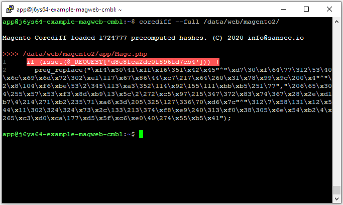

---
myst:
  html_meta:
    description: 'Magento Corediff is an open source tool to quickly find unauthorized
      modifications in a Magento install. Find out how to use Magento Corediff on
      Hypernode. '
    title: How to use Magento Corediff on Hypernode?
redirect_from:
  - /en/hypernode/tools/how-to-use-magento-corediff-on-hypernode/
---

<!-- source: https://support.hypernode.com/en/hypernode/tools/how-to-use-magento-corediff-on-hypernode/ -->

# How to Use Magento Corediff on Hypernode

[Magento Corediff](https://github.com/sansecio/magento-corediff) is an open source tool to quickly find unauthorized modifications in a Magento 1 or 2 install. It compares each line of code in your webshop with a database filled with millions of lines of trusted code, showing you exactly what code your webshop contains that isn't supposed to be there.

Corediff was created by [Sansec](https://sansec.io), specialists in Magento security and digital forensics since 2010.

## Scanning your Magento's code

By default, *corediff* requires a Magento installation folder to scan. You can simply point the tool at your Magento installation to have it scan the entire webshop for unknown code.

```
app@j6ys64-example-magweb-cmbl:~$ corediff /data/web/magento2
```

If you're running Magento 1, you will need to change the path from */data/web/magento2* to */data/web/public*

You can also have *corediff* scan all code, instead of just known Magento paths, by including the *--ignore-paths* argument.

## Interpreting the results

Hopefully the scan doesn't return any modified files. If it does, you will need to see if these modifications are purposely made changes to your Magento core files made by your own developers, or malicious code made by cybercriminals. How to tell the difference between these two is something that falls beyond the scope of this document, but is something your developers should be able to do.



In the example above, you can see that the file */data/web/magento2/app/Mage.php* contains two lines of code that have not ever been seen before in any version of Magento. A cursory glance quickly teaches us that this is malicious code, waiting for specific arguments to be passed containing remote code to execute, a technique often used by malicious actors.

## Cleaning up malicious code

If you do end up finding malicious code, we advise you to follow our guide on recovering [a hacked magento shop](../../best-practices/security/how-to-recover-a-hacked-magento-shop.md).
