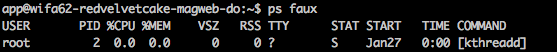

---
myst:
  html_meta:
    description: "Cronjobs are periodic tasks that run in the background of your Hypernode.\
      \ We'll help you to set up and use these periodic tasks. "
    title: How to Use Periodic Tasks or Cronjobs on Hypernode?
redirect_from:
  - /en/hypernode/tools/how-to-use-periodic-tasks-cronjobs-on-hypernode/
  - /knowledgebase/configure-cronjobs-on-hypernode/
---

<!-- source: https://support.hypernode.com/en/hypernode/tools/how-to-use-periodic-tasks-cronjobs-on-hypernode/ -->

# How to Use Periodic Tasks (Cronjobs) on Hypernode

Cronjobs are periodic tasks that run in the background of your Hypernode. They can be used for all sorts of maintenance, such as cleaning up logs or importing new products. In fact, Magento makes extensive use of cronjobs.

If you need some help to get the timing settings right, check [crontab guru](https://crontab.guru/) and [cronjob time predictor](https://cronjob.xyz/) these little helpers can assist you configuring cron jobs.

## Setting up Cron Jobs

### Enabling the Magento 1.x Cron

This is recommended for every installation! Log in using SSH and run `crontab -e` and add the following lines:

```nginx
# Run the Magento cron every 5 minutes, skip if previous run is still
# busy, and mail any output to my@email.com
# MAILTO=your@email.com # Uncomment to receive the error output on your own email address
*/5 * * * * flock -n ~/.cron.lock php /data/web/public/cron.php
```

After adding the cronjob, press **CTRL+X**, **Y** and then **ENTER** to save the cronjob into your crontab.

### Enabling the Magento 2 Cron

To configure the cron for Magento 2 you'll have to run the commando below. The cron will automatically be added to the crontab.

```nginx
bin/magento cron:install
```

Magento 2 uses another mechanism for scheduling tasks. That’s why the Magento 2 cron needs to run every minute instead of every 5 minutes. More information can be found in [the Magento 2 documentation](http://devdocs.magento.com/guides/v2.0/config-guide/cli/config-cli-subcommands-cron.html).

#### Magento 2.4. Cron

\*\*Please note:\*\*the `update/cron.php` file has been removed in Magento 2.4.0, if this file exists on your installation, it can be safely removed.

Any reference to `update/cron.php` and `bin/magento setup:cron:run` can also be removed from the crontab.

### Adding Custom Cronjobs

For most cases, cronjob syntax is actually quite easy. See the [full documentation](https://help.ubuntu.com/community/CronHowto) or use these examples.

```nginx
# Run an hourly job at 10 minutes past the hour
10 * * * * flock -n ~/.myjob.lock php /data/web/mycron.php
```

```nginx
# Run a daily job at 3:20 in the night
20 3 * * * flock -n ~/.myjob.lock php /data/web/mycron.php
```

```nginx
# Run a job on the first day of the month at 3:20
20 3 1 * * flock -n ~/.myjob.lock php /data/web/mycron.php
```

### Stopping Cronjobs After a Timeout Period

To avoid cronjobs running for hours, blocking all other crontasks to be executed by Magento, you can make use of the `timeout` utility.

This tool can be given a “max execution time” and will stop the running task when this time period has exeeded.

For example:

```nginx
# Run a daily job at 3:20 in the night and kill after 120 seconds
20 3 * * * timeout 120 php /data/web/mycron.php
```

### Cron Deadlock Protection

Our system will automatically add `flock` to your cron commands. This will prevent many problems, for example when multiple concurrent imports cause a database deadlock. If you do not want our auto flock (not recommended!) you can add `# noflock` to your command, like this:

```nginx
# Run a command that does not care whether it is already running
* * * * * php /data/web/mycron.php # noflock
```

### Cron Jitter (Sleep) Added to Cronjobs

Our automation will add a cron jitter (`sleep xx;`) to all the cronjobs in your cron commands. This will make sure that not all cronjobs on our platform will run at the exact same time. For example, if your Hypernode has `sleep 34;` added to the cron commands, it means that the command will be started 34 seconds after the time that is set in your cron task. This should not cause any issues since the crons still run every x time, they'll just run 34 seconds later. However, if you really want your crons to run on the exact minute then you can disable the sleep by adding `#nosleep` at the end of the cron command. More information about this setting can be found in [this changelog](https://changelog.hypernode.com/changelog/release-7220-configurable-innodb_buffer_pool-size-cron-jitter-and-more/).

### Changing Your Crontab Editor

When you use `crontab -e` for the first time, you’ll be asked which editor you want to use. If you’d like to change your editor after your initial choice, please use the `select-editor` command. If you want to temporarily change your editor, you can do this by exporting the `EDITOR` variable: export `EDITOR=vim; crontab -e`

## Recommendations

- Idem-potency: When you write your own cron script, make sure the script is idempotent. When a script should only be run after a certain time or when a new import file is present, always make sure to exit the script when the conditions are not met. This avoids things breaking down when people run cron scripts manually to debug cron issues.
- Time is always based on UTC (= GMT). This might differ from your local time: Dutch time is UTC+1 in winter and UTC+2 in summer. Or use this [handy converter](http://www.timeanddate.com/worldclock/))
- Do not run the Magento crons using `wget` or `curl`, as this is slow, might give partial results, and occupies webslots for real visitors). See above how to invoke the non-HTTP Magento cron.
- Do not run the same cron simultaneously on multiple hosts, as results are unpredictable. When migrating, do not forget to disable the old crons.
- Be carefull when using day of month and day of week together. Using `Dom` and `Dow` without wildcards makes this an `OR` condition and not an `AND`, running the job more often then you’d expect.
- Cron does not deal with seconds so you can’t have cron job’s going off in any time period dealing with seconds. Like a cronjob going off every 30 seconds.
- Monitor your cronjobs! You can do this by checking the exitcode and or the mail that is sent, or using a third party monitor. A free third party cron monitoring tool is [healthchecks.io](https://healthchecks.io/)

## Debugging Cron Issues

For new users, cron can be difficult to work with, as it’s hard finding out wat is causing cron not to run or to end before finishing the job. This section gives you some tips and tricks to debug cron issues.

### Test If the Cron’s Timing Is Actually What You Are Expecting

If the cron is configured, but appears not to be running, check if the time configuration is at what you’d expect.

A great helper utility to validate the cron’s timing, is [crontab.guru](https://crontab.guru/).

### Test If the Cron Is Currently Running

If it appears your cron is not running anymore, check whether it is currently running using flock.

Sometimes a cronjob takes more time than expected or ends up running in a recursive loop.

If this happens, the lock never gets removed causing the cron daemon to delay the consecutive jobs.

To resolve this issue, find out why it’s still running and kill the current running cronjob. Then start a new one.

You can use the `ps faux` command to check the running processes. If you see a cronjob still running, you can kill it by using its PID number:



You can kill the process (with PID 2) by using this command:

`kill -9 2`.

### Check If the Cron Daemon Is Running

We monitor cron extensively, but to ensure yourself, `grep` in the process list to verify whether the daemon is really running:

```nginx
ps -ef | grep -i cron
```

### Verify the Cron Command From Your Logs

When a cronjob ran, a log entry is written to `/var/log/syslog`. Retrieve the cron command from the logs and check whether the command can be run on the commandline to avoid typo’s or badly copied example cronjobs.

### Check If All Cronjobs Use Their Own Lockfile for Flock or Share One

If multiple cronjobs share the same lockfile and one job is running, the other can’t start.

To avoid this, ensure that all crons use a unique lockfile.

### Test If the Lock Files Are Cleaned Up

Sometimes when a cronjob crashes, the locks are not cleaned up successfully. This will obstruct the cronjob from running.

To fix, cleanup the old lockfiles by removing them:

```nginx
rm ~/.a6fe0d58.lock
```

This will remove the file, effectively removing the lock set on the file as well.

### Test If the Cron Has Ever Run Since You Configured It

To get a history of all cron actions, like editing, updating and listing the cron files, all jobs of all users etc, you can easily grep for cron in syslog:

```nginx
grep -i cron /var/log/syslog
```

This will generate a huge list of all jobs cron has run including editting, listing and removing the cronjob.

To verify whether it has run, grep for all cronjobs that are run by user app and check if your cronjob has ever run:

```nginx
grep -i cron /var/log/syslog | grep '(app)'
```

### Verify Whether Your `PATH` Variable and Other Environment Variables Are Set Correctly

Cron does not automatically source environment and or shell settings from `.bashrc`, `.profile` etc.

You can’t use predefined shell environment settings like `$PATH`, `$HOME`, `$USER` or homedir expansion like `~/sbin`.

If you want to use these settings you’d have to source the corresponding settings file accordingly by adding it to your cronjob:

```nginx
PATH=/usr/local/sbin:/usr/local/bin:/usr/sbin:/usr/bin:/sbin:/bin:/usr/games:/usr/local/games
```

Or alternatively if you want all the settings you use in the shell, source your `bashrc` file prior to executing:

```nginx
*/5 * * * * source /data/web/.bashrc && cp $HOME/somefile $HOME/public/exports
```

You can set things like `MAILTO=`, `SHELL=` or `PATH=` and other environment variables the shell uses.

For example:

```nginx
IMPORTFILE="/data/web/public/some-very-long-import-file-in-cvs-format.products-from-some-website.cvs"
DESTINATION="/data/web/public/some/very/long/path/in/the/magento/directory`
*/5 * * * * cp $IMPORTFILE $DESTINATION/
```

### Verify Whether Your Locations Are Setup Correctly

Verify the correct path in cron arguments.

Cronjobs often contain full paths to scripts inside your homedirectory. Be sure to replace them for your situation at Hypernode. For example, if your site is currently hosted at Hypernode, you need to replace `/home/users/domaiftp` with `/data/web/`, and `/home/users/domaiftp/domain.com` with `/data/web/public`.

### Verify Whether Your Cron Is Working When You Run It on the command line

If your cronjob appears to be started by cron, but does not finish the job it is supposed to handle, check what output is generated by running the cron on the commandline.

### Ensure Yourself You Are Not Using Special Characters Like `%` and `@` in Your Cron Command

Cron uses some special characters in it’s syntax. Therefor you cannot use chars: `*`,`,`, `-`, `@`, `#` and `%`

If used with command substitution (IE: the `date` command) you can use shell command substitution (`$()`).

To use special chars, escape them with a backslash: `\%` instead of `%`

### Verify the Cron Output

Many users will add `2> /dev/null` or `2>&1 > /dev/null` to their cronjobs, redirecting all error output to `/dev/null`.

If you use this option, you will never see the error output the job creates.

To check whether a job generates error output, redirect output to standard out and let cron mail it’s output by setting a `MAILTO` variable containing your email address. This will send all output of the cronjob to your email address.

If you only want to receive a mail when the jobs fails, use `chronic`. This lovely tool only returns output when the exit code is not 0, therefor only sending the output to cron when the job did not succeed.

### Catching Error Output in a Log File

If you want to debug cron timing issues, use a wrapper that logs all issues to log files:

```
#!/bin/bash
# This script is a debug utility for cronjobs as explained in:
# - https://support.hypernode.com/knowledgebase/configure-cronjobs-on-hypernode/
# It logs all output and timing to a log file
#
# To use it, download the script, add the executable bit and put it in your cronjob:
# */5 * * * * /data/web/bin/debug-cron php -f /data/web/public/cron.php

LOGDIR="/data/web/public/var/log/crons"
TIMESTAMP="$( date '+%Y%m%d%H%M' )"
FILENAME="$LOGDIR/cronjob-${TIMESTAMP}.log"

function log() {
    while read LOG ; do
        echo "$(date) - $LOG" | tee -a $FILENAME
    done < "${1:-/dev/stdin}"
}

## Test if log dir is present
[ -d "${LOGDIR}" ] || mkdir -p "${LOGDIR}"

## Get arguments from script
SCRIPTNAME="$0"
COMMAND="${@}"

## Exit if no arguments
if [ "${COMMAND}x" == "x" ] ; then
    echo "$0 Usage $SCRIPTNAME <command>"
    exit 1
fi

## Log and run
echo "Running cron job \'${COMMAND}\'" | log
${COMMAND} | log
EXITCODE="$?"
echo "Cron job \'${COMMAND}\' finished with exit code ${EXITCODE}" | log
```

Save it as `~/bin/debug-cron` and make it executable with `chmod +x ~/bin/debug-cron`

Now you can debug your cron issues using the following syntax:

```nginx
*/5 * * * * flock -n ~/.a6fe0d58.lock -c '/data/web/bin/debug-cron php -f /data/web/public/cron.php'
```

To check the output and run/stop time of the cronjob, check the logfiles in `/data/web/public/var/log/crons`
