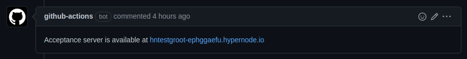

---
myst:
  html_meta:
    description: 'Hypernode Brancher is a powerful tool that allows users to create
      and manage temporary servers based on their production Hypernode. Learn more. '
    title: Hypernode Brancher | Everything you need to know
redirect_from:
  - /en/support/solutions/articles/48001227297-hypernode-brancher/
---

<!-- source: https://support.hypernode.com/en/support/solutions/articles/48001227297-hypernode-brancher/ -->

# Hypernode Brancher

Hypernode Brancher is a powerful tool that allows users to create and manage temporary servers based on their production Hypernode.

Hypernode Brancher is fully integrated with the Hypernode platform. With just a few simple commands, users can create and manage Brancher nodes. This is useful for running parallel integration tests, testing software version upgrades, or performing any other tasks that require a temporary and isolated server environment.

Using our Hypernode API, you can also automate the management of Brancher nodes, which enables you to automate your DTAP environment. This saves time and resources, and it allows users to test and develop their applications with confidence.

Overall, Hypernode Brancher is a valuable addition to the Hypernode toolset, and it can help users improve the reliability and performance of their applications.

## What is Hypernode Brancher?

Hypernode Brancher is an extra service that runs alongside our core product Hypernode. It’s an addon based on your Hypernode subscription and is intended to add additional functionality that’s useful for developing and testing your webshop.

Hypernode Brancher is a mutable and temporary copy of your Hypernode. It’s based on the latest backup made for your Hypernode, meaning that the state on the Brancher node is at most 24 hours old.

If you wish to get a more recent state on the Brancher node, you can create a new backup on your Hypernode using `hypernode-systemctl create_backup`. Note that this requires SLA Standard to be enabled on your Hypernode.

Read more about our [backup policy here](../backups/hypernode-backup-policy.md).

## Why should I use it?

Typically you simulate the environment on your Hypernode via the hypernode-docker image. This is an easy way to have a near-identical environment which contains all Hypernode tooling without having to test on your actual Hypernode.

However, there are some significant drawbacks to using the Docker image. For one, this isn’t exposed to the internet like a regular Hypernode is. Requesting SSL certificates, exposing your environment to other colleagues or taking advantage of the full Hypernode automation are all missing in the Hypernode Docker image. Next to that, we cannot replicate full behaviour on Docker containers because of the lack of systemd, which we heavily utilize on Hypernode.

All of these features are available on Hypernode Brancher, as it’s just another Hypernode. Next to that, it copies over the state of your Hypernode, meaning that there are no strange side-effects that would happen on production that you wouldn’t be able to reproduce on a Docker container.

The most common use-cases are done by integrating Hypernode Brancher into your integration tests, or as an ad-hoc situation where you want to test a software version upgrade.

### Example: MySQL version upgrade

Let’s say you want to upgrade your MySQL version to 8.0 on your Hypernode. We provide all of the tooling to do this easily, by running the following command:

```console
$ hypernode-systemctl settings mysql_version 8.0
```

However, we do warn you about changing this, as downgrading your MySQL version is not possible. If you do this upgrade, you should be sure about it and consider the consequences carefully.

One way of testing this change is by using a development Hypernode, and try out the change there. The problem here lies in the fact that you can only try this once on your development environment, and that it has a different state compared to your production Hypernode.

### Example: Acceptance server per pull request

Another common use-case is to have a separate acceptance server per pull request. You can give access to this acceptance server to your colleagues, or to your customers, so that they can test your changes before they are merged into the main branch.

You can achieve this by making a separate Github Actions workflow. This workflow will create a new Brancher node based on the current pull request, and leave a comment on the pull request with the URL to the Brancher node. This way, you can easily test your changes in a real environment, and you can easily clean up the Brancher node when you’re done. This workflow file can look like this:

```yaml
name: Deploy to acceptance server

on:
  pull_request:
...

jobs:
    ...
      - name: deploy to acceptance
        run: hypernode-deploy deploy acceptance -vvv
        env:
          HYPERNODE_API_TOKEN: ${{ secrets.HYPERNODE_API_TOKEN }}
      - name: Get brancher hostname
        run: echo "BRANCHER_HOSTNAME=$(jq .hostnames[0] deployment-report.json -r)" >> $GITHUB_ENV
      - name: Comment hostname on PR
        uses: thollander/actions-comment-pull-request@v1
        with:
          message: |
            Acceptance server is available at https://${{ env.BRANCHER_HOSTNAME }}
```

This fetches the hostname of the Brancher node, and leaves a comment on the pull request with the URL to the Brancher node on every push to the pull request:



## How do I use it?

You can use Brancher in three (and soon four) different ways: via our Hypernode API, Hypernode Deploy or the `hypernode-systemctl brancher` CLI tool.

### Hypernode API

You can create new Brancher nodes via the Hypernode API with the following POST request:

```console
$ curl -X POST -H "Authorization: Token <token>" https://api.hypernode.com/v2/app/<appname>/brancher/
```

The appname specified in the request url is the appname on which the Brancher node will be based. This returns the name of the Brancher node, which is in the format of `<appname>-eph123456`. To make things easier for you, we have made API client libraries available in [PHP](https://github.com/ByteInternet/hypernode-api-php) and in [Python](https://github.com/ByteInternet/hypernode-api-python). Go check them out!

Once the Brancher node becomes available, you can control it via the `/v2/app/<appname>-eph123456` endpoint just like a regular Hypernode.

### Hypernode-deploy

Hypernode-deploy is our recommended way of deploying your webshop to Hypernode. which makes it easier for you to manage your application’s codebase. This platform is fully integrated with Hypernode Brancher, which makes it a breeze for you to try out upgrade scenarios, or pushes to the Staging environment.

Once you set up your Hypernode to make use of Hypernode-deploy, you can run your tests against a Brancher node with just a single command. This will then run against your fresh Branched version of the Node, making sure that your tests are passing before deploying to production.

You can use Brancher in your Hypernode-deploy deploy.php file like this:

```php
<?php

namespace Hypernode\DeployConfiguration;

$configuration = new ApplicationTemplate\Magento2(['en_GB', 'nl_NL']);

$testStage = $configuration->addStage('test', 'example.com');

// We use an automatically created Brancher node based on the parent for the 'test' stage.
// In your testing pipeline, you can simply use the 'test' stage to push changes to the Brancher server,
// and run your tests. Cancel it when your tests fail or after your tests pass to incur minimal costs.
$testStage->addBrancherServer('appname')
    ->setSettings(['cron_enabled' => false, 'supervisor_enabled' => false]);

return $configuration;
```

This will automatically create a Brancher node based on the parent Hypernode and push to it, allowing you to test the changes before making them on the production Hypernode.

### Hypernode-systemctl brancher

You can use the command hypernode-systemctl brancher tool to quickly interact with the Hypernode API in a validated and controlled manner. Creating a Brancher node goes like this:

```console
$ hypernode-systemctl brancher --create
Brancher App created for app 'testalex'. See hypernode-systemctl brancher --list for the progress
app_name: testalex-eph123456
parent: testalex
Host: testalex-eph123456.hypernode.io
IP: will become available in a couple of minutes
```

You can then list the available Brancher nodes:

```console
$ hypernode-systemctl brancher --list
+--------------------+----------------+---------------------------------+---------+
|        Name        |       IP       |               Host              | Minutes |
+--------------------+----------------+---------------------------------+---------+
| testalex-ephjopv59 |  83.217.88.80  | testalex-ephjopv59.hypernode.io |   4592  |
| testalex-ephw4zcjr | 185.111.198.18 | testalex-ephw4zcjr.hypernode.io |   4345  |
| testalex-ephsbuos6 | 37.72.165.123  | testalex-ephsbuos6.hypernode.io |   1866  |
+--------------------+----------------+---------------------------------+---------+
```

Finally, you can delete it:

```console
$ hypernode-systemctl brancher --delete
Brancher App 'testalex-eph123456' deleted. See hypernode-systemctl brancher --list for the list of remaining brancher apps.
```

And with some creativity you can come up with a one-liner to remove all active Brancher nodes:

```console
$ hypernode-systemctl brancher --list | awk '{print$2}' | grep -eph | xargs -n1 hypernode-systemctl brancher --delete
Brancher App 'testalex-eph123456' deleted. See hypernode-systemctl brancher --list for the list of remaining brancher apps.
Brancher App 'testalex-eph234567' deleted. See hypernode-systemctl brancher --list for the list of remaining brancher apps.
```
