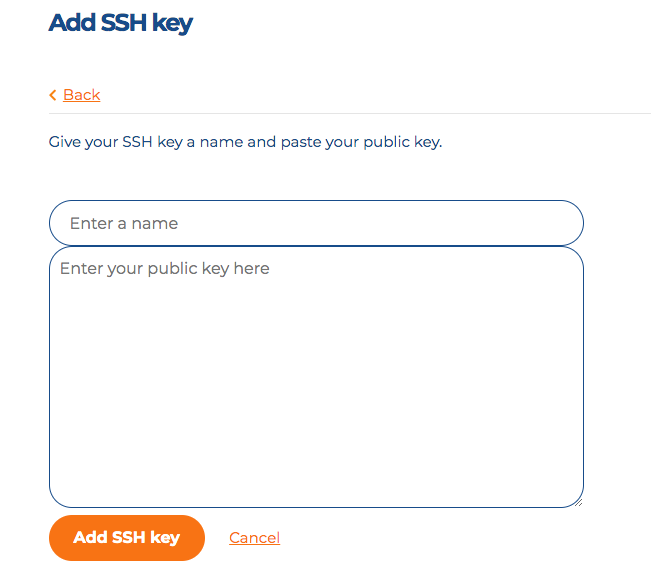
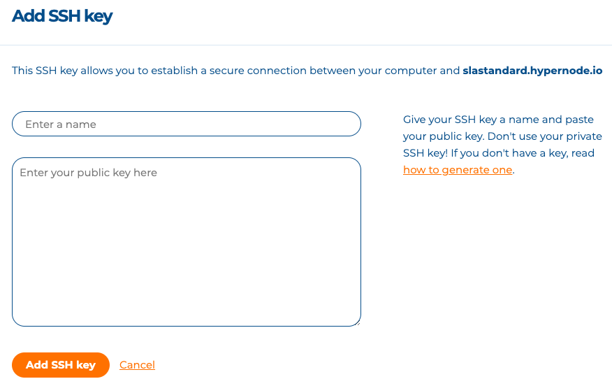

---
myst:
  html_meta:
    description: 'You can add SSH Keys to your Hypernode(s) via the Control Panel.
      Following our comprehensive guide to add an SSH key to one Hypernode. '
    title: How to add keys to the SSH key manager? Hypernode
redirect_from:
  - /en/services/control-panel/how-to-add-keys-to-the-ssh-keymanager/
---

<!-- source: https://support.hypernode.com/en/services/control-panel/how-to-add-keys-to-the-ssh-keymanager/ -->

# How to Add Keys to The SSH Key Manager

By adding your SSH key to the SSH Key Manager, you add your SSH key to all Hypernodes you have access to without having to do this for each Hypernode separately. You can also add an SSH key to one Hypernode for deployment purposes.

## Adding an SSH Key to All Your Hypernodes

You can add SSH Keys to your Hypernode(s) via the Control Panel by following the next steps:

1. Log in to your [Control Panel](https://my.hypernode.com/)
1. Hover over your name in the upper right corner and select **Account Settings** from the dropdown menu.
1. Scroll down to SSH Keys and click the **Add SSH Key\*\*\*\*button**.
1. Paste the content of your public key into the public key field and give your SSH key a name.
1. Click on the **Add SSH key button** to add the key to the Key Manager
1. Congrats! Your key will now be added to all Hypernodes you have access to.

Repeat the above steps if you would like to add more keys.

## Adding an SSH Key to One Hypernode

Need to add an SSH key to just **one** Hypernode (e.g. SSH keys that are used to deploy the application and nothing else)? Follow the steps below to do so.

1. Log in to the [Control Panel](http://my.hypernode.com/).
1. From the Hypernode overview, select a specific Hypernode by clicking on **Details**.
1. Then hover over **Hypernodes**in the sidebar and select **SSH keys:**
1. You can add a new key on this page by clicking the **Add SSH key**button. You'll also see an overview of previously added keys.
1. On the next page, paste the content of your public key into the public key field and give your SSH key a name:
   
1. Click **Add SSH key**to add the key to the Hypernode.

## Important

- The following SSH public key types in the control panel are supported: RSA keys >= 2048 bits (\*), ECDSA and Ed25519 keys.
- DSA and RSA keys \< 2048 bits * will not be permitted because they are not secure.
- You will be prompted with a clear message if there is a problem with your key.
