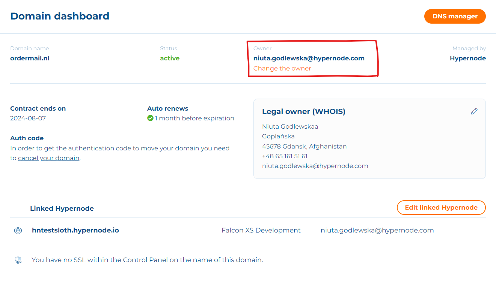
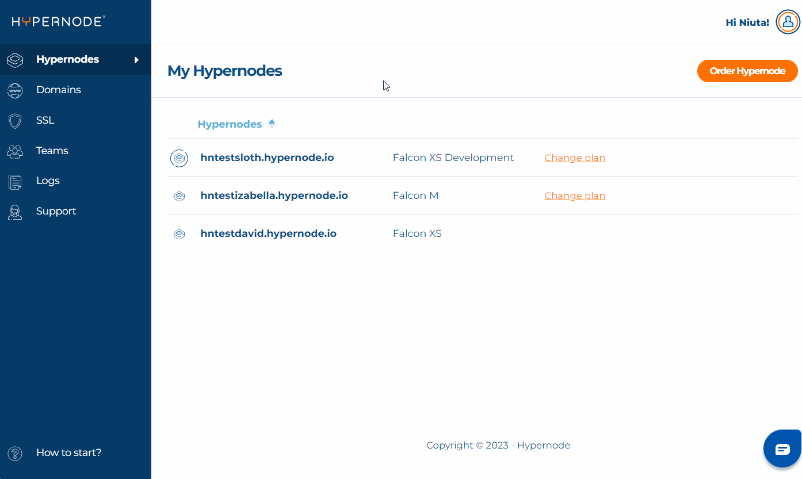

---
myst:
  html_meta:
    description: Learn how to change the legal owner (WHOIS) in the Control Panel.
      This guide provides step-by-step instructions on how to securely change the
      legal owner.
    title: How to change the legal owner (WHOIS) of a domain? | Control Panel
    keywords: hypernode, domains, legal owner, WHOIS, change legal owner, domain legal
      owner, domain owner
---

# How to change legal owner (WHOIS) of the domain in the Control Panel?

*Note: This feature is accessible only for the Owners of the domains. To check if you’re the owner go to Control Panel > Domains > choose a domain you want to check. If you are the Owner, your e-mail will appear next to the status of the domain.*

## How to change legal owner (WHOIS) details in the Control Panel?

Follow steps below to change the WHOIS details:

1. Log in to [Control Panel](https://my.hypernode.com/)
1. Go to **Domains** and choose the domain where you want to change the Legal owner.
1. Find the block “Legal owner (WHOIS)” and click the pencil icon to **Change WHOIS details**
1. Select one of existing Legal owners or add a new one.
1. Press **Change WHOIS button**
1. New Legal owner will be updated automatically.

## Issue: I don’t see the pencil icon to change WHOIS details

If you don’t see the pencil icon next to “Legal Owner (WHOIS)” title, you don’t have permissions to edit the details. Check if you’re the Owner of the domain or ask the Owner to change the details.

### Issue: I don’t see the WHOIS details

If you have DNS-only domain you won’t see WHOIS details. Changing WHOIS for the domain is applicable only for TLD domains. To be able to change WHOIS details you need to upgrade DNS-only to TLD.
