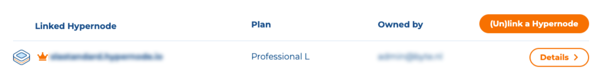

---
myst:
  html_meta:
    description: 'Need help connecting your domain to your Hypernode? Our step-by-step
      guide will walk you through the process in the Control Panel. '
    title: How to link your domain to your Hypernode? | Control Panel
redirect_from:
  - /en/best-practices/usage/how-to-link-your-domain-to-your-hypernode/
---

<!-- source: https://support.hypernode.com/en/best-practices/usage/how-to-link-your-domain-to-your-hypernode/ -->

# How to Link Your Domain to Your Hypernode

## Introduction

Thanks to Hypernode’s very cool **Dedicated IP** feature the IP address of your Hypernode does not (!) change when you change a Hypernode plan. However, there are two exceptions to take into account.

### Dedicated IP on Hypernode – Two Exceptions

There are two exceptions when you can't benefit from a dedicated IP and which may have impact on how you would like to manage your DNS:

1. Changing between Falcon (formerly known as Professional), Pelican and Eagle (formerly know as Excellence) plans will lead to an IP change because you will change providers (e.g. Combell OpenStack or DigitalOcean to Amazon and vice versa)
1. If you request your node to be booted in a different region (datacenter) the IP address will change as well.

If you are likely to switch between Falcon and Eagle plans in the future, we recommend to move your domain(s) to Hypernode so we can handle the DNS of your domains to avoid downtime.

For domains hosted at Hypernode, we provide a functionality to automagically update your DNS records when the IP address of your node changes. To achieve this, you need to link your domain to your Hypernode. Please see below for more information on this.

## IP Changes on Hypernodes

Hypernode is a cloud-based hosting service. In case of an up – or downgrade, your shop will almost transparently be moved to other hardware. Your Hypernode has a dedicated IP, so the IP address of your Hypernode will remain the same after you changed your hosting plan. However, there are 2 exceptions as explained above.

If you sync your domain to your Hypernode, an IP change will not impact your site visitors.

In [Magereport Premium](https://www.magereport.com/) you will find the “Store Front Status”.

The Store Front Status shows you whether your DNS settings are correctly set up for the storefronts defined in your webshop.

## Link and Sync Your Domain to Your Hypernode

When you link your domain to your Hypernode, you mark your domain as being in use on a Hypernode.

This way we know which domains are used on a node that is being migrated or upgraded, so we are able to take action. When you sync a domain, we automatically add a CNAME- and A-record that points to your Hypernode to the DNS. If the IP address of the Hypernode has changed, we correct this by updating the DNS records of the domain(s) on our name servers.

To make this work your domains should be hosted at Hypernode, so [order your domain](https://www.byte.nl/hosting/domeinnaam) or migrate it to Hypernode.

If your domains are not hosted at Hypernode, read the documentation about [how to configure your DNS for Hypernode](../../hypernode-platform/dns/how-to-manage-your-dns-settings-for-hypernode.md).

### Link your Domain to Your Hypernode

When you orde a domain plan, in the process you are asked to link the domain to one of your Hypernodes.

You can also unlink your domain from one Hypernode and link it to another at any time. You can also do this on the domain detail page.

### Sync Your Domain to Your Hypernode in the Control Panel

To sync the DNS of your domain to a linked Hypernode, use the following steps:

- Log in to the Control Panel.
- Select **Domains**from the sidebar on the left.
- Go the domain detail page by clicking **Details**.
- Click the orange **DNS manager**button in the top right.

You can manage your domain's DNS on this page. Set the toggle at the top of the page, at **S\*\*\*\*ynchronize DNS with example.hypernode.io**, to **on**to sync your domain to the linked Hypernode. We will automatically add the CNAME- and A-record that point to your Hypernode to the DNS. We also add [the required records for outgoing email](../../hypernode-platform/email/how-to-set-up-your-dns-for-outgoing-email.md). You can't edit these specific records while the domain is synced to the Hypernode. When you disable syncing, you are able to edit and/or remove these records.
