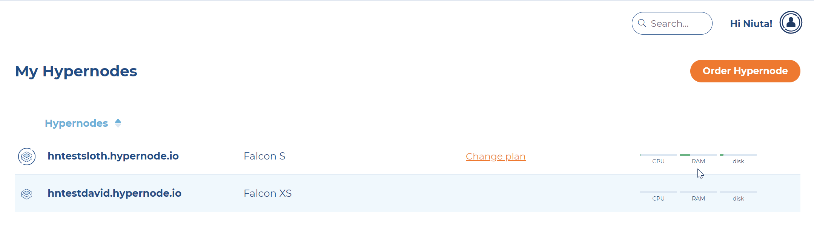
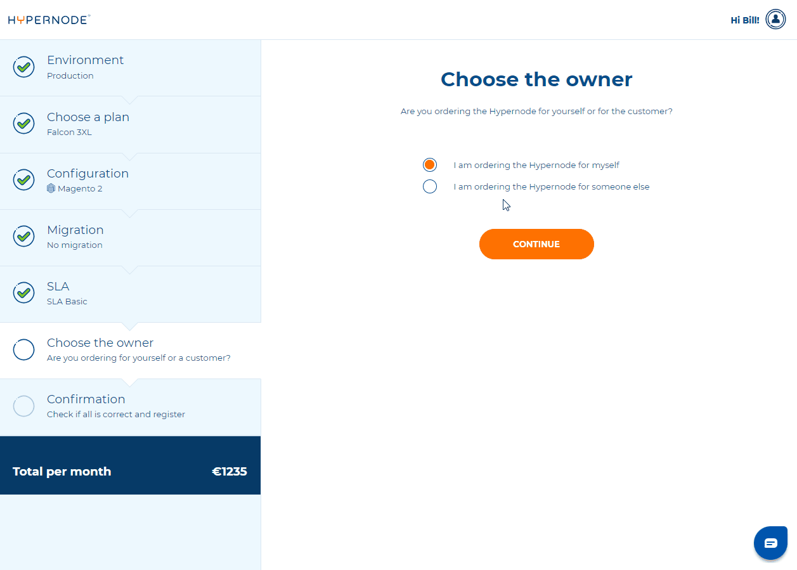

---
myst:
  html_meta:
    description: We’ve added an extra step to the order flow, allowing for placing
      Hypernode orders on behalf of your customers.
    title: How to order Hypernode for someone else? | Hypernode
---

# How to Order a Hypernode for Someone Else?

This feature is available only for agencies and provides a more efficient and convenient way to meet your clients’ needs. Upon acceptance of the invitation, the client immediately becomes the new owner of the Hypernode responsible for the payment.

## Step-by-step instructions

To transfer ownership of a Hypernode you need to follow these steps:

1. Log into the [Control Panel](https://my.hypernode.com).
1. Navigate to **Order Hypernode**

3. Choose desired environment, plan, configuration and SLA for the new Hypernode.
1. After configuring your Hypernode, in the **Choose the owner** step, choose **I am ordering for someone else**.
1. Enter the email of the customer who will become the owner—this can be an existing customer or someone without a Control Panel account. We’ll suggest email options based on your existing Hypernodes.
1. Choose whether you want to retain admin rights to the Hypernode.

7. Once the order is complete, we’ll send an invitation email to the new owner, awaiting their acceptance.
1. As a security measure we will also send a confirmation email to the general agency contact to prevent potential abuse.

## Note for gmail or common email providers

If you’re logged in with Gmail or another common email provider, you may not see the extra step while ordering. To access the feature, ensure you’re logged in with your agency email.
