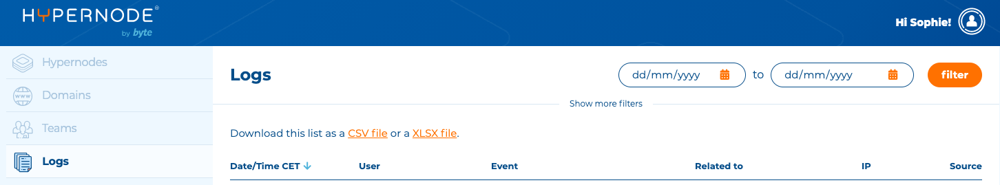

---
myst:
  html_meta:
    description: Learn how to use logs in the Hypernode control panel. Discover why
      they're essential and how to view them, set up automated log downloads, and
      more.
    title: How to use logs in the Control Panel? | Hypernode
redirect_from:
  - /en/services/control-panel/using-logs-in-the-control-panel/
---

<!-- source: https://support.hypernode.com/en/services/control-panel/using-logs-in-the-control-panel/ -->

# Using Logs in the Control Panel

You can review the logs in the Control Panel to get a better understanding of actions you or others have performed for your account.

Access the logs by clicking **Logs**in the sidebar on the left:

At the top you can filter the logs by date. By clicking **Show more filters**you can filter on other details.

The logs show the following things:

- When an action was performed
- The user that performed the action
- The action that was performed
- The Hypernode or user to action was related to
- The IP address from which the account was performed
- The source of the account, so the commandline or the Control Panel
