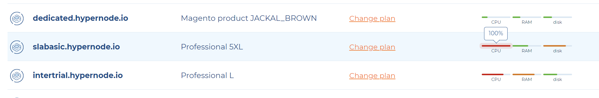
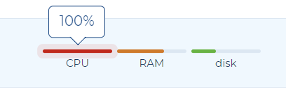

---
myst:
  html_meta:
    description: In the Control Panel you can check the health status of each of your
      Hypernode, which consist of CPU, RAM and disk usage.
    title: What overloaded CPU/RAM or disk means and how to prevent that? | Hypernode
---

# What overloaded server means and how to prevent that?

In the Control Panel you can check the health status of each of your Hypernode, which consist of CPU, RAM and disk usage. When some of your metrics are red it means the resource is overloaded and some actions might be required to keep your server working properly.

## How can overloaded CPU, RAM or disk usage affect your webshop?

When a computer's CPU is said to be "overloaded," it means that the CPU is being pushed beyond its processing capacity. This occurs when the CPU is required to handle more tasks or processes simultaneously than it can effectively manage.

It can result in:

### Slower performance and page loading

Overloaded CPU, RAM and Disk usage may lead to slower response times when visitors try to access your online store. As a result, web pages take longer to load, which can frustrate customers and lead to higher bounce rates.

### Transaction failures

If your online store's database or file storage is hosted on the overloaded disk or RAM, transactional operations, such as processing orders and updating inventory, may fail or take an unusually long time to complete.

### Downtime

In extreme cases, overloaded RAM or Disk usage can cause your online store to become unresponsive or even crash.

### Decreased User Experience

When customers encounter delays or lag when browsing your website or making transactions, they may abandon their shopping carts and seek alternatives.

### Search Engine Ranking Impact

Search engines like Google consider page speed as a ranking factor. An overloaded CPU or Disk usage leading to slow website performance can result in lower search engine rankings, reducing your online store's visibility to potential customers.

### Security Risks

When CPU is overloaded it may become less responsive to security threats, making it more susceptible to attacks. This can lead to data breaches, potentially damaging your reputation and customer trust.

## How to fix overloaded CPU, RAM or Disk usage?

### Optimize data and file management

Ensure that your website's data, images, and files are efficiently managed and organized. Remove unnecessary or redundant data.

### Application research

You could look into your application problems causing the overload trying to spot the issue and check if the load is spreading across the time or it’s unusual peak.

### Upgrade the plan

Consider upgrading to a more powerful CPU or larger/faster storage drive, if your current hardware is insufficient. You can do it by <a href=”https://my.hypernode.com” target=”_blank”>changing your plan in the Control Panel</a>

### Regular Monitoring

Continuously monitor CPU usage to detect issues early and take action as needed.

### Data Backups

Regularly back up your data to prevent data loss in case of disk-related issues.

### Implement Caching

Implement caching mechanisms to reduce the load on the CPU and improve response times.

### Load Balancing

Distribute traffic across multiple servers to prevent overloading a single CPU.

### Failover and Redundancy

Consider implementing failover and redundancy solutions to ensure that your online store remains accessible even in the event of server issues. This can be done by making a cluster setup from your single Hypernode.

By managing your server's CPU, RAM and disk usage effectively, you can help ensure that your online store runs smoothly, delivers a positive user experience, and maintains reliable service for your customers.
