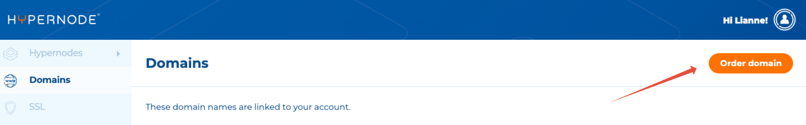
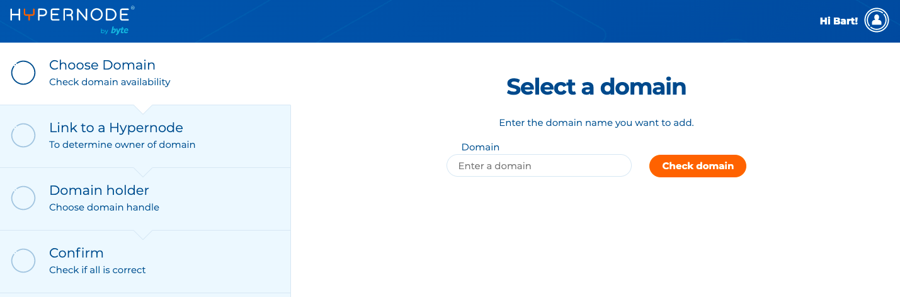
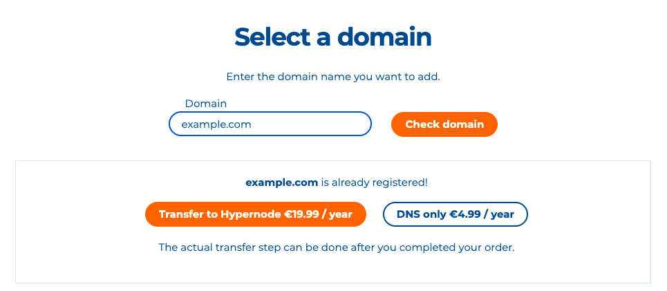
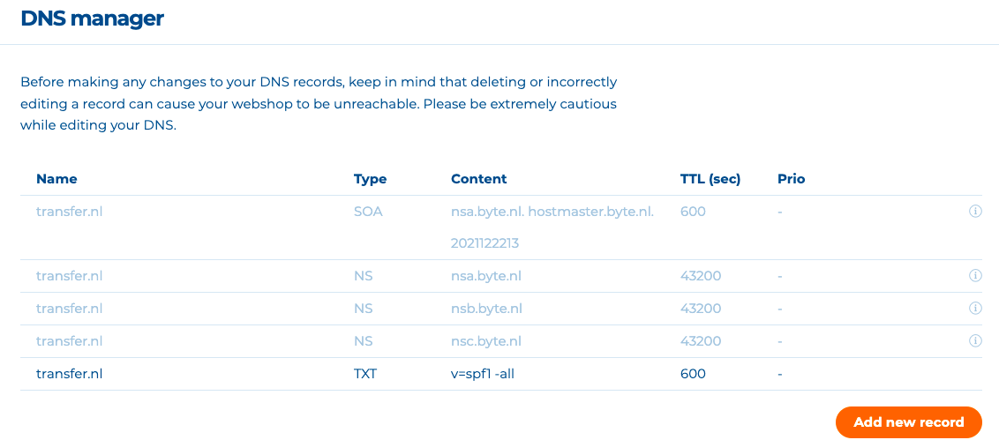

---
myst:
  html_meta:
    description: Learn how to use domains in the Hypernode Control Panel. Get detailed
      instructions on how to add, delete, and manage domains in your environment.
    title: How to use Domains in the Control Panel? | Hypernode
redirect_from:
  - /en/services/domains/how-to-use-domains-in-the-control-panel/
---

<!-- source: https://support.hypernode.com/en/services/domains/how-to-use-domains-in-the-control-panel/ -->

# How to Use Domains in the Control Panel

There are three different ways to use domains in the Control Panel.

## Registering a New Domain

To register a new domain, follow these steps:

1. Log in to the Hypernode Control Panel.
1. Select domains from the sidebar on the left.
1. Click on the orange **Order domain** button on the right.
   
1. Enter the domain you want to add to your account and click **Check domain**.
1. If the domain is available, you'll see an **Order domain** button.
   
1. Choose a Hypernode to link the domain to.
   We will create an A record for example.com and a CNAME record for [www.example.com](http://www.example.com). If a domain is linked to a Hypernode, it’s no longer possible to manually change the apex records that point to your Hypernode.
   **Please note:** the Hypernode owner is also the domain plan owner, meaning they pay for the domain and can cancel the plan.
1. Next, you can choose a domain holder. You can either pick an existing domain holder or add a new one. The domain holder is the legal owner of the domain name. Only they can initiate a transfer or reinstate a quarantined domain, so please make sure you pick the right holder.
1. Please fill in the TLD (Top Level Domain) information. For some extensions, more information is needed to complete the registration.
1. Check if everything is correct and place your order.

## Transfer an Existing Domain to Hypernode

To transfer an existing domain, follow these steps:

1. Log in to the Hypernode Control Panel.
1. Select domains from the sidebar on the left.
1. Click on the orange **Order domain** button on the right.
1. Enter the domain you want to add to your account and click **Check domain**.
   
1. To transfer the domain, click on the **Transfer to Hypernode** button.
1. Choose a Hypernode to link the domain to.
   We will create an A record for example.com and a CNAME record for [www.example.com](http://www.example.com). If a domain is linked to a Hypernode, it’s no longer possible to manually change the apex records that point to your Hypernode.
   \*\*Please note:\*\*the owner of the Hypernode is also the owner of the domain plan, which means they pay for the domain and can cancel the plan.
1. Next choose a domain holder. You can either pick an existing domain holder or add a new one. The domain holder is the legal owner of the domain name. Only they can initiate a transfer or reinstate a quarantined domain, so please make sure you pick the right holder.
1. Check if everything is correct and place your order.
1. At this point, your domain has not been transferred yet. Before you transfer your domain to Hypernode you should configure your DNS. If you use external mail solutions, it is certainly advisable to set the MX records for example. We also strongly advise you to delete any AAAA-record from your DNS before transferring your domain to Hypernode. At the moment, the Hypernode platform does not support the use of IPv6 addresses.
1. To initiate the transfer, enter your authorization code in the Control Panel. Please note: domain transfers can take a few days to complete, depending on the domain extension.

## Using Our DNS Only Service

You can also use our DNS only plan. This means you can host your domain externally and only change the domain's nameservers to our nameservers.
Follow the steps below:

1. Log in to the Hypernode Control Panel.
1. Select domains from the sidebar on the left.
1. Click on the orange **Order domain** button on the right.
1. Enter the domain you want to add to your account and click **Check domain**.
1. Press **DNS only**.
1. Choose a Hypernode to link the domain to.
   We will create an A record for example.com and a CNAME record for [www.example.com](http://www.example.com). If a domain is linked to a Hypernode, it’s no longer possible to manually change the apex records that point to your Hypernode. Please note: the owner of the Hypernode is also the owner of the domain, which means they pay for the domain.
1. Check if everything is correct and place your order.
1. Go to the DNS Manager and add, edit or delete records as needed:
   
1. Assign our nameservers (**nsa.byte.nl**, **nsb.byte.nl**, **nsc.byte.nl**) to your domain name through your domain registrar. The DNS records set in the Control Panel will not be active until after you've updated your nameservers.
