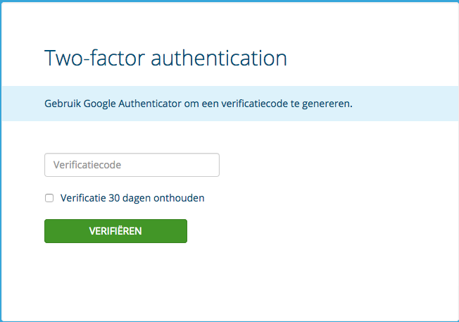
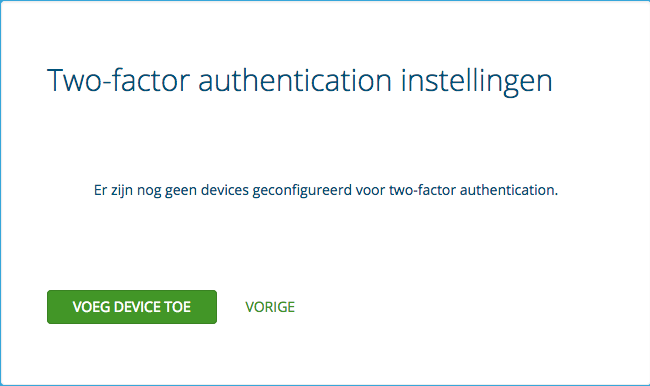
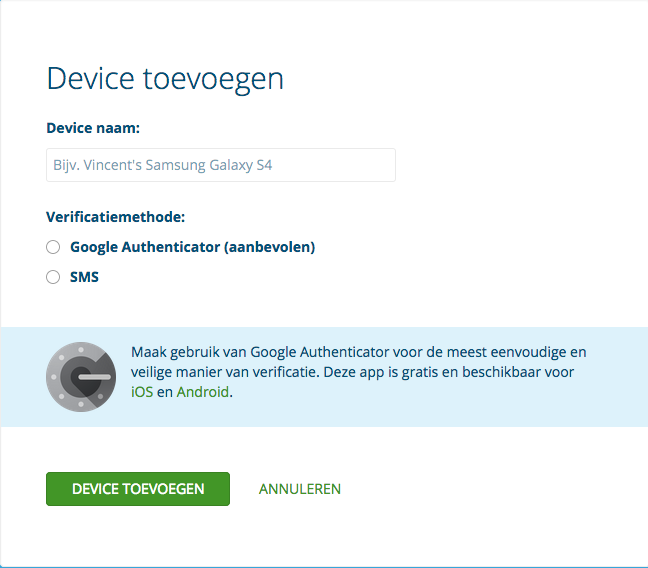
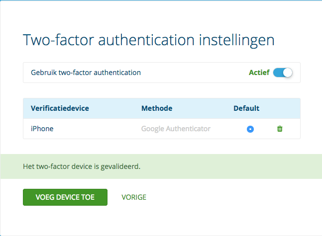

---
myst:
  html_meta:
    description: Protect your Service Panel with two-factor authentication (2FA).
      Learn how to set up 2FA on Hypernode and keep your data secure.
    title: How to use 2FA on the Service Panel? | Hypernode
redirect_from:
  - /en/services/service-panel/how-to-use-2fa-for-the-service-panel/
---

<!-- source: https://support.hypernode.com/en/services/service-panel/how-to-use-2fa-for-the-service-panel/ -->

# How to Use 2FA on the Service Panel

**Please note that this only applies to Service Panel users who log in via service.byte.nl.**

Two factor authentication, also known as two-step verification, is a more secure way of logging in than logging in with just a password, because everyone receives a unique code to log in. In this article we explain how to enable two factor authentication on the Service Panel.

## What Is Two Factor Authentication?

Two factor authentication is a safer way to log in, because it requires an extra code to log in. This ensures that your customer account is extra protected against unauthorised login attempts. In the image below you can see what that looks like.

After entering your customer number and password, you will then be asked for your own unique verification code. When you enter this and it is correct, you can only proceed to the Service Panel. At Hypernode you can receive the verification code in two ways: with an SMS or via an app. You enter a code during the second step when logging in, which you will see on your phone. If you have entered the correct code you will be logged in. Prefer to log in with your tablet? Then you use the app.

## How to Receive the Verification Code?

At Hypernode we support two ways of two factor authentication with your phone: with an SMS or via an app. We recommend using an app, such as [Google Authenticator](https://play.google.com/store/apps/details?id=com.google.android.apps.authenticator2), as a two-factor authentication method. Another app you can use is, for example: [Duo Mobile](https://duo.com/solutions/features/authentication-methods/duo-mobile).

### Logging in via an App

A two factor authentication app generates a code that you need during the login process. We recommend that you use an app for this, because the apps work even if you don't have internet or if your device is in airplane mode.

### Logging in via SMS

If you cannot use an app to generate codes, we can send you an SMS containing the code you need to log in. The disadvantage of this is that you have to be able to receive an SMS and it can sometimes take a while before you receive an SMS.

*Please note! There is a limit of 15 text messages per day per device. Have you reached your limit, but do you still want to be able to log in? Then use an app to log in.*

### Are Multiple Users Still Able to Log in When Using 2FA?

You can add multiple devices to your customer account. This way, every employee can log in with their own device and therefore a unique verification code. It works as follows:

- Each employee can only log in with two-factor authentication. This is done via an SMS on their mobile phone or an app.

- You record with which device (telephone number or app) each employee can log in to your customer account.

-If the employee is no longer allowed to enter the account, you can remove their device in the Service Panel and they can no longer access it.

## How Can I Set up Two-Factor Authentication?

You can do this via the Service Panel. To set up two-factor authentication, you also need a smartphone or tablet to which an SMS can be sent or an authenticator app.

## Adding a Device

The great thing about two-factor authentication is that you can determine who can log in to your customer account and the Hypernode Emergency Service based on devices. You do this by adding different devices. This way you can give each employee in your organisation unique access.

How to set up two-factor authentication:

1. Log in to the Service Panel.
1. Click on your account in the upper right corner and select **Mijn Gegevens** from the dropdown menu. Then click on **Wijzigen** at **Two-factor authentication**.
   
1. Click **Voeg device toe**(see the image above).
1. Give your device a name.
   
1. Pick a verification method (if you pick SMS, enter a phone number).
1. Click **Device toevoegen**(see image).
1. Enter the code you receive per SMS or in your authenticator app.
1. Click **Device valideren**.
   

Your device has been validated, you can now use 2FA to log into the Service Panel.

## How Do I Disable Two Factor Authentication?

You can disable two factor authentication by following these steps:

1. Log into the Service Panel.
1. Click on your account and select **Accountbeveiliging**.
1. Switch the **Actief**slidenext to **Gebruik 2-staps verificatie.**

## FAQ

### My Validation Code Doesn't Work

After you have used a certain code, we ensure that it cannot be used again for security reasons. It is therefore possible that you have just logged in and want to validate a device immediately. Then the app you are using will probably still show the same code, even though this is no longer a valid code. Then wait for a while until your app shows a new code and use this code. Code via SMS that does not work? Request a new code to make sure the code has not already been used.

It is also possible that the time on your device is not set correctly. That chance is not very big, but it is there. Our server uses a timestamp. Once your app is connected to the internet, it will automatically be at the same time. Synchronise the clock on your mobile or tablet using the internet (every smartphone and tablet includes this function) and try again with a new code. Still not working? Please contact us by mail: support@hypernode.com or telephone: 020 - 521 6226.

### I'm Not Receiving a Code

Do you have enough coverage? It can always happen that you have no coverage on your mobile phone. If that is the case, please wait until you are back in service, the SMS will come in automatically. You may also have reached your SMS limit. If that is the case, please contact us by mail: support@hypernode.com or telephone: 020-5216226.
