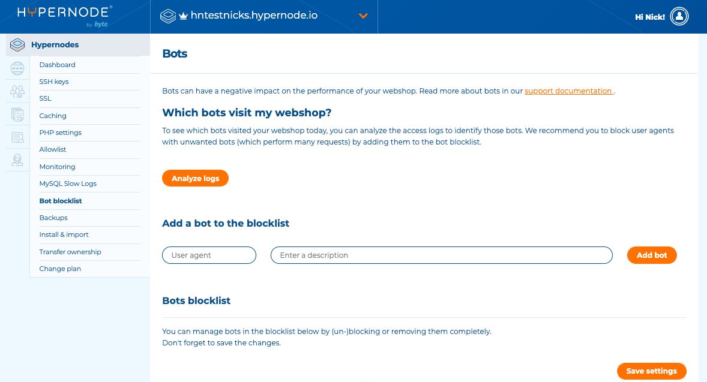

---
myst:
  html_meta:
    description: "Protect your website from bad bots and malicious requests with Hypernode's\
      \ Control Panel. "
    title: How to block bad bots via the Control Panel? | Hypernode
redirect_from:
  - /en/services/control-panel/block-bad-bots-via-the-control-panel/
---

<!-- source: https://support.hypernode.com/en/services/control-panel/block-bad-bots-via-the-control-panel/ -->

# How to Block Bad Bots via the Control Panel

A lot of bot traffic has a negative impact on the performance of your webshop. Some bots are very useful (e.g. Google), others have no value at all and even have a negative influence on the performance of your shop. We offer you the possibility to block bad user agents with a few mouse clicks, via your Control Panel.

## Add Bad Bots to the Blocklist

If blocking (a part of) the recommended list of bad bots does not have enough positive impact on your webshop, please add unwanted bots to the list yourself.

1. Log in to the Control Panel.
1. Select Hypernodes in the sidebar on the left.
1. Select a Hypernode and then click on **Bot Blocklist** in the sidebar.
1. Click the **Analyse logs**button to see which user agens visited your webshop today and how many requests they performed.
1. To add a bot, fill in the user agent, add a description and click **Add bot**.

You do not have to copy the entire user agent, using the unique part (the name) is sufficient. Please pay attention: if you use a generic name or abbreviation, you can unintentionally block more than desired. Therefore you must enter at least 4 characters.

Also make sure you do not make any spelling errors!

User agents are not case sensitive, there is no need to use uppercase letters.

For example:

`Mozilla / 5.0 (compatible; DotBot / 1.1; http://www.opensiteexplorer.org/dotbot, help@moz.com)`

Please do not block *Mozilla*, because the results will be disastrous. Block `DotBot` instead.

We also recommend you to specify the entire bot name, in this case, `DotBot`. Do not use an abbreviation like *Bot*, because it is very likely you will block too much.

## Overview of the Top 20 Bad Bots Identified by Hypernode

We have already added 20 bots as a suggestion to the Bots blocklist. Please see below for an explanation of these bots. You can tick the box in the column **Blocked** to either enable or disable blocking per bot. Don't forget to click the **Save** button when you change something!

1. **SEMrushBot**
   Data collected by SEMrushBot is used in: AdSense (Display Advertising) reports, public backlink search engine index maintained as a dedicated tool called “SEMrush backlinks”, Site audit tool that analyses on-page SEO, technical and usability issues.
1. **Yandex**
   Yandex is the largest search engine in Russia. It is ranked as the fifth largest search engine worldwide. You may want to consider blocking Yandex bot if you are not interested in doing business in the Russian market.
1. **OpenLinkProfiler**
   OpenLinkProfiler.org ist a link research tool that enables you to check the backlinks of any website.
1. **Blexbot**
   BLEXBot visits pages to examine and analyse the content. BLEXBot collects information on the link structure of sites and their interlinking on the web. This information is used to avoid any technical and possible legal issues and improve overall online experience.
1. **Ltx71**
   Ltx71 continuously scans the internet for security research purposes. They claim their crawling is not malicious and only notes summary information for a page.
1. **Rogerbot**
   Rogerbot accesses the code of a site. It is used for link intelligence and other SEO-related information.
1. **Dotbot**
   Moz Open Site Explorer collects information to create analytics software for marketing purposes.
1. **Leipzig Corpora Collection**
   The Leipzig Corpora Collection (LCC) is a project of the University of Leipzig. The LCC offers access to monolingual dictionaries in more than 200 languages. The crawler that visited your website is collecting data for this project. The crawled data are used for language documentation and language statistics which are freely available on their website.
1. **Linguee**
   The Linguee bot is a web scraping bot that will scan the content of any website it encounters to search for multilingual text. It does not harvest email addresses, and it won’t index content that is not multilingual.
1. **HubSpot**
   HubSpot bot is a web scraping bot that scrapes contact information from various lists for companies to use to generate sales leads.
1. **Quant**
   Qwantify is a search engine from France.
1. **Baidu**
   Chinese search engine Baidu scrapes webpages and returns updates to the Baidu index. If your business is not interested in marketing to the Chinese market, you might want to consider blocking this bot.
1. **Seoscanners**
   Offers SEO reports about crawling, head elements, content relevance, links, domain, url structure, user experience, etc.
1. **Vagabondo**
   Provides search technology as well as data mining solutions on internet data.
1. **AlphaBot**
   AlphaSeoBot collects new and updated web data. Data is used in AdSense (Display Advertising) reports, public backlink search engine index maintained as a dedicated tool called “AlphaSeo backlinks”and Site audit tool that analyses on-page SEO, technical and usability issues
1. **Mail.ru**
   Mail.Ru Group is a leading internet company in Russia. Search Mail.Ru is the third largest search engine in Russia. You might want to block this bot if you are not interested in doing business in Russia.
1. **Magebee**
   Magebee is an online web service helping Magento merchants and developers to track their store availability and other metrics including security posture. Consider blocking this bot is you do not make use of this tool.
1. **Seznam**
   Seznam is the most visited search engine in the Czech Republic. You may want to consider blocking this bot if you're not interested in doing business in the Czech Republic.
1. **Domain ReAnimator**
   Domain ReAnimator is a web scraping bot that scrapes domains for various purposes, allowing users to research, register, and rebuild unlimited expired domains.
1. **TurnitinBot**
   This robot collects content from the Internet for the purpose of helping educational institutions prevent plagiarism.
