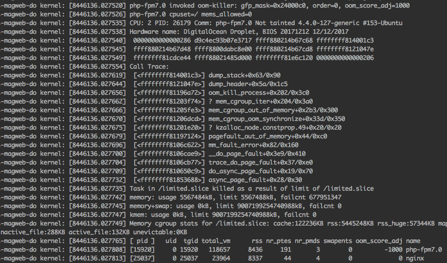
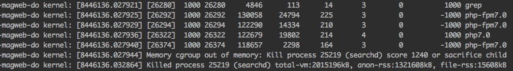

---
myst:
  html_meta:
    description: Out of memory errors can be difficult to debug. Learn how to troubleshoot
      and resolve out of memory events on your Hypernode with our easy-to-follow guide.
    title: How to debug out of memory events? | Hypernode
redirect_from:
  - /en/troubleshooting/performance/how-to-debug-out-of-memory-oom-events/
---

<!-- source: https://support.hypernode.com/en/troubleshooting/performance/how-to-debug-out-of-memory-oom-events/ -->

# How to Debug ‘out of Memory’ (OOM) Events

When processes on your Hypernode require more memory than is available, there is a risk of downtime. To prevent such an ‘out of memory’ event from happening, the Linux oom-killer process tries to kill processes in order to free up memory. This oom-killer process is a last-resort measure to prevent the Hypernode from going down.

## The OOM-Killer Explained

The OOM-killer will try to kill the process using the most memory first. As this is usually MySQL, this is not always a good idea. So we use Cgroups, a Linux kernel feature, to group specific processes together and assign them a value to control which processes should be killed first and which crucial processes should not be killed at all.

Processes like SSH, crons, or inactive Nginx workers will typically be killed first, having been assigned a high numerical value of 1000. You’ll also encounter processes with a value of -1000, which translates to ‘don’t kill this process’ which will be assigned to for example mysqld or php-fpm. MySQL, in particular, tends to hog memory and is reluctant to release it, which can be worked around by performing a graceful restart using the hypernode-servicectl tool.

### Configuring the OOM-Killer

It is possible to change the behavior of the OOM-killer, configuring it to be permissive of short-term memory usage, allowing memory-hungry processes to run without executing overly drastic measures. While this allows short-lived scripts to run more stable, it does result in processes that would later become memory problems to be prevented from being culled in an early stage in shops with a particular type of memory footprint.

The default is to be more restrictive, as, on average, that seems to be the most effective setting.

This configurable setting can be set using the [hypernode-api](https://community.hypernode.io/#/Documentation/hypernode-api/README) or the [hypernode-systemctl](https://community.hypernode.io/#/Documentation/hypernode-api/settings/README) command-line tool from the Hypernode.

If you want to enable or disable this setting, you can do so with the command below. But before you do, read[this changelog](https://changelog.hypernode.com/changelog/release-5874-better-out-of-memory-pattern-detection-for-preventive-non-essential-process-slaying/) for an in-depth explanation of what the setting exactly entails.

```nginx
$ hypernode-systemctl settings permissive_memory_management --value True
```

To disable this setting, use the following command:

```nginx
$ hypernode-systemctl settings permissive_memory_management --value False
```

Note that even though this setting can give you some more leeway in regards to memory utilization on Hypernode and gives you the option to decide whether you value keeping the site online at the cost of killing non-essential processes early versus trading some risk in terms of stability for increasing the chance of memory hungry one-off processes to complete if you notice structural Out Of Memory messages in your kern.log that often indicates a real problem in the shop or that it might be time to upgrade.

**Prioritize Important Processes**

To protect a command from the OOM-killer and give it maximum priority over all other services, you can ‘wrap’ the command with the hypernode-oom-protect command. This will start the command specified as usual, except that the OOM score adj will be set to -1000.

For Example:

`hypernode-oom-protect php /data/web/memory_hungry_script.php`

Because the MySQL process is also marked as unkillable by default, it is possible to execute scripts to interact directly with the database (for example, using [PDO](http://php.net/manual/en/ref.pdo-mysql.php)) that will be unhampered by the memory state of the system.

There is still a finite amount of memory

Please keep in mind that marking processes as unkillable does not magically add more memory, and it will also not prevent memory allocation errors like PHP Fatal error: Out of memory (allocated 1234) (tried to allocate 12345 bytes). It serves a nice purpose of [taming the OOM-killer](https://lwn.net/Articles/317814/), but eventually, it only shifts the problem slightly. If you persistently have problems with memory (and those not caused by a structural misallocation of resources), the real solution would still be to [upgrade to a bigger plan.](https://www.hypernode.com/magento-hosting-plans/)

For more information about hypernode-oom-protect please see the [changelog](https://changelog.hypernode.com/changelog/release-6202-mark-processes-as-unkillable-when-out-of-memory/).

## Debug OOM Events

If you receive a notification that an ‘out of memory’ event has occurred, the OOM-killer process will already have done its job, and you’ll see that memory has been freed up. So in order to find out what happened, we’ll have to inspect the logs. You can use the command `less /var/log/kern.log|grep -v 'UFW BLOCK'` (or `dmesg --ctime --color=always | grep -v 'UFW BLOCK'`) to find out what happened. Example below:



So you may have found an out of memory event in your kernel log. It will start with\*‘\[process\] invoked oom-killer’\* followed by a stack trace and and a list of running processes and child processes.



The log ends with ‘*Killed process \[pid\] (name of the process)*’. You’ll also have a timestamp (not included in these screenshots), so you’ll be able to check other logs and see if something correlates. Note that this does not always mean there is a single culprit. The logs you could check are /var/log/mysql/mysql-slow.log and /var/log/php-fpm/php-slow.log. In addition, you can check the exception.log and system.log in Magento’s /data/web/public/var/log folder.

## How to Deal With Out-of-Memory Events

If you receive emails about OOM(Out-of-Memory) events regularly, there are various ways to deal with this. These options roughly fall into two categories; Reducing memory usage and reducing memory requirements.

### Reducing Memory Usage

By reducing the memory usage of software running on your Hypernode, more memory will be available for visitors and for running [periodic tasks](../../hypernode-platform/tools/how-to-use-periodic-tasks-cronjobs-on-hypernode.md). One of the main culprits of memory usage is MySQL. MySQL will allocate more memory when it needs this for running large queries but will not free it afterward. This means MySQL memory will only increase over time and not go down again. A simple way to deal with this is to periodically restart MySQL using the `hypernode-servicectl restart mysql` command.

If you are using a [basic staging environment](../../ecommerce-applications/magento-2/how-to-set-up-a-basic-staging-environment-for-magento-2.md) on your Hypernode, some memory will always be allocated to your staging environment. As such, it might be beneficial to replace this with a separate [Development Hypernode](../../hypernode-platform/tools/how-to-use-hypernode-development-plans.md).

### Reducing Memory Requirements

Some tasks in Magento use up a lot of memory, sometimes more than is available on the server. Often this memory will not be free until the process is finished, even if it’s no longer needed.

One way to deal with this is to run smaller tasks, ending the process earlier and freeing up this memory again. By not stacking your cronjobs and by running smaller imports instead of a gigantic bulk import, you can reduce a memory peak to several memory bumps instead, which will have a reduced impact on your system.

Another way to ensure less memory is needed is by reducing file sizes. As Magento often loads images into memory to resize those, [optimizing images](../../best-practices/performance/how-to-optimize-your-images.md) to take up less disk space means these also use up less memory when Magento works on these files.

### Upgrade to a Larger Plan

If you cannot make enough memory available, the only remaining option is to [upgrade](https://www.hypernode.com/magento-hosting-plans/) to a larger Hypernode with more memory. As Magento becomes more complex over time and databases and visitor counts grow, at one point or another, your shop will become too large for your existing Hypernode and require an upgrade for extra memory and other server capacities.

## Release MySQL Memory Script

On smaller Hypernodes or Hypernodes with databases with big datasets, over time, sometimes too much memory is allocated by MySQL. The rest of the system will go into a state of undesirable memory pressure while MySQL is hogging a lot of memory that it might not even actively use. MySQL’s memory footprint can be configured with settings such as `innodb_buffer_pool_size` but correctly tweaking MySQL’s memory allocation is a complex topic, and sometimes periodically restarting the service is the easiest solution.

If you have a Hypernode which is occasionally low on memory due to dormant MySQL caches building up after a while, it might be an intelligent move to periodically check if the server is below a certain memory-free threshold and then restart the MySQL service. To facilitate that, we have placed a script in `/usr/local/bin/release_mysql_cached_memory` on every Hypernode that users can configure to run in a cron if they have this problem.

```nginx
app@levkcl-appname-magweb-cmbl:~$ cat /usr/local/bin/release_mysql_cached_memory
#!/bin/bash
read -r -d '' USAGE <&2 echo "Invalid action. $USAGE"; exit 1
esac
done

if [ -z $MEMFREETHRESHOLD ] || [ -z $COOLDOWNFORRESTART ]; then
    >&2 echo "Invalid action. $USAGE"; exit 1
else
    if ! find /tmp/release_mysql_cached_memory_cooldown -mmin -$COOLDOWNFORRESTART 2>/dev/null | grep -q .; then
        echo "Checking if we're in a low memory situation"
        if [ $(free -m | grep Mem | awk '{print$7}') -lt $MEMFREETHRESHOLD ]; then
            touch /tmp/release_mysql_cached_memory_cooldown
            echo "Low memory condition detected and we haven't restarted MySQL in the last $COOLDOWNFORRESTART minutes"
            echo "Restarting MySQL..."
            hypernode-servicectl restart mysql
        else
            echo "No low memory condition detected, have at least $MEMFREETHRESHOLD MB of mem available"
        fi;
    else
        echo "Not checking low memory condition, already restarted MySQL because of low mem in the last $COOLDOWNFORRESTART minutes"
    fi
fi
```

You can configure this script with a cron like:

```nginx
* * * * * /usr/local/bin/release_mysql_cached_memory -m 1024 -c 30

```

Then when the system reaches a configurable low watermark of memory available, MySQL will automatically be restarted to free up some RAM. The second argument specifies a cooldown in minutes for how long there should be at least between any MySQL restart. Of course, you don’t want to restart your database too often in a production environment.

You should not need to run a script like this to keep your memory usage at bay. Still, in some cases where you know that tweaking MySQL memory usage exactly correctly is complex or if you’re working with limited resources, this might be an excellent tool to have in your toolkit.
