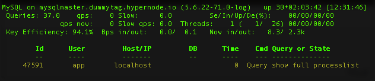
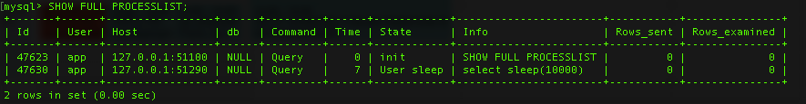
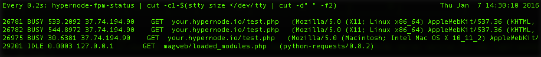

---
myst:
  html_meta:
    description: Learn how to quickly identify and stop long-running processes on
      Hypernode with our easy-to-follow guide.
    title: How to idfentify and stop long running processes? | Hypernode
redirect_from:
  - /en/troubleshooting/performance/how-to-identify-and-stop-long-running-processes/
---

<!-- source: https://support.hypernode.com/en/troubleshooting/performance/how-to-identify-and-stop-long-running-processes/ -->

# How to Identify and Stop Long Running Processes

Long running processes can indicate that the the site might benefit from an index (SQL), that there’s inefficient or erroneous code (PHP), or that a deadlock has occurred. This article explains how to identify long running processes.

## Long Running SQL Processes

To identify long running SQL processes you can use the tool `Mytop`. `Mytop` displays the running mysql processes in real time. To identify a long running SQL process with `Mytop`, you can run the following command to inspect the duration of your SQL processes:

```nginx
mytop
```

The output will look like something like this:

Alternatively you can request the processlist from MySQL yourself by using the commands:

```nginx
mysql -Be 'SHOW FULL PROCESSLIST;'
```

The outcome will look like this (screenshot includes the commands that been used):*To make your life easier, we created an alias myprocs to watch the processlist while devving. In some cases using this alias instead of `mytop` will provide more accurate information.*

Once you’ve identified the long running process(es) you can kill them with the command `kill` and it’s ID number. The example below shows how we kill the longest running query:

```nginx
kill 47630
```

If that doesn’t work, there is a more aggressive method of killing using the `-9` flag. This instructs the kernel to kill the process without running any cleanup handling and instantly stops a process:

```nginx
kill -9 47630
```

And the outcome will be:


## Long Running FPM Processes

To identify a long running PHP process you can run the following command to inspect the duration of your FPM processes in real time:

```nginx
livefpm
```

The output will look something like this:
. The example below shows how we kill a all long running queries:

```bash
kill -9 26781 26782 26975
```

By typing several ID numbers after the kill command you can kill multiple long running processes. There won’t be any output, but you’ll see `IDLE` behind the queries you killed. Your visitor will receive a HTTP Error 502 – Bad Gateway message in their browser.

## Long Running SSH Process

To find long running shell processes you can use this command:

```nginx
ps --sort etime -A -o etime,pid,user,args | grep php | grep -vE 'php-fpm|\-\-mode daemon|grep'
```

The output will look something like this:


Like SQL and FPM processes you can kill long running SSH processes with the command `kill` and the process ID:

```nginx
kill -9 22123
```
