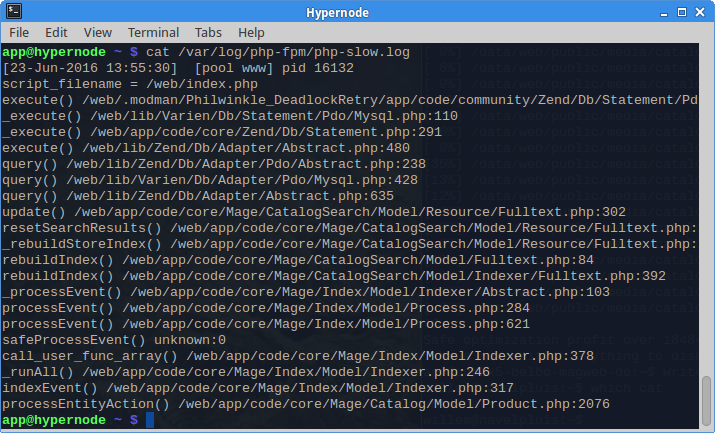

---
myst:
  html_meta:
    description: "Learn how to quickly spot slow extensions using PHP slow logs in\
      \ Hypernode. We'll show you the best practices for finding and resolving issues. "
    title: How to spot slow extensions using PHP slow logs? | Hypernode
redirect_from:
  - /en/troubleshooting/performance/how-to-spot-slow-extensions-using-the-php-slow-logs/
  - /knowledgebase/spot-slow-extensions-using-phps-slow-log/
---

<!-- source: https://support.hypernode.com/en/troubleshooting/performance/how-to-spot-slow-extensions-using-the-php-slow-logs/ -->

# How to Spot Slow Extensions Using the PHP Slow Logs

A little known gem of PHP-FPM is its slow log. Does your Magento shop sometimes freeze for unknown reasons? Use this cool feature to get the culprit on a silver platter.

So what does it do? On average, PHP takes half a second to render a page. When it takes longer than a configured threshold (say, 10 seconds), PHP will record a stack trace and save it to disk for later inspection. Here is an example.


## So What Is a Stack Trace?

A stack trace is a snapshot in time of all current active functions, plus their locations in the source code. Because the most specific functions are listed first, you should read a stack trace backwards for a chronological order.

In this example, `rebuildIndex()` was called and eventually led to to a number of database `query()` calls. At the moment of the trace, the program was busy with the `execute()` function in Philwinkle’s DeadlockRetry module.

## How to Interpret

In this example, one can clearly deduce the bottleneck of this particular slow request. The active module `DeadlockRetry` is a subtle ☺ indication of a locked database. Further analysis should involve `mytop` to monitor live database behaviour and to view past queries in MySQL’s slow query log.

In our experience of analysing hundreds of Magento shops, these are the three most common causes for slow requests:

1. PHP is waiting for **database queries** to complete. Easily recognized from the function names. Either the database is busy with a large query, or waiting for a lock.
1. PHP is waiting for **external systems** (inventory, supplier, feedback systems). This is easily spotted when the active function is `curl_exec()` or (sometimes) `simplexml_load_file()`
1. PHP is busy running PHP code, for example **looping** over many products or parsing loads of XML data. This is illustrated when the active function is a PHP function that does not deal with external data.

One should note that the active function or module is not always the source of delay. In the example above, the real cause is a database locking problem started elsewhere, and the DeadlockRetry module is just checking whether the lock has lifted yet.

## Usage

On Hypernode, the slow PHP log is enabled for you and can be found in `/var/log/php-fpm/php-slow.log`. To enable this on your own system, add these lines to the PHP-FPM `pool.conf`:

```nginx
slowlog = /var/log/php-fpm/php-slow.log
request_slowlog_timeout = 10s
```

If you have a high-traffic but slow shop, this file will likely contain hundreds of traces. So to extract useful conclusions from this data, some parsing is required. On Hypernode there is a handy utility at your service, for Magento you can use the following format: `hypernode-fpm-slow-modules3 --cms *(Magento version)*` which will find non-core Magento extensions in the traces. For cms you have to specify if its either Magento 1 `*(magento_1)*` or Magento 2 `*(magento_2)*` in the command:

```nginx
$ hypernode-fpm-slow-modules3 --cms magento_2
23-Jun-2020 08:03:03 Fooman_PdfCustomiserPicking
23-Jun-2020 08:12:30 Amasty_Shopby
23-Jun-2020 09:13:14 Mage_Sales
23-Jun-2020 09:15:41 Aschroder_SMTPPro
23-Jun-2020 09:16:38 Mage_Sales
23-Jun-2020 09:18:48 Amasty_Shopby
23-Jun-2020 09:18:48 Nexcessnet_Turpentine
23-Jun-2020 09:18:51 Nexcessnet_Turpentine
23-Jun-2020 09:54:25 Aschroder_SMTPPro
23-Jun-2020 09:58:51 Mage_Sales
23-Jun-2020 09:59:55 Aschroder_SMTPPro
23-Jun-2020 10:25:12 Amasty_Shopby
```

If this, again, yields a long list, you can produce a summary like this:

```nginx
$ hypernode-fpm-slow-modules3 --cms magento_2 | cut -b22- | sort | uniq -c | sort -nr
     51 Aschroder_SMTPPro
     43 Mage_Sales
     15 Nexcessnet_Turpentine
      9 TBT_Rewards
      9 Amasty_Shopby
      5 WP_CustomMenu
      5 Fooman_PdfCustomiser
```

Here, the Aschroder module caused most slow requests (51). It was probably waiting for a slow SMTP server. Time to switch SMTP servers!

NB. In this example, Mage_Sales looks like a core module but actually is a local override.

## Conclusion

The possibility of PHP to automatically produce stack traces for long running requests is little known but very useful. In many cases this will help you to spot a troubled extension or at the very least tell you where to go from here.
