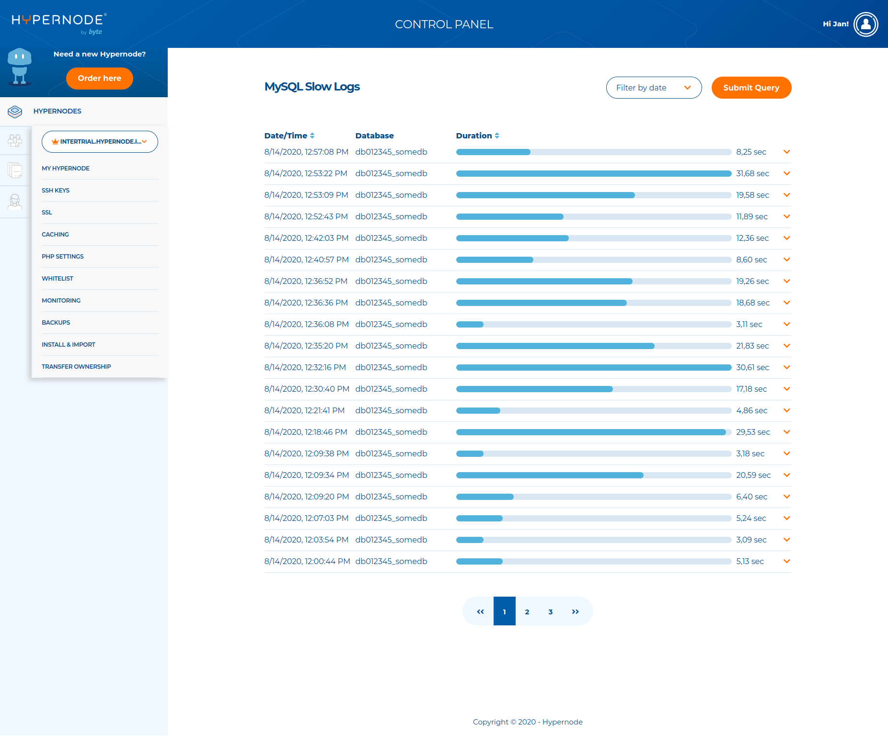
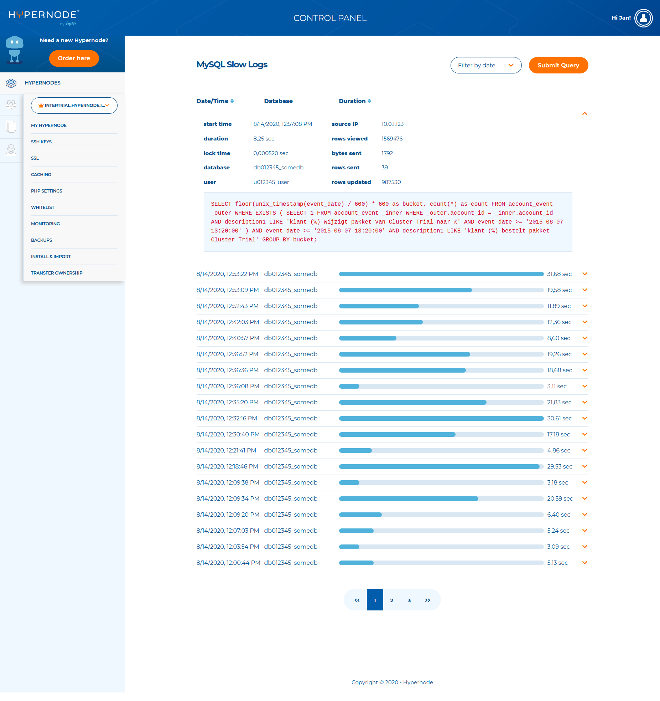

---
myst:
  html_meta:
    description: Learn how to use the Hypernode Control Panel to quickly and easily
      identify slow queries in your MySQL database.
    title: Use MySQL slow queries in the Control Panel | Hypernode
redirect_from:
  - /en/support/solutions/articles/48001154919-how-to-use-the-mysql-slow-queries-in-the-control-panel/
---

<!-- source: https://support.hypernode.com/en/support/solutions/articles/48001154919-how-to-use-the-mysql-slow-queries-in-the-control-panel/ -->

# How to Use the MySQL Slow Queries in the Control Panel

If your database query takes too long, you run the risk of crashing your site, because this will delay other queries. The database server can also become overloaded by poorly designed queries, causing performance issues on your Hypernode. You can use the MySQL Slow Logs in the Control Panel to find out what's causing the delay.

## MySQL Slow Logs in the Control Panel

In the Control Panel you can view the slow query logs under the button MySQL Slow Queries in the sidebar on the left. MySQL queries that took longer than two seconds are logged here:

## MySQL Slow Logs Details

You can also unfold an entry for more information by clicking the **orange arrow**:

This entry contains the following information:

- start time
- duration
- database
- user
- bytes sent
- lock time
- source IP
- rows evaluated
- rows updated
- rows returned
- the actual query

## Filtering Logs

We have seven days worth of MySQL slow logs in the Control Panel. You can also filter the logs by date:

